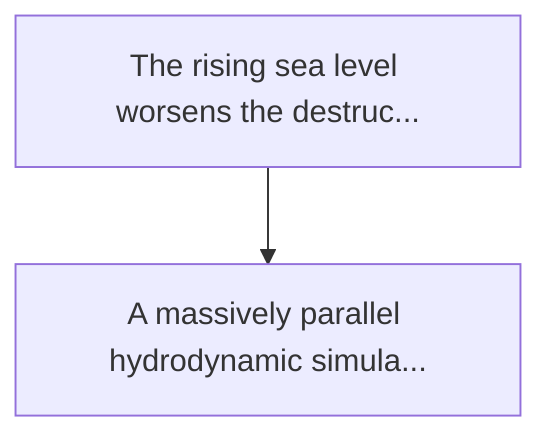
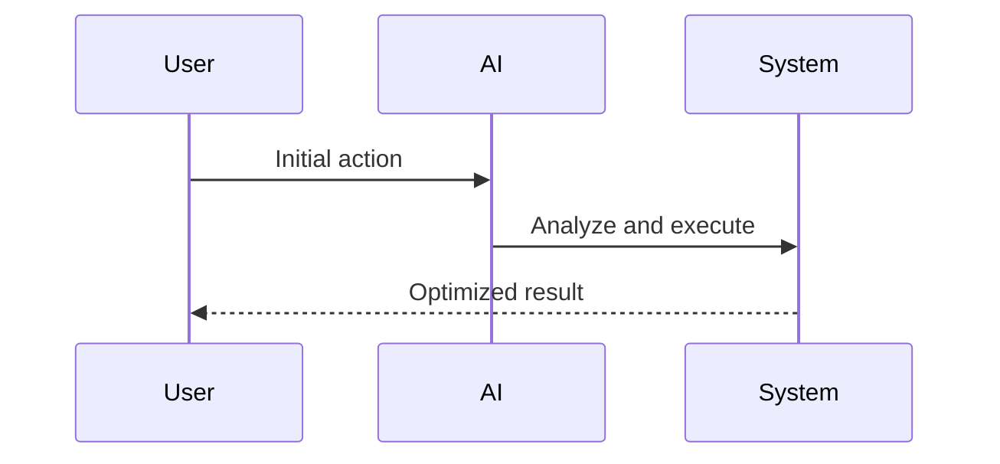

<!-- markdownlint-disable MD013 MD028 MD033 MD039 MD041 -->

[ 🇫🇷 Version Française ](./README.fr.md)

# Tsunami coastal simulator

> **Executive Summary:** A massively parallel hydrodynamic simulation engine (multi-gpu) integrating urban digital twins (bim/gis 3d). the system solves the...

---

## 1. Visual Overview & Wow Effect

## 2. Contrarian Thesis (Peter Thiel Style)

Popular Belief: Generic solutions can solve this.
Hidden Truth: Standard 2d flood maps are simple altitude-based extrusions. they ignore the physics of complex fluids (reflection, diffraction, sediment transport/debris) that determines the actual impact force on structures.

## 3. Problem & Target Market

Business Model: B2G / B2B
Target Audience: Coastal governments, urban planners, real estate insurers (reinsurance), offshore infrastructure developers
Urgent Pain Point: The rising sea level worsens the destructive impact of tsunamis and storm surges. current flood patterns are macroscopic and static; they do not take into account the dynamic interaction between the wave and 3d urban geometry (how the water rushes into specific streets, destroying some buildings and not others).

## 4. Technical Architecture & Infrastructure

## 5. Business Model & Financial Viability

| Metric                 | Value              |
| ---------------------- | ------------------ |
| Pricing Structure      | Custom Pricing     |
| 12-Month Target        | 100 customers      |
| Revenue Formula        | 100 \* 1000 = 100k |
| Estimated Gross Margin | 80%                |

## 6. Distribution Engine & Moat

Acquisition Strategy: Direct B2B Sales
Moat (Defensibility): Standard 2d flood maps are simple altitude-based extrusions. they ignore the physics of complex fluids (reflection, diffraction, sediment transport/debris) that determines the actual impact force on structures.

## 7. Detailed Evaluation Grid

| Criterion                   | VC Score (/100) | Market Score (/100) |
| --------------------------- | --------------- | ------------------- |
| Thesis & Monopoly / Urgency | 24 / 25         | -- / 25             |
| Moat / LLM Immunity         | 25 / 25         | -- / 25             |
| Scalability / UX Friction   | 17 / 25         | -- / 25             |
| Unit Economics / ROI        | 20 / 25         | -- / 25             |
| **TOTAL**                   | **86 / 100**    | **-- / 100**        |

> **VC Verdict:** This massively parallel hydrodynamic simulation engine is a critical piece of infrastructure for global coastal resilience. Integrating fluid dynamics with urban BIM/GIS models offers a highly defensible software moat that generic AI cannot replicate. Despite long sales cycles involving governments and insurance giants, becoming the gold standard for coastal risk assessment guarantees a highly lucrative monopoly.

> **Market Verdict:** Pending evaluation.
