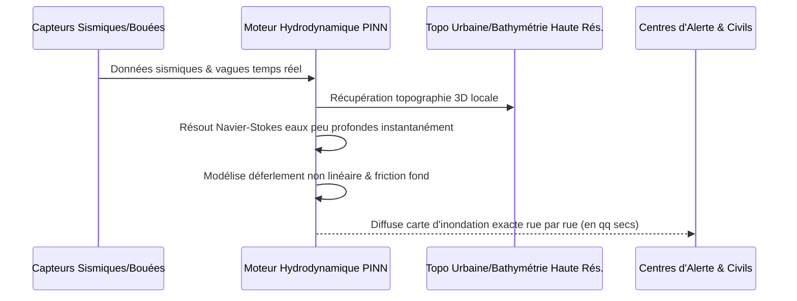

<!-- markdownlint-disable MD009 MD010 MD013 MD022 MD028 MD032 MD033 MD034 MD036 MD037 MD039 MD041 MD058 MD060 -->

[ 🇬🇧 English Version ](./README.md)

# Tsunami Hydro-Twin

> **Résumé exécutif :** Un jumeau numérique hydrodynamique propulsé par l'IA qui utilise des réseaux de neurones informés par la physique pour prédire en temps réel la hauteur des vagues de tsunami et les zones exactes d'inondation urbaine, sauvant ainsi des vies et des infrastructures.

---

## 1. Aperçu visuel & Effet Wahou

```mermaid
graph TD
    %% Schéma comparatif Problème vs Solution ou Flux d'architecture
    subgraph Systemes_Alerte_Actuels ["Systèmes d'alerte actuels"]
        A[Séisme Sous-marin] --> B[Modèles CPU / Tables précalculées]
        B --> C["Calcul lent (>15-30 mins)"]
        C --> D[Alertes vagues, Retards d'évacuation fatals]
    end
    subgraph Tsunami_HydroTwin ["Tsunami Hydro-Twin"]
        E[Séisme Sous-marin] --> F[Réseaux Neuronaux Informés par la Physique PINN]
        F --> G["Simulation hydrodynamique temps réel (<5s)"]
        G --> H[Carte d'inondation précise rue par rue]
        H --> I[Évacuations immédiates ciblées]
    end
```

## 2. La thèse contrariante (Peter Thiel Style)

**La croyance populaire :** Pour améliorer les alertes aux tsunamis, nous avons juste besoin de plus de capteurs dans l'océan et d'ordinateurs plus rapides pour exécuter des simulations de dynamique des fluides traditionnelles.

**La vérité cachée :** La dynamique des fluides traditionnelle (Navier-Stokes) est fondamentalement trop lente pour les interventions d'urgence, même sur des supercalculateurs. En entraînant l'IA non seulement sur des données, mais directement sur les lois de la physique (Physics-Informed Neural Networks), nous pouvons contourner le goulot d'étranglement informatique et simuler la propagation non linéaire des fluides sur une topographie urbaine complexe en quelques secondes, transformant instantanément de vagues alertes régionales en cartes de survie à l'échelle de la rue.

## 3. Le problème & La cible

**Modèle économique :** B2G

**Cible précise :** Systèmes d'alerte aux tsunamis (ex: PTWC), gouvernements côtiers, assurances, et gestionnaires d'infrastructures critiques côtières (centrales nucléaires, ports).

**La douleur urgente :** Lors d'un séisme sous-marin, les alertes tsunami actuelles reposent sur des modèles bathymétriques simplifiés et des tables précalculées. La prédiction de la hauteur exacte de la vague et de la zone d'inondation locale (run-up) prend trop de temps à calculer avec précision (souvent >15-30 mins). Cette latence et le manque de granularité locale entraînent de fausses alertes coûteuses ou, pire, des évacuations tardives fatales et la destruction d'infrastructures mal préparées.

## 4. Architecture technique & Plomberie

## 5. Modèle économique & Viabilité financière

| Métrique                    | Valeur                                                                          |
| :-------------------------- | :------------------------------------------------------------------------------ |
| Structure de prix           | Licence SaaS annuelle Entreprise/Gouv (par zone côtière surveillée)             |
| Objectif 12 mois            | 1-2 déploiements pilotes avec des centres d'alerte nationaux (ex. Japon, Chili) |
| Calcul du CA (Target 100k€) | 1 déploiement Pilote \* 100 000 € = 100k€ ARR                                   |
| Marge brute estimée         | 85% (Marges purement logicielles une fois le modèle entraîné par zone)          |

## 6. Moteur de distribution & Fossé défensif (Moat)

**Stratégie d'acquisition :** Ventes B2G de haut niveau ciblant les agences nationales de gestion des catastrophes et les organismes internationaux (UNESCO/COI). Piloter le système en parallèle des logiciels obsolètes existants pour démontrer la vitesse et la précision sans forcer un remplacement immédiat.

**Moat (Barrière à l'entrée) :** Les modèles d'IA météorologiques/statistiques standards ne peuvent pas capturer l'extrême non-linéarité de l'hydrodynamique côtière (déferlement, friction du fond, topographie urbaine). Les simulateurs CPU traditionnels sont précis mais beaucoup trop lents pour les urgences vitales. Le fossé réside dans la maîtrise des réseaux de neurones informés par la physique (PINNs) adaptés aux équations en eau peu profonde et dans l'intégration de données bathymétriques côtières à ultra-haute résolution, souvent classifiées.

## 7. Grille d'évaluation détaillée

| Critère                           | Score VC (/100) | Score Terrain (/100) |
| :-------------------------------- | :-------------- | :------------------- |
| Thèse & Monopole / Urgence        | -- / 25         | 22 / 25              |
| Moat / Résistance aux LLM natifs  | -- / 25         | 23 / 25              |
| Scalability / Friction d'adoption | -- / 25         | 15 / 25              |
| Unit Economics / ROI direct       | -- / 25         | 20 / 25              |
| **TOTAL**                         | **-- / 100**    | **80 / 100**         |

> **Verdict VC :** En attente d'évaluation.
> **Verdict Terrain :** Urgence modérée mais valeur stratégique à long terme. L'immunité aux LLM est bonne, reposant sur des modèles spécifiques. L'adoption présente des frictions notables qui pourraient ralentir la monétisation initiale.
