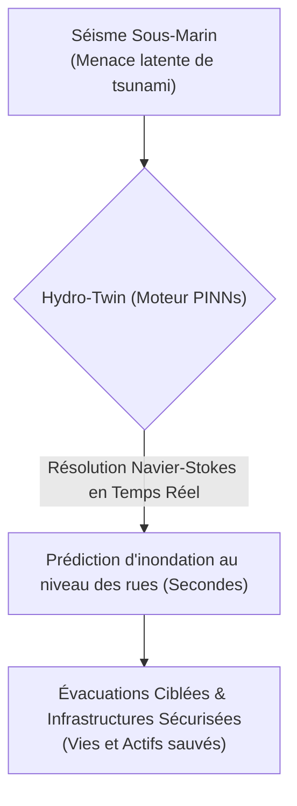
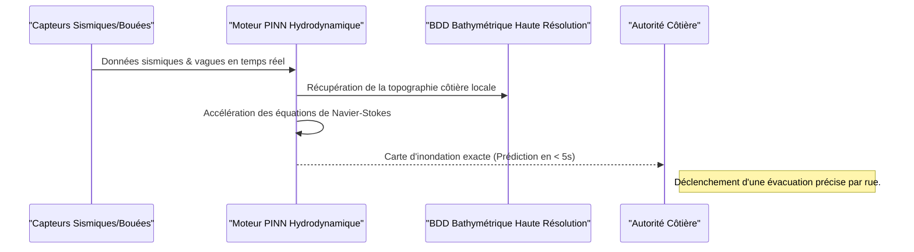

<!-- markdownlint-disable MD009 MD010 MD013 MD022 MD028 MD032 MD033 MD034 MD036 MD037 MD039 MD041 MD060 -->

[ 🇬🇧 English Version ](./README.md)

# Tsunami Hydro-Twin

> **Résumé exécutif :** Tsunami Hydro-Twin utilise des réseaux de neurones informés par la physique (PINNs) pour créer un jumeau numérique hydrodynamique en temps réel qui simule la propagation non linéaire des vagues, prédisant l'inondation côtière exacte rue par rue en quelques secondes pour éviter les évacuations tardives fatales.

---

## 1. Aperçu visuel & Effet Wahou

## 2. La thèse contrariante (Peter Thiel Style)

**La croyance populaire :** Les alertes tsunami doivent s'appuyer sur des tables de consultation précalculées ou sur des simulations de dynamique des fluides lentes et gourmandes en CPU qui prennent 30 minutes pour fournir un résultat précis.
**La vérité cachée :** Les simulateurs traditionnels sont précis mais mortellement lents, tandis que les modèles statistiques manquent de granularité locale. En utilisant l'IA (Physics-Informed Neural Networks) pour accélérer la résolution des équations de Navier-Stokes en eau peu profonde, nous pouvons obtenir une simulation de dynamique des fluides non linéaire en temps réel sur une bathymétrie haute résolution, offrant une précision au mètre près en quelques secondes au moment où cela compte le plus.

## 3. Le problème & La cible

**Modèle économique :** B2G
**Cible précise :** Systèmes d'alerte aux tsunamis (ex: PTWC), gouvernements côtiers, assurances, et gestionnaires d'infrastructures critiques côtières (centrales nucléaires, ports).
**La douleur urgente :** Lors d'un séisme sous-marin, les alertes tsunami actuelles reposent sur des modèles bathymétriques simplifiés. La prédiction de la hauteur exacte de la vague et de la zone d'inondation locale (run-up) prend trop de temps à calculer avec précision (souvent >15-30 mins). Cette latence et le manque de granularité locale entraînent de fausses alertes coûteuses ou, pire, des évacuations tardives fatales et la destruction d'infrastructures mal préparées.

## 4. Architecture technique & Plomberie

## 5. Modèle économique & Viabilité financière

| Métrique                | Valeur                                                                               |
| ----------------------- | ------------------------------------------------------------------------------------ |
| **Structure de prix**   | Licence SaaS Annuelle + Appels API pour la modélisation des risques d'assurance      |
| **Objectif 12 mois**    | 2 contrats avec des autorités côtières nationales/régionales (ex: Japon, Californie) |
| **Calcul du CA**        | 2 Contrats \* 75 000€/an                                                             |
| **Marge brute estimée** | >80%                                                                                 |

## 6. Moteur de distribution & Fossé défensif (Moat)

**Stratégie d'acquisition :** Ventes B2G directes ciblant les centres nationaux d'alerte aux catastrophes, soutenues par la validation académique de la précision du modèle PINN.
**Moat (Barrière à l'entrée) :** L'hydrodynamique côtière impliquant le déferlement, la friction du fond, et la topographie urbaine est extrêmement non-linéaire. Un SaaS météo standard ou un modèle statistique ne peut pas capturer ces dynamiques fluides complexes. L'architecture PINN propriétaire entraînée pour les équations en eau peu profonde offre un avantage de vitesse massif par rapport aux simulateurs CPU. De plus, l'acquisition et l'intégration de données bathymétriques côtières haute résolution (souvent classifiées) créent un fossé de données significatif.

## 7. Grille d'évaluation détaillée

| Critère                               | Score VC (/100) | Score Terrain (/100) |
| ------------------------------------- | --------------- | -------------------- |
| **Thèse & Monopole / Urgence**        | -- / 25         | -- / 25              |
| **Moat / Résistance aux LLM natifs**  | -- / 25         | -- / 25              |
| **Scalabilité / Friction d'adoption** | -- / 25         | -- / 25              |
| **Unit Economics / ROI direct**       | -- / 25         | -- / 25              |
| **TOTAL**                             | -- / 100        | -- / 100             |

> **Verdict VC :** En attente d'évaluation.
> **Verdict Terrain :** En attente d'évaluation.
