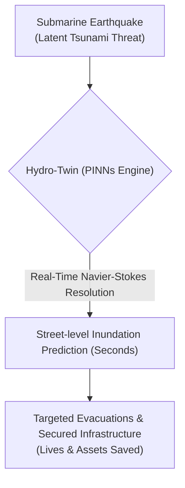
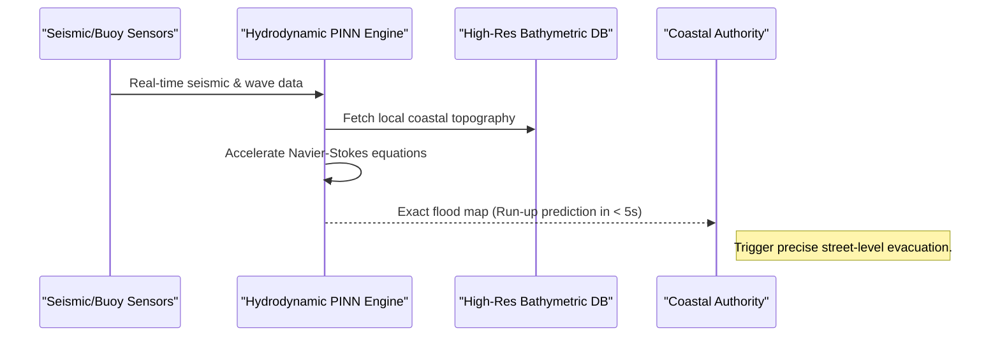

<!-- markdownlint-disable MD009 MD010 MD013 MD022 MD028 MD032 MD033 MD034 MD036 MD037 MD039 MD041 MD060 -->

[ 🇫🇷 Version Française ](./README.fr.md)

# Tsunami Hydro-Twin

> **Executive Summary:** Tsunami Hydro-Twin utilizes Physics-Informed Neural Networks (PINNs) to create a real-time hydrodynamic digital twin that simulates non-linear wave propagation, predicting exact coastal inundation (run-up) street-by-street in seconds to prevent fatal late evacuations.

---

## 1. Visual Overview & Wow Effect

## 2. Contrarian Thesis (Peter Thiel Style)

**Popular Belief:** Tsunami warnings must rely on pre-calculated lookup tables or slow, CPU-heavy fluid dynamics simulations that take 30 minutes to resolve accurately.
**Hidden Truth:** Traditional simulators are precise but lethally slow, while statistical models lack local granularity. By using AI (Physics-Informed Neural Networks) to accelerate the resolution of shallow-water Navier-Stokes equations, we can achieve real-time, non-linear fluid dynamics simulation on high-resolution bathymetry, delivering street-level accuracy in seconds when it matters most.

## 3. Problem & Target Market

**Business Model:** B2G
**Target Audience:** Tsunami warning systems (e.g., PTWC), coastal governments, insurance companies, and critical coastal infrastructure managers (nuclear plants, ports).
**Urgent Pain Point:** Following a submarine earthquake, current tsunami alerts rely on simplified bathymetric models. Predicting the exact wave height and local inundation zone (run-up) takes too much time to calculate accurately (>15-30 mins). This latency and lack of local granularity lead to costly false alarms or, worse, fatal late evacuations and the destruction of unprepared infrastructure.

## 4. Technical Architecture & Infrastructure

## 5. Business Model & Financial Viability

| Metric                     | Value                                                                            |
| -------------------------- | -------------------------------------------------------------------------------- |
| **Pricing Structure**      | Annual SaaS License + API calls for insurance risk modeling                      |
| **12-Month Target**        | 2 contracts with national/regional coastal authorities (e.g., Japan, California) |
| **Revenue Formula**        | 2 Contracts \* €75k/year                                                         |
| **Estimated Gross Margin** | >80%                                                                             |

## 6. Distribution Engine & Moat

**Acquisition Strategy:** Direct B2G sales targeting national disaster warning centers, backed by academic validation of the PINN model's accuracy.
**Moat (Defensibility):** Coastal hydrodynamics involving wave breaking, bottom friction, and urban topography are extremely non-linear. A standard weather SaaS or statistical model cannot capture these complex fluid dynamics. The proprietary PINN architecture trained for shallow-water equations provides a massive speed advantage over CPU simulators. Additionally, acquiring and integrating highly classified, high-resolution coastal bathymetric data creates a significant data moat.

## 7. Detailed Evaluation Grid

| Criterion                       | VC Score (/100) | Market Score (/100) |
| ------------------------------- | --------------- | ------------------- |
| **Thesis & Monopoly / Urgency** | -- / 25         | -- / 25             |
| **Moat / LLM Immunity**         | -- / 25         | -- / 25             |
| **Scalability / UX Friction**   | -- / 25         | -- / 25             |
| **Unit Economics / ROI**        | -- / 25         | -- / 25             |
| **TOTAL**                       | -- / 100        | -- / 100            |

> **VC Verdict:** Pending evaluation.
> **Market Verdict:** Pending evaluation.
