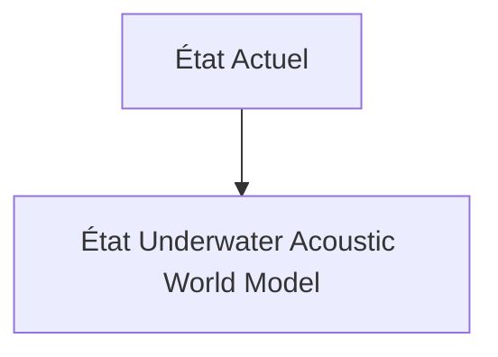
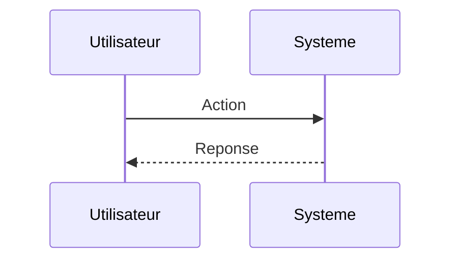

<!-- markdownlint-disable MD009 MD010 MD013 MD022 MD028 MD032 MD033 MD034 MD036 MD037 MD039 MD041 MD060 -->

[ 🇬🇧 English Version ](./README.md)

# Underwater Acoustic World Model

> **Résumé exécutif :** Création d'un "World Model" spatio-temporel génératif spécialisé dans la propagation acoustique non linéaire en milieu marin. Il ingère des données sonar brutes dispersées, des profils de célérité du son (température/salinité) et des données bathymétriques pour synthétiser un jumeau numérique 3D en temps réel de l'environnement sous-marin, prédisant l'état des infrastructures et identifiant les anomalies malgré un très faible ratio signal/bruit.

---

## 1. Aperçu visuel & Effet Wahou

## 2. La thèse contrariante (Peter Thiel Style)

**La croyance populaire :** Les solutions généralistes IA peuvent résoudre ce problème.

**La vérité cachée :** Les modèles de vision par ordinateur standards (LLaVA, etc.) ne fonctionnent pas sur les données acoustiques sous-marines. Les moteurs physiques classiques (Unity, Unreal) ne modélisent pas la réfraction acoustique complexe et les effets de trajets multiples de l'eau profonde. Il faut un Neural Physics Engine propriétaire entraîné sur des données acoustiques maritimes spécifiques.

## 3. Le problème & La cible

**Modèle économique :** B2B / B2G

**Cible précise :** Opérateurs d'infrastructures critiques sous-marines (câbles télécoms, pipelines, parcs éoliens offshore) et marines nationales (défense).

**La douleur urgente :** L'inspection et la surveillance des infrastructures sous-marines profondes sont extrêmement coûteuses, lentes (utilisation de ROV/AUV) et limitées par la visibilité optique nulle et la distorsion acoustique imprévisible. Les anomalies structurelles ou les intrusions sont souvent détectées trop tard, entraînant des ruptures catastrophiques (ex: sabotage de pipelines, coupure de câbles internet) avec des coûts de réparation se chiffrant en dizaines de millions d'euros par incident.

## 4. Architecture technique & Plomberie

## 5. Modèle économique & Viabilité financière

| Métrique                    | Valeur                        |
| --------------------------- | ----------------------------- |
| Structure de prix           | Abonnement SaaS               |
| Objectif 12 mois            | 10 clients                    |
| Calcul du CA (Target 100k€) | 10 clients \* 10k€/an = 100k€ |
| Marge brute estimée         | 80%                           |

## 6. Moteur de distribution & Fossé défensif (Moat)

**Stratégie d'acquisition :** Vente directe B2B

**Moat (Barrière à l'entrée) :** Accès limité aux jeux de données de sonars militaires ou industriels de haute qualité. Complexité de calcul immense nécessitant du calcul edge performant sur les AUV pour un traitement en temps réel. Forte barrière réglementaire et de sécurité (données classifiées).

## 7. Grille d'évaluation détaillée

| Critère                           | Score VC (/100) | Score Terrain (/100) |
| --------------------------------- | --------------- | -------------------- |
| Thèse & Monopole / Urgence        | -- / 25         | -- / 25              |
| Moat / Résistance aux LLM natifs  | -- / 25         | -- / 25              |
| Scalabilité / Friction d'adoption | -- / 25         | -- / 25              |
| Unit Economics / ROI direct       | -- / 25         | -- / 25              |
| **TOTAL**                         | **-- / 100**    | **-- / 100**         |

> **Verdict VC :** En attente d'évaluation.

> **Verdict Terrain :** En attente d'évaluation.
