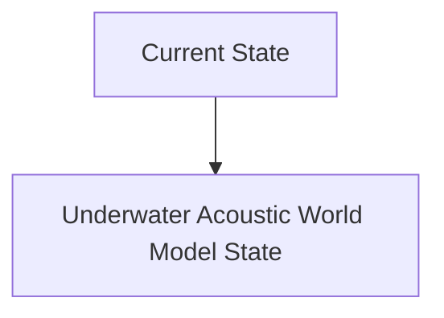
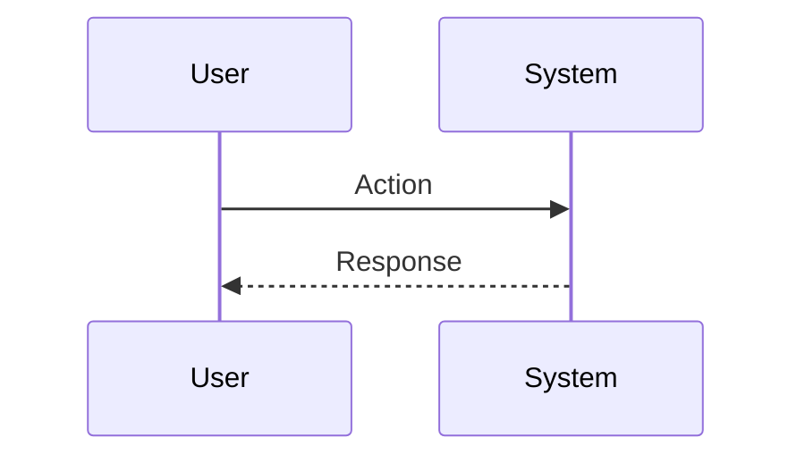

<!-- markdownlint-disable MD009 MD010 MD013 MD022 MD028 MD032 MD033 MD034 MD036 MD037 MD039 MD041 MD060 -->

[ 🇫🇷 Version Française ](./README.fr.md)

# Underwater Acoustic World Model

> **Executive Summary:** Creation of a generative spatio-temporal "World Model" specialized in non-linear acoustic propagation in a marine environment. It ingests scattered raw sonar data, sound velocity profiles (temperature/salinity) and bathymetric data to synthesize a real-time 3D digital twin of the underwater environment, predicting infrastructure status and identifying anomalies despite a very low signal-to-noise ratio.

---

## 1. Visual Overview & Wow Effect

## 2. Contrarian Thesis (Peter Thiel Style)

**Popular Belief:** General AI solutions can solve this problem.

**Hidden Truth:** Standard computer vision models (LLaVA, etc.) do not work on underwater acoustic data. Classic physics engines (Unity, Unreal) do not model the complex acoustic refraction and multipath effects of deep water. It requires a proprietary Neural Physics Engine trained on specific maritime acoustic data.

## 3. Problem & Target Market

**Business Model:** B2B / B2G

**Target Audience:** Underwater critical infrastructure operators (telecom cables, pipelines, offshore wind farms) and national navies (defense).

**Urgent Pain Point:** Inspection and monitoring of deep underwater infrastructure is extremely expensive, slow (use of ROV/AUV) and limited by zero optical visibility and unpredictable acoustic distortion. Structural anomalies or intrusions are often detected too late, leading to catastrophic failures (e.g. sabotage of pipelines, cutting of internet cables) with repair costs running into tens of millions of euros per incident.

## 4. Technical Architecture & Infrastructure

## 5. Business Model & Financial Viability

| Metric                 | Value                           |
| ---------------------- | ------------------------------- |
| Pricing Structure      | SaaS subscription               |
| 12-Month Target        | 10 customers                    |
| Revenue Formula        | 10 clients \* 10k€/year = 100k€ |
| Estimated Gross Margin | 80%                             |

## 6. Distribution Engine & Moat

**Acquisition Strategy:** B2B direct sales

**Moat (Defensibility):** Limited access to high quality military or industrial sonar datasets. Immense computational complexity requiring high-performance edge computing on AUVs for real-time processing. Strong regulatory and security barrier (classified data).

## 7. Detailed Evaluation Grid

| Criterion                   | VC Score (/100) | Market Score (/100) |
| --------------------------- | --------------- | ------------------- |
| Thesis & Monopoly / Urgency | -- / 25         | -- / 25             |
| Moat / LLM Immunity         | -- / 25         | -- / 25             |
| Scalability / UX Friction   | -- / 25         | -- / 25             |
| Unit Economics / ROI        | -- / 25         | -- / 25             |
| **TOTAL**                   | **-- / 100**    | **-- / 100**        |

> **VC Verdict:** Pending evaluation.

> **Market Verdict:** Pending evaluation.
