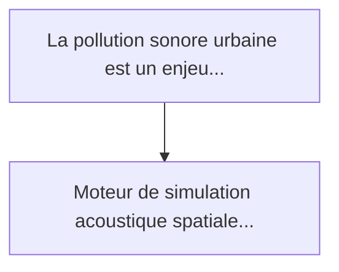
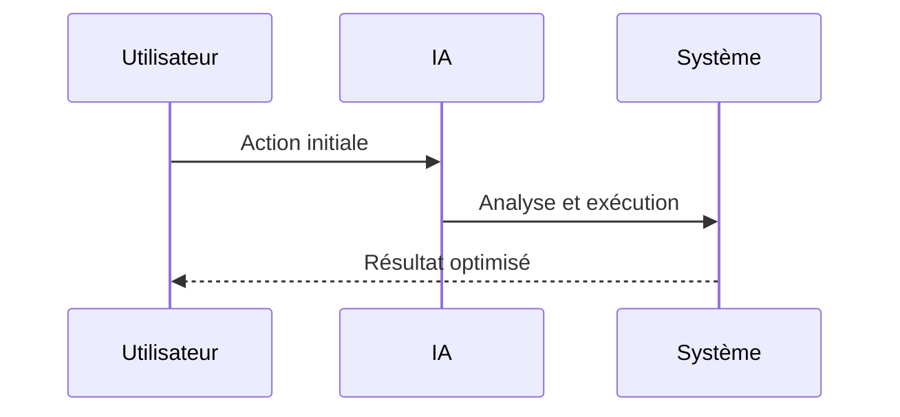

<!-- markdownlint-disable MD013 MD028 MD033 MD039 MD041 -->

[🇬🇧 English Version](./README.md)

# Urban Acoustic Neural Twin

> **Résumé exécutif :** Moteur de simulation acoustique spatiale à l'échelle d'une ville (Neural Twin) utilisant des réseaux de neurones informés par la physique (PINNs) p...

---

## 1. Aperçu visuel & Effet Wahou

## 2. La thèse contrariante (Peter Thiel Style)

La croyance populaire : Les solutions génériques peuvent résoudre cela.
La vérité cachée : Les méthodes numériques traditionnelles (Boundary Element Method) ne scalent pas à la taille d'une métropole. Un LLM ou un SaaS standard n'a aucune compréhension des équations différentielles partielles régissant la physique ondulatoire et la diffraction dans des géométries urbaines complexes.

## 3. Le problème & La cible

Modèle économique : B2G / B2B
Cible précise : Municipalités, urbanistes, constructeurs de transports (métros, tramways), et promoteurs immobiliers.
La douleur urgente : La pollution sonore urbaine est un enjeu majeur de santé publique, réduisant l'espérance de vie et causant des maladies cardiovasculaires. Les simulations acoustiques actuelles (Ray Tracing audio) prennent des jours de calcul, sont limitées à de petites zones et échouent à modéliser la réflexion sonore complexe des nouveaux matériaux de construction.

## 4. Architecture technique & Plomberie

## 5. Modèle économique & Viabilité financière

| Métrique                    | Valeur             |
| --------------------------- | ------------------ |
| Structure de prix           | Prix sur mesure    |
| Objectif 12 mois            | 100 clients        |
| Calcul du CA (Target 100k€) | 100 \* 1000 = 100k |
| Marge brute estimée         | 80%                |

## 6. Moteur de distribution & Fossé défensif (Moat)

Stratégie d'acquisition : Vente B2B directe
Moat (Barrière à l'entrée) : Les méthodes numériques traditionnelles (Boundary Element Method) ne scalent pas à la taille d'une métropole. Un LLM ou un SaaS standard n'a aucune compréhension des équations différentielles partielles régissant la physique ondulatoire et la diffraction dans des géométries urbaines complexes.

## 7. Grille d'évaluation détaillée

| Critère                           | Score VC (/100) | Score Terrain (/100) |
| --------------------------------- | --------------- | -------------------- |
| Thèse & Monopole / Urgence        | -- / 25         | -- / 25              |
| Moat / Résistance aux LLM natifs  | -- / 25         | -- / 25              |
| Scalabilité / Friction d'adoption | -- / 25         | -- / 25              |
| Unit Economics / ROI direct       | -- / 25         | -- / 25              |
| **TOTAL**                         | **-- / 100**    | **-- / 100**         |

> **Verdict VC :** En attente d'évaluation.

> **Verdict Terrain :** En attente d'évaluation.
