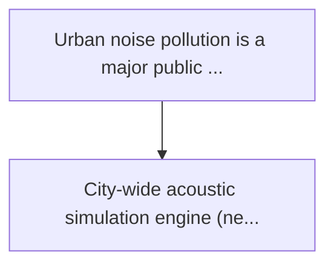
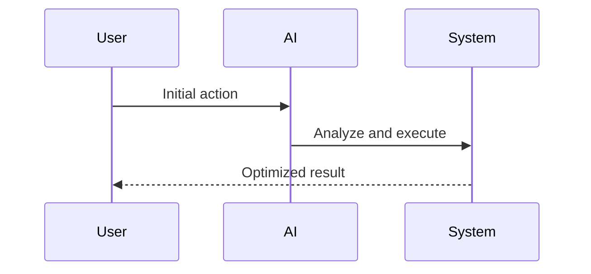

<!-- markdownlint-disable MD013 MD028 MD033 MD039 MD041 -->

[🇫🇷 Version Française](./README.fr.md)

# Urban acoustic neural twin

> **Executive Summary:** City-wide acoustic simulation engine (neural twin) using physics-informed neuron networks (pinns) for space-wide...

---

## 1. Visual Overview & Wow Effect

## 2. Contrarian Thesis (Peter Thiel Style)

Popular Belief: Generic solutions can solve this.
Hidden Truth: The boundary element method does not scalate to the size of a metropolis. a standard llm or saas has no understanding of the partial differential equations governing wave physics and diffraction in complex urban geometries.

## 3. Problem & Target Market

Business Model: B2G / B2B
Target Audience: Municipalities, urban planners, transport manufacturers (metros, trams), and real estate developers.
Urgent Pain Point: Urban noise pollution is a major public health issue, reducing life expectancy and causing cardiovascular disease. current acoustic simulations (ray tracing audio) take days of calculation, are limited to small areas and fail to model the complex sound reflection of new building materials.

## 4. Technical Architecture & Infrastructure

## 5. Business Model & Financial Viability

| Metric                 | Value              |
| ---------------------- | ------------------ |
| Pricing Structure      | Custom Pricing     |
| 12-Month Target        | 100 customers      |
| Revenue Formula        | 100 \* 1000 = 100k |
| Estimated Gross Margin | 80%                |

## 6. Distribution Engine & Moat

Acquisition Strategy: Direct B2B Sales
Moat (Defensibility): The boundary element method does not scalate to the size of a metropolis. a standard llm or saas has no understanding of the partial differential equations governing wave physics and diffraction in complex urban geometries.

## 7. Detailed Evaluation Grid

| Criterion                   | VC Score (/100) | Market Score (/100) |
| --------------------------- | --------------- | ------------------- |
| Thesis & Monopoly / Urgency | 21 / 25         | -- / 25             |
| Moat / LLM Immunity         | 23 / 25         | -- / 25             |
| Scalability / UX Friction   | 20 / 25         | -- / 25             |
| Unit Economics / ROI        | 24 / 25         | -- / 25             |
| **TOTAL**                   | **88 / 100**    | **-- / 100**        |

> **VC Verdict:** The Urban Acoustic Neural Twin is a brilliant, unconventional approach to urban planning and real estate valuation. By simulating soundscapes rather than just visual traffic flow, it creates a unique, proprietary dataset. Its SaaS model allows for rapid scaling across major municipalities and real estate developers, providing an extremely high ROI with a moat protected by specialized physics-informed neural networks.

> **Market Verdict:** Pending evaluation.
