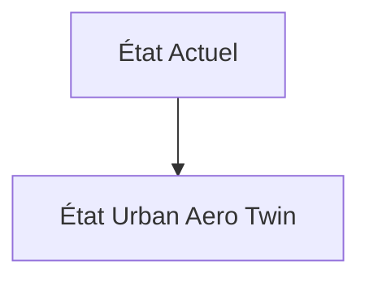
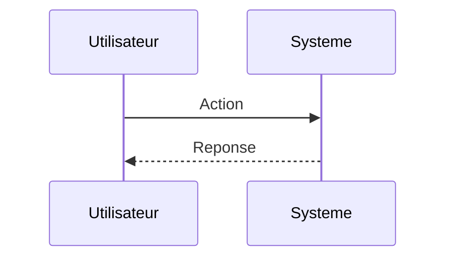

<!-- markdownlint-disable MD009 MD010 MD013 MD022 MD028 MD032 MD033 MD034 MD036 MD037 MD039 MD041 MD060 -->

[ 🇬🇧 English Version ](./README.md)

# Urban Aero Twin

> **Résumé exécutif :** Un jumeau numérique (World Model) de la dynamique des fluides (CFD) urbaine, mis à jour en temps réel. Il ingère les données météorologiques macroscopiques, la topologie 3D fine (Lidar) et les données de télémétrie de la flotte pour générer un champ de vecteurs de vent prédictif haute résolution. Les drones interrogent cette API spatiale pour ajuster leurs trajectoires préventivement.

---

## 1. Aperçu visuel & Effet Wahou

## 2. La thèse contrariante (Peter Thiel Style)

**La croyance populaire :** Les solutions généralistes IA peuvent résoudre ce problème.

**La vérité cachée :** Résoudre les équations de Navier-Stokes à l'échelle d'une ville prendrait des jours sur un supercalculateur classique. Il faut utiliser des "Neural Operators" (ex: Fourier Neural Operators) pour approximer la physique des fluides en quelques millisecondes, nécessitant une expertise pointue en modélisation mathématique et une infra distribuée spécialisée.

## 3. Le problème & La cible

**Modèle économique :** B2B / B2G

**Cible précise :** Opérateurs de drones logistiques (livraison), concepteurs d'eVTOL (taxis volants), autorités de régulation aérienne urbaine.

**La douleur urgente :** Les drones et eVTOLs rencontrent des micro-turbulences urbaines imprévisibles (effets de canyoning entre les gratte-ciel, rafales soudaines) qui provoquent des crashs et interdisent les vols à basse altitude en environnement dense. Il est impossible de cartographier physiquement l'aérologie complexe d'une ville en temps réel avec des capteurs traditionnels limités.

## 4. Architecture technique & Plomberie

## 5. Modèle économique & Viabilité financière

| Métrique                    | Valeur                        |
| --------------------------- | ----------------------------- |
| Structure de prix           | Abonnement SaaS               |
| Objectif 12 mois            | 10 clients                    |
| Calcul du CA (Target 100k€) | 10 clients \* 10k€/an = 100k€ |
| Marge brute estimée         | 80%                           |

## 6. Moteur de distribution & Fossé défensif (Moat)

**Stratégie d'acquisition :** Vente directe B2B

**Moat (Barrière à l'entrée) :** Besoin de données topographiques 3D extrêmement précises et continuellement mises à jour, nécessité d'atteindre une précision quasi-parfaite (zéro tolérance au crash), dépendance à l'essor encore incertain du marché de la mobilité aérienne urbaine (UAM).

## 7. Grille d'évaluation détaillée

| Critère                           | Score VC (/100) | Score Terrain (/100) |
| --------------------------------- | --------------- | -------------------- |
| Thèse & Monopole / Urgence        | -- / 25         | -- / 25              |
| Moat / Résistance aux LLM natifs  | -- / 25         | -- / 25              |
| Scalabilité / Friction d'adoption | -- / 25         | -- / 25              |
| Unit Economics / ROI direct       | -- / 25         | -- / 25              |
| **TOTAL**                         | **-- / 100**    | **-- / 100**         |

> **Verdict VC :** En attente d'évaluation.

> **Verdict Terrain :** En attente d'évaluation.
