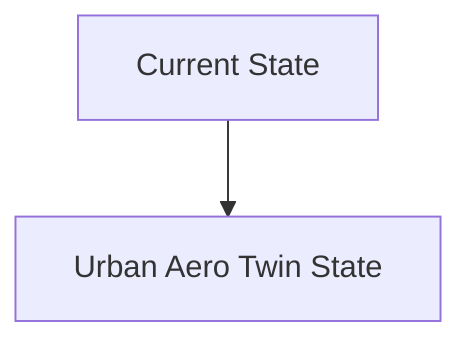
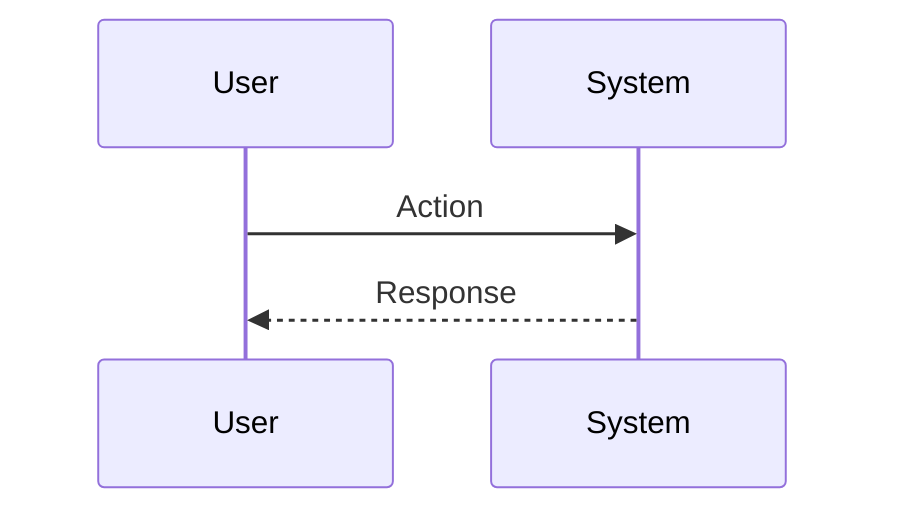

<!-- markdownlint-disable MD009 MD010 MD013 MD022 MD028 MD032 MD033 MD034 MD036 MD037 MD039 MD041 MD060 -->

[ 🇫🇷 Version Française ](./README.fr.md)

# Urban Aero Twin

> **Executive Summary:** A digital twin (World Model) of urban fluid dynamics (CFD), updated in real time. It ingests macroscopic weather data, fine 3D topology (Lidar), and fleet telemetry data to generate a high-resolution predictive wind vector field. The drones interrogate this spatial API to adjust their trajectories preventively.

---

## 1. Visual Overview & Wow Effect

## 2. Contrarian Thesis (Peter Thiel Style)

**Popular Belief:** General AI solutions can solve this problem.

**Hidden Truth:** Solving the Navier-Stokes equations on a city scale would take days on a typical supercomputer. It is necessary to use “Neural Operators” (e.g. Fourier Neural Operators) to approximate the physics of fluids in a few milliseconds, requiring advanced expertise in mathematical modeling and specialized distributed infrastructure.

## 3. Problem & Target Market

**Business Model:** B2B / B2G

**Target Audience:** Logistics drone operators (delivery), eVTOL designers (flying taxis), urban air regulation authorities.

**Urgent Pain Point:** Drones and eVTOLs encounter unpredictable urban micro-turbulences (canyoning effects between skyscrapers, sudden gusts) which cause crashes and prohibit low-altitude flights in dense environments. It is impossible to physically map the complex aerology of a city in real time with limited traditional sensors.

## 4. Technical Architecture & Infrastructure

## 5. Business Model & Financial Viability

| Metric                 | Value                           |
| ---------------------- | ------------------------------- |
| Pricing Structure      | SaaS subscription               |
| 12-Month Target        | 10 customers                    |
| Revenue Formula        | 10 clients \* 10k€/year = 100k€ |
| Estimated Gross Margin | 80%                             |

## 6. Distribution Engine & Moat

**Acquisition Strategy:** B2B direct sales

**Moat (Defensibility):** Need for extremely precise and continuously updated 3D topographical data, need to achieve near-perfect precision (zero crash tolerance), dependence on the still uncertain growth of the urban air mobility (UAM) market.

## 7. Detailed Evaluation Grid

| Criterion                   | VC Score (/100) | Market Score (/100) |
| --------------------------- | --------------- | ------------------- |
| Thesis & Monopoly / Urgency | -- / 25         | -- / 25             |
| Moat / LLM Immunity         | -- / 25         | -- / 25             |
| Scalability / UX Friction   | -- / 25         | -- / 25             |
| Unit Economics / ROI        | -- / 25         | -- / 25             |
| **TOTAL**                   | **-- / 100**    | **-- / 100**        |

> **VC Verdict:** Pending evaluation.

> **Market Verdict:** Pending evaluation.
