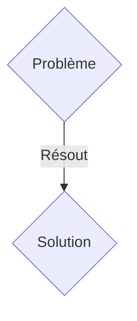
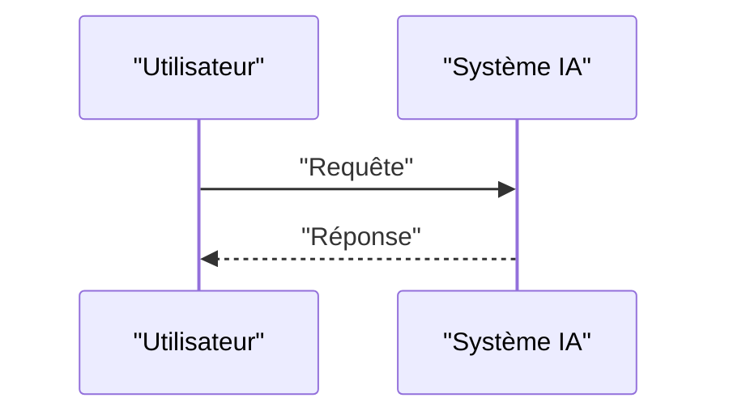

<!-- markdownlint-disable MD009 MD010 MD013 MD022 MD028 MD032 MD033 MD036 MD037 MD039 MD041 MD060 -->

[ 🇬🇧 English Version ](./README.md)

# Urban Quantum Engine

> **Résumé exécutif :** Une solution B2G / B2B / M2M ciblant Gestionnaires d'infrastructures urbaines (réseaux électriques, eau, trafic urbain), opérateurs de réseaux critiques et planificateurs de Smart Cities. pour résoudre : Les infrastructures urbaines actuelles gèrent les incidents de manière réactive et en silo. Une défaillance mineure (ex: surcharge locale du réseau électrique) provoque des réactions en chaîne incontrôlables (panne des feux de signalisation, engorgement logistique, défaillance des hôpitaux). Les simulateurs classiques sont incapables de calculer ces effets papillons en temps réel, entraînant un gaspillage massif de ressources et des temps d'arrêt critiques.

---

## 1. Aperçu visuel & Effet Wahou

## 2. La thèse contrariante (Peter Thiel Style)

- **La croyance populaire :** Les solutions génériques suffisent.
- **La vérité cachée :** Un réseau de capteurs Edge (Hardware propriétaire à très basse consommation) qui alimente un "World Model" physique de la ville. Ce modèle est accéléré par des algorithmes d'informatique quantique (Quantum-inspired / Quantum Annealing) pour simuler les dynamiques fluides et électriques en temps réel. Le système interagit de machine à machine (M2M) pour ajuster les charges électriques et le trafic de manière autonome et prédictive.

## 3. Le problème & La cible

- **Modèle économique :** B2G / B2B / M2M
- **Cible précise :** Gestionnaires d'infrastructures urbaines (réseaux électriques, eau, trafic urbain), opérateurs de réseaux critiques et planificateurs de Smart Cities.
- **La douleur urgente :** Les infrastructures urbaines actuelles gèrent les incidents de manière réactive et en silo. Une défaillance mineure (ex: surcharge locale du réseau électrique) provoque des réactions en chaîne incontrôlables (panne des feux de signalisation, engorgement logistique, défaillance des hôpitaux). Les simulateurs classiques sont incapables de calculer ces effets papillons en temps réel, entraînant un gaspillage massif de ressources et des temps d'arrêt critiques.

## 4. Architecture technique & Plomberie

Un réseau de capteurs Edge (Hardware propriétaire à très basse consommation) qui alimente un "World Model" physique de la ville. Ce modèle est accéléré par des algorithmes d'informatique quantique (Quantum-inspired / Quantum Annealing) pour simuler les dynamiques fluides et électriques en temps réel. Le système interagit de machine à machine (M2M) pour ajuster les charges électriques et le trafic de manière autonome et prédictive.

## 5. Modèle économique & Viabilité financière

| Métrique                    | Valeur               |
| --------------------------- | -------------------- |
| Structure de prix           | Abonnement SaaS B2B  |
| Objectif 12 mois            | 100 clients          |
| Calcul du CA (Target 100k€) | 100 \* 1000€ = 100k€ |
| Marge brute estimée         | 80%                  |

## 6. Moteur de distribution & Fossé défensif (Moat)

- **Stratégie d'acquisition :** Vente directe et partenariats stratégiques.
- **Moat (Barrière à l'entrée) :** Les LLM textuels n'ont aucune compréhension de la géométrie, de la physique ou des lois de la thermodynamique. Ils ne peuvent pas résoudre des problèmes d'optimisation combinatoire NP-difficiles en quelques millisecondes, ni s'interfacer directement avec des actionneurs industriels via des réseaux bas-niveau (SCADA, LoRaWAN) pour agir sur le monde physique.

## 7. Grille d'évaluation détaillée

| Critère                           | Score VC (/100) | Score Terrain (/100) |
| --------------------------------- | --------------- | -------------------- |
| Thèse & Monopole / Urgence        | -- / 25         | -- / 25              |
| Moat / Résistance aux LLM natifs  | -- / 25         | -- / 25              |
| Scalabilité / Friction d'adoption | -- / 25         | -- / 25              |
| Unit Economics / ROI direct       | -- / 25         | -- / 25              |
| TOTAL                             | -- / 100        | -- / 100             |

> **Verdict VC :** En attente d'évaluation.
> **Verdict Terrain :** En attente d'évaluation.
