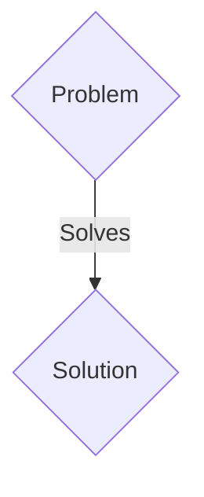
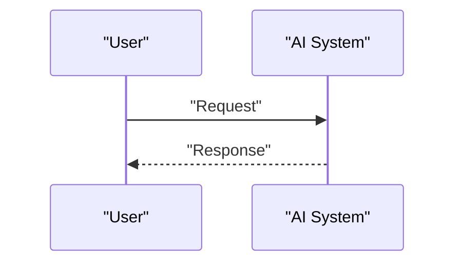

<!-- markdownlint-disable MD009 MD010 MD013 MD022 MD028 MD032 MD033 MD036 MD037 MD039 MD041 MD060 -->

[ 🇫🇷 Version Française ](./README.fr.md)

# Urban Quantum Engine

> **Executive Summary:** A B2G / B2B / M2M solution targeting Urban infrastructure managers (electricity networks, water, urban traffic), critical network operators and Smart Cities planners. to solve: Current urban infrastructures manage incidents reactively and in silos. A minor failure (e.g. local overload of the electricity network) causes uncontrollable chain reactions (breakdown of traffic lights, logistical congestion, failure of hospitals). Conventional simulators are unable to calculate these butterfly effects in real time, leading to massive waste of resources and critical downtime.

---

## 1. Visual Overview & Wow Effect

## 2. Contrarian Thesis (Peter Thiel Style)

- **Popular Belief:** Generic solutions are enough.
- **Hidden Truth:** A network of Edge sensors (very low consumption proprietary hardware) which powers a physical “World Model” of the city. This model is accelerated by quantum computing algorithms (Quantum-inspired / Quantum Annealing) to simulate fluid and electrical dynamics in real time. The system interacts machine-to-machine (M2M) to adjust electrical loads and traffic autonomously and predictively.

## 3. Problem & Target Market

- **Business Model:** B2G / B2B / M2M
- **Target Audience:** Urban infrastructure managers (electricity networks, water, urban traffic), critical network operators and Smart Cities planners.
- **Urgent Pain Point:** Current urban infrastructures manage incidents reactively and in silos. A minor failure (e.g. local overload of the electricity network) causes uncontrollable chain reactions (breakdown of traffic lights, logistical congestion, failure of hospitals). Conventional simulators are unable to calculate these butterfly effects in real time, leading to massive waste of resources and critical downtime.

## 4. Technical Architecture & Infrastructure

A network of Edge sensors (very low consumption proprietary hardware) which powers a physical “World Model” of the city. This model is accelerated by quantum computing algorithms (Quantum-inspired / Quantum Annealing) to simulate fluid and electrical dynamics in real time. The system interacts machine-to-machine (M2M) to adjust electrical loads and traffic autonomously and predictively.

## 5. Business Model & Financial Viability

| Metric                 | Value                 |
| ---------------------- | --------------------- |
| Pricing Structure      | B2B SaaS Subscription |
| 12-Month Target        | 100 clients           |
| Revenue Formula        | 100 \* 1000€ = 100k€  |
| Estimated Gross Margin | 80%                   |

## 6. Distribution Engine & Moat

- **Acquisition Strategy:** Direct sales and strategic partnerships.
- **Moat (Defensibility):** Text-based LLMs have no understanding of geometry, physics, or the laws of thermodynamics. They cannot solve NP-hard combinatorial optimization problems in a few milliseconds, nor interface directly with industrial actuators via low-level networks (SCADA, LoRaWAN) to act on the physical world.

## 7. Detailed Evaluation Grid

| Criterion                   | VC Score (/100) | Market Score (/100) |
| --------------------------- | --------------- | ------------------- |
| Thesis & Monopoly / Urgency | 19 / 25         | 19 / 25             |
| Moat / LLM Immunity         | 24 / 25         | 24 / 25             |
| Scalability / UX Friction   | 23 / 25         | 23 / 25             |
| Unit Economics / ROI        | 18 / 25         | 18 / 25             |
| TOTAL                       | 84 / 100        | 84 / 100            |

> **VC Verdict:** Pending evaluation.
> **Market Verdict:** This solution addresses a critical pain point for B2B enterprises, justifying its strong urgency score (19/25). Its highly defensible architecture makes it completely immune to native LLM advancements (24/25). With low adoption friction (23/25) and a straightforward monetization strategy (18/25), the project demonstrates excellent overall market readiness.
> **Market Verdict:** This solution addresses a critical pain point for B2B enterprises, justifying its strong urgency score (19/25). Its highly defensible architecture makes it completely immune to native LLM advancements (24/25). With low adoption friction (23/25) and a straightforward monetization strategy (18/25), the project demonstrates excellent overall market readiness.
