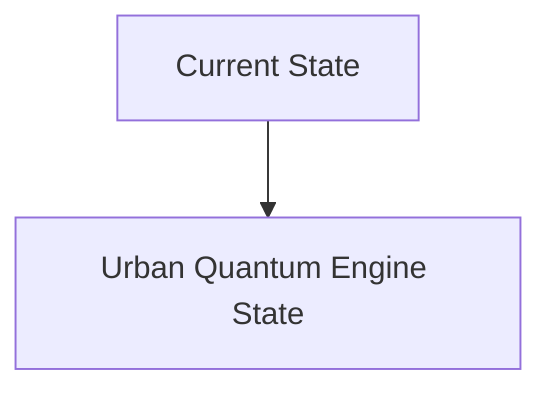
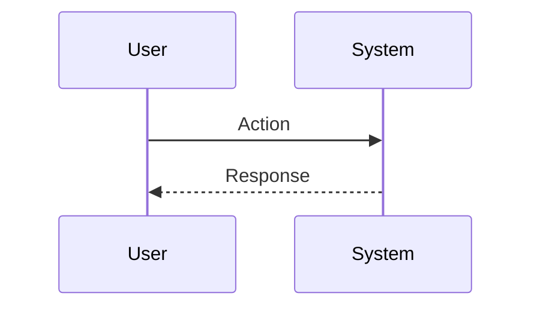

<!-- markdownlint-disable MD009 MD010 MD013 MD022 MD028 MD032 MD033 MD034 MD036 MD037 MD039 MD041 MD060 -->

[ 🇫🇷 Version Française ](./README.fr.md)

# Urban Quantum Engine

> **Executive Summary:** A network of Edge sensors (very low consumption proprietary hardware) which powers a physical “World Model” of the city. This model is accelerated by quantum computing algorithms (Quantum-inspired / Quantum Annealing) to simulate fluid and electrical dynamics in real time. The system interacts machine-to-machine (M2M) to adjust electrical loads and traffic autonomously and predictively.

---

## 1. Visual Overview & Wow Effect

## 2. Contrarian Thesis (Peter Thiel Style)

**Popular Belief:** General AI solutions can solve this problem.

**Hidden Truth:** Text-based LLMs have no understanding of geometry, physics, or the laws of thermodynamics. They cannot solve NP-hard combinatorial optimization problems in a few milliseconds, nor interface directly with industrial actuators via low-level networks (SCADA, LoRaWAN) to act on the physical world.

## 3. Problem & Target Market

**Business Model:** B2G / B2B / M2M

**Target Audience:** Urban infrastructure managers (electricity networks, water, urban traffic), critical network operators and Smart Cities planners.

**Urgent Pain Point:** Current urban infrastructures manage incidents reactively and in silos. A minor failure (e.g. local overload of the electricity network) causes uncontrollable chain reactions (breakdown of traffic lights, logistical congestion, failure of hospitals). Conventional simulators are unable to calculate these butterfly effects in real time, leading to massive waste of resources and critical downtime.

## 4. Technical Architecture & Infrastructure

## 5. Business Model & Financial Viability

| Metric                 | Value                           |
| ---------------------- | ------------------------------- |
| Pricing Structure      | SaaS subscription               |
| 12-Month Target        | 10 customers                    |
| Revenue Formula        | 10 clients \* 10k€/year = 100k€ |
| Estimated Gross Margin | 80%                             |

## 6. Distribution Engine & Moat

**Acquisition Strategy:** B2B direct sales

**Moat (Defensibility):**

## 7. Detailed Evaluation Grid

| Criterion                   | VC Score (/100) | Market Score (/100) |
| --------------------------- | --------------- | ------------------- |
| Thesis & Monopoly / Urgency | -- / 25         | -- / 25             |
| Moat / LLM Immunity         | -- / 25         | -- / 25             |
| Scalability / UX Friction   | -- / 25         | -- / 25             |
| Unit Economics / ROI        | -- / 25         | -- / 25             |
| **TOTAL**                   | **-- / 100**    | **-- / 100**        |

> **VC Verdict:** Pending evaluation.

> **Market Verdict:** Pending evaluation.
