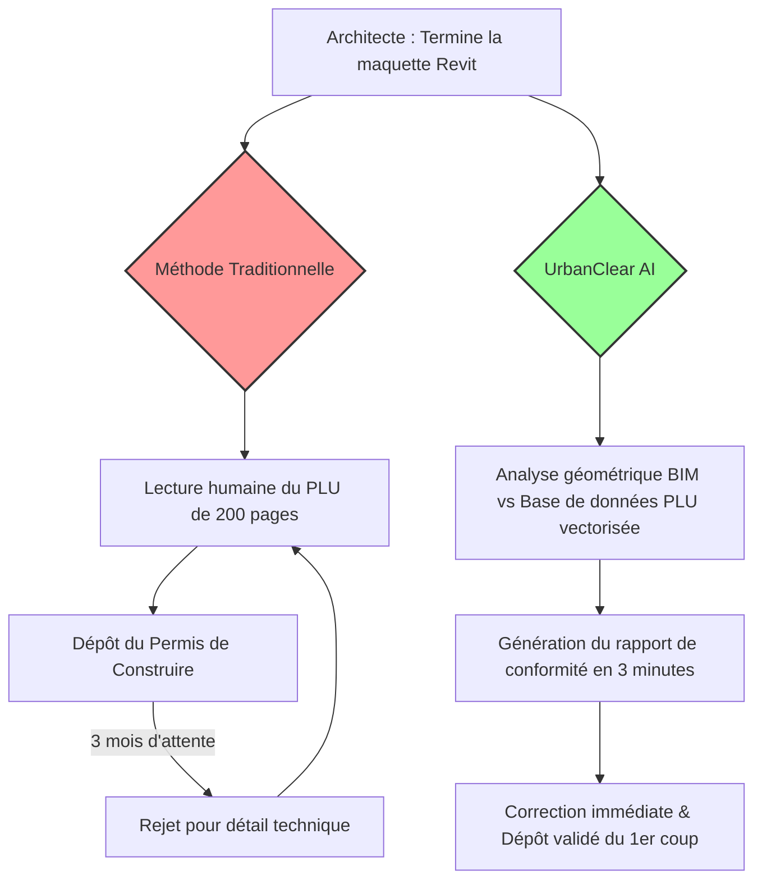
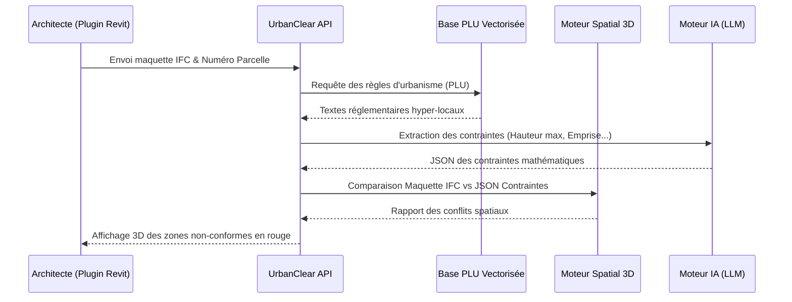

<!-- markdownlint-disable MD013 MD033 -->

# UrbanClear AI

> **Résumé exécutif :** UrbanClear AI automatise la pré-validation légale et architecturale des permis de construire en confrontant directement les maquettes BIM aux Plans Locaux d'Urbanisme (PLU). En réduisant les rejets administratifs, il fait gagner des mois de procédures aux promoteurs et architectes.


---

## 1. Aperçu visuel



## 2. La thèse contrariante (Peter Thiel Style)

**La croyance populaire :**L'intelligence artificielle dans l'architecture sert principalement à générer des rendus visuels époustouflants, de l'idéation de concept ou des plans d'aménagement d'intérieur.
**La vérité cachée :**Le véritable goulot d'étranglement de l'immobilier, causant des milliards de pertes, n'est pas la conception créative mais la conformité légale hyper-locale (les PLU). Celui qui parvient à structurer les données légales géolocalisées et à les confronter aux géométries 3D détient le monopole du temps de développement immobilier.

## 3. Le problème & La cible

**Modèle économique :**B2B
**Cible précise :**Cabinets d'architecture (10-50 employés), promoteurs immobiliers régionaux et nationaux, bureaux d'études.
**La douleur urgente :**Un permis rejeté pour un détail (ex: la pente du toit dépasse l'angle maximal de 2 degrés à 4 mètres de la voirie) retarde un projet de 3 à 6 mois. Le coût d'immobilisation financière (intérêts intercalaires, inflation des matériaux) s'élève de 10 000€ à plus de 100 000€ par mois d'attente.

## 4. Architecture technique & Plomberie

Extrait de code

:

```python
# Moteur de validation hybride : LLM (pour le texte du PLU) + Moteur Géométrique (pour le BIM)
def validate_clearance_constraint(bim_model_data, plu_vector_db, parcel_id):
    # 1. RAG pour extraire la règle locale spécifique à la parcelle
    rule_context = plu_vector_db.query(f"Règles de recul par rapport à la voirie, parcelle {parcel_id}")
    rule_parser = LLM.extract_geometric_constraints(rule_context)

    # 2. Exécution déterministe via moteur géométrique
    # Un LLM ne sait pas faire de maths 3D spatiales, on utilise une librairie CAD
    min_distance_found = cad_engine.calculate_minimum_distance(
        bim_model_data.buildings,
        bim_model_data.parcel_boundaries.road_facing
    )

    if min_distance_found < rule_parser['min_recul_metres']:
         return {"status": "FAILED", "issue": "Recul insuffisant", "diff": rule_parser['min_recul_metres'] - min_distance_found}
    return {"status": "PASSED"}
```



## 5. Modèle économique & Viabilité financière

| Métrique                    | Valeur                                                                                                              |
| --------------------------- | ------------------------------------------------------------------------------------------------------------------- |
| Structure de prix           | Abonnement SaaS de 600€/mois par cabinet + 50€ par analyse unitaire complexe (pay per compute)                      |
| Objectif 12 mois            | 20 cabinets abonnés (Early adopters) effectuant en moyenne 10 analyses supplémentaires par mois                     |
| Calcul du CA (Target 100k€) | (20 clients \*600€ \*12 mois) + (20 clients \*10 analyses \*50€ \*12 mois) = 144 000€ + 120 000€ = **264 000€ ARR** |
| Marge brute estimée         | 82% (Les coûts d'inférence RAG et de calcul spatial sont largement absorbés par le prix premium)                    |

## 6. Moteur de distribution & Fossé défensif (Moat)

**Stratégie d'acquisition :**Distribution B2B directe en visant d'abord l'intégration sous forme de plugin natif dans Autodesk Revit et Archicad. L'architecte n'a pas à changer ses outils de travail ou ouvrir un nouvel onglet, la friction d'usage est nulle.
**Moat (Barrière à l'entrée) :**

1. *Data Moat :*La base de données propriétaire de PLU normalisés et transformés en règles mathématiques déterministes. Chaque commune française a son propre document PDF non structuré.
2. *Technological Moat :*Les LLMs comme ChatGPT ou Gemini sont notoirement mauvais en mathématiques spatiales (ils hallucinent des distances 3D). Le Moat réside dans l'architecture hybride qui confie l'extraction des règles au LLM et le calcul des distances à un moteur géométrique déterministe en C++. Impossible à cloner par un simple prompt.

## 7. Grille d'évaluation détaillée

| Critère                           | Score VC (/100) | Score Terrain (/100) |
| --------------------------------- | --------------- | -------------------- |
| Thèse & Monopole / Urgence        | 24 / 25         | 25 / 25              |
| Moat / Résistance aux LLM natifs  | 25 / 25         | 24 / 25              |
| Scalabilité / Friction d'adoption | 21 / 25         | 23 / 25              |
| Unit Economics / ROI direct       | 23 / 25         | 25 / 25              |
| **TOTAL**                         | **93 / 100**    | **97 / 100**         |

**Verdict global :**Un projet à exceptionnellement haute valeur ajoutée B2B car il résout un problème extrêmement coûteux (l'immobilisation temporelle des projets immobiliers) via un Moat de données profondes. En couplant la compréhension du langage naturel des LLM avec des moteurs de calcul spatial, UrbanClear s'immunise totalement contre la concurrence des IA généralistes tout en offrant un ROI massif à ses utilisateurs.
