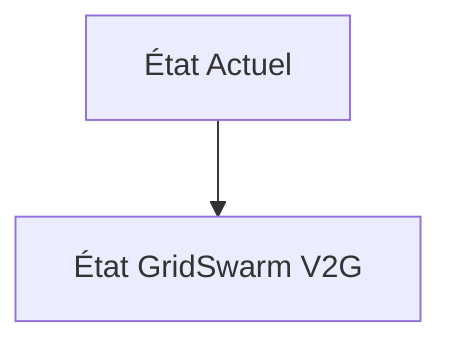
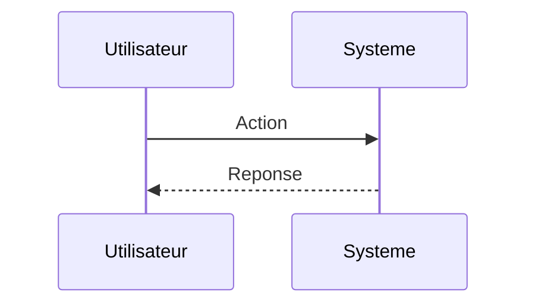

<!-- markdownlint-disable MD009 MD010 MD013 MD022 MD028 MD032 MD033 MD034 MD036 MD037 MD039 MD041 MD060 -->

[ 🇬🇧 English Version ](./README.md)

# GridSwarm V2G

> **Résumé exécutif :** Un essaim d'agents autonomes hiérarchisés (Multi-Agent Reinforcement Learning - MARL). Chaque véhicule possède un agent "local" qui optimise sa propre durée de vie de batterie et les besoins de mobilité de l'utilisateur. Ces agents négocient de manière asynchrone (via un protocole d'enchères léger) avec des agents "régionaux" pour offrir des services de régulation de fréquence au réseau en temps réel, garantissant la stabilité du grid sans point de défaillance central.

---

## 1. Aperçu visuel & Effet Wahou

## 2. La thèse contrariante (Peter Thiel Style)

**La croyance populaire :** Les solutions généralistes IA peuvent résoudre ce problème.

**La vérité cachée :** Les solveurs d'optimisation linéaire traditionnels (MILP) ne scalent pas au-delà de quelques milliers de nœuds en temps réel. Une approche cloud centralisée souffre de latence et de vulnérabilité, alors que la régulation de fréquence exige des réactions en millisecondes et une architecture décentralisée.

## 3. Le problème & La cible

**Modèle économique :** B2B2C / B2B (Revenue split sur l'arbitrage)

**Cible précise :** Opérateurs de réseaux de transmission (RTE, National Grid), gestionnaires de flottes de véhicules électriques (EV), agrégateurs d'énergie.

**La douleur urgente :** L'intégration massive des énergies renouvelables intermittentes (solaire/éolien) déstabilise la fréquence du réseau électrique (50/60 Hz). La solution est le Vehicle-to-Grid (V2G) utilisant les batteries des millions d'EV comme stockage distribué, mais coordonner les cycles de charge/décharge de millions de véhicules aléatoirement connectés, sans dégrader leurs batteries ni frustrer les utilisateurs, est un cauchemar d'optimisation stochastique à grande échelle.

## 4. Architecture technique & Plomberie

## 5. Modèle économique & Viabilité financière

| Métrique                    | Valeur                        |
| --------------------------- | ----------------------------- |
| Structure de prix           | Abonnement SaaS               |
| Objectif 12 mois            | 10 clients                    |
| Calcul du CA (Target 100k€) | 10 clients \* 10k€/an = 100k€ |
| Marge brute estimée         | 80%                           |

## 6. Moteur de distribution & Fossé défensif (Moat)

**Stratégie d'acquisition :** Vente directe B2B

**Moat (Barrière à l'entrée) :** Hétérogénéité des protocoles de bornes de recharge et des constructeurs automobiles (manque de standardisation V2G bidirectionnelle). Acceptation par l'utilisateur final de laisser l'IA "décharger" sa voiture (garanties d'état de charge (SoC) requises).

## 7. Grille d'évaluation détaillée

| Critère                           | Score VC (/100) | Score Terrain (/100) |
| --------------------------------- | --------------- | -------------------- |
| Thèse & Monopole / Urgence        | -- / 25         | -- / 25              |
| Moat / Résistance aux LLM natifs  | -- / 25         | -- / 25              |
| Scalabilité / Friction d'adoption | -- / 25         | -- / 25              |
| Unit Economics / ROI direct       | -- / 25         | -- / 25              |
| **TOTAL**                         | **-- / 100**    | **-- / 100**         |

> **Verdict VC :** En attente d'évaluation.

> **Verdict Terrain :** En attente d'évaluation.
