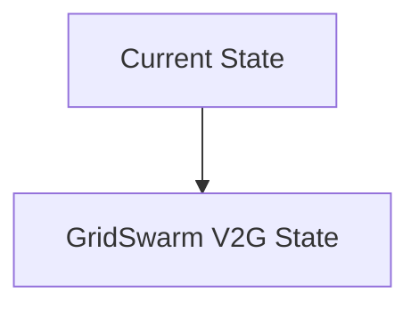
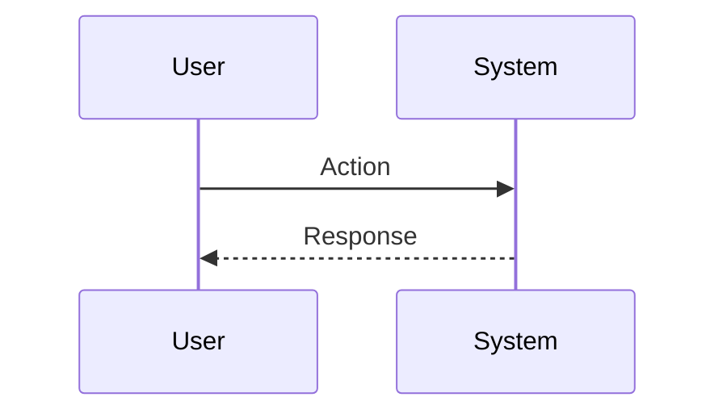

<!-- markdownlint-disable MD009 MD010 MD013 MD022 MD028 MD032 MD033 MD034 MD036 MD037 MD039 MD041 MD060 -->

[ 🇫🇷 Version Française ](./README.fr.md)

# GridSwarm V2G

> **Executive Summary:** A swarm of hierarchical autonomous agents (Multi-Agent Reinforcement Learning - MARL). Each vehicle has a “local” agent that optimizes its own battery life and the user’s mobility needs. These agents negotiate asynchronously (via a lightweight auction protocol) with "regional" agents to offer frequency regulation services to the grid in real time, ensuring grid stability without a central point of failure.

---

## 1. Visual Overview & Wow Effect

## 2. Contrarian Thesis (Peter Thiel Style)

**Popular Belief:** General AI solutions can solve this problem.

**Hidden Truth:** Traditional linear optimization solvers (MILP) do not scale beyond a few thousand nodes in real time. A centralized cloud approach suffers from latency and vulnerability, while frequency regulation requires millisecond reactions and a decentralized architecture.

## 3. Problem & Target Market

**Business Model:** B2B2C / B2B (Revenue split sur l'arbitrage)

**Target Audience:** Transmission network operators (RTE, National Grid), electric vehicle (EV) fleet managers, energy aggregators.

**Urgent Pain Point:** The massive integration of intermittent renewable energies (solar/wind) is destabilizing the frequency of the electricity network (50/60 Hz). The solution is Vehicle-to-Grid (V2G) using the batteries of millions of EVs as distributed storage, but coordinating the charge/discharge cycles of millions of randomly connected vehicles, without degrading their batteries or frustrating users, is a large-scale stochastic optimization nightmare.

## 4. Technical Architecture & Infrastructure

## 5. Business Model & Financial Viability

| Metric                 | Value                           |
| ---------------------- | ------------------------------- |
| Pricing Structure      | SaaS subscription               |
| 12-Month Target        | 10 customers                    |
| Revenue Formula        | 10 clients \* 10k€/year = 100k€ |
| Estimated Gross Margin | 80%                             |

## 6. Distribution Engine & Moat

**Acquisition Strategy:** B2B direct sales

**Moat (Defensibility):** Heterogeneity of charging station protocols and car manufacturers (lack of bidirectional V2G standardization). Acceptance by the end user to let the AI ​​“discharge” their car (state of charge (SoC) guarantees required).

## 7. Detailed Evaluation Grid

| Criterion                   | VC Score (/100) | Market Score (/100) |
| --------------------------- | --------------- | ------------------- |
| Thesis & Monopoly / Urgency | -- / 25         | -- / 25             |
| Moat / LLM Immunity         | -- / 25         | -- / 25             |
| Scalability / UX Friction   | -- / 25         | -- / 25             |
| Unit Economics / ROI        | -- / 25         | -- / 25             |
| **TOTAL**                   | **-- / 100**    | **-- / 100**        |

> **VC Verdict:** Pending evaluation.

> **Market Verdict:** Pending evaluation.
