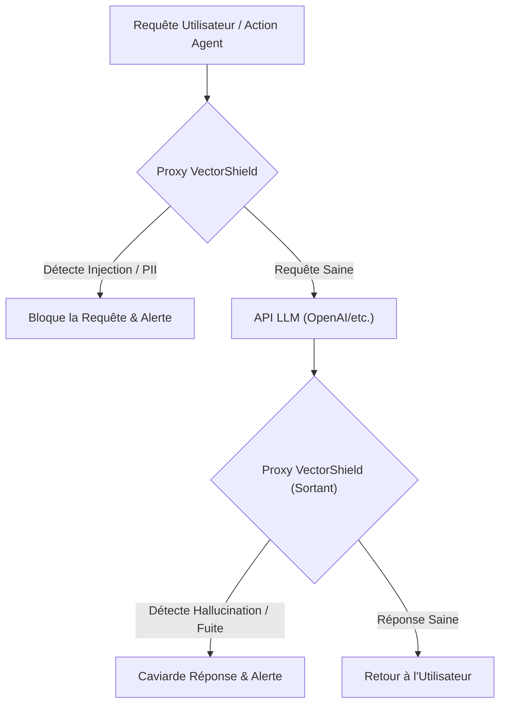
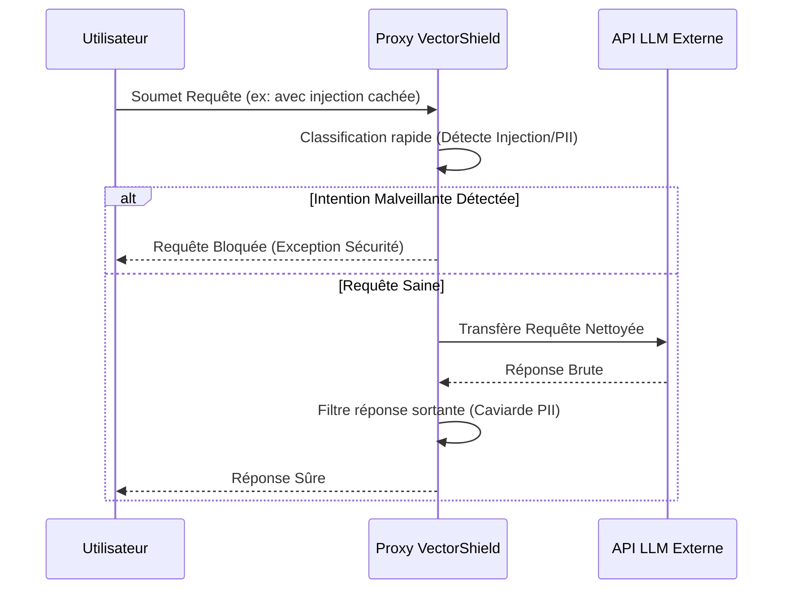

<!-- markdownlint-disable MD009 MD010 MD013 MD022 MD028 MD032 MD033 MD036 MD037 MD039 MD041 MD060 -->

[ 🇬🇧 English Version ](./README.md)

# VectorShield

> **Résumé exécutif :** Un reverse proxy et API gateway déterministe qui intercepte le trafic LLM en temps réel pour bloquer les injections de prompt, les jailbreaks et caviarder les données sensibles (PII) avant qu'elles n'atteignent le modèle ou l'utilisateur.

---

## 1. Aperçu visuel

## 2. La thèse contrariante (Peter Thiel Style)

- **La croyance populaire :** Nous pouvons sécuriser les LLMs en améliorant continuellement leur entraînement de sécurité interne (RLHF) et en écrivant de meilleurs "system prompts".
- **La vérité cachée :** Les LLMs sont intrinsèquement vulnérables aux injections de prompt (jailbreaks) car ils traitent les instructions et les données dans le même flux contextuel. Les system prompts seront toujours contournés. La vraie sécurité exige une couche réseau déterministe externe qui isole totalement la logique de sécurité du modèle génératif.

## 3. Le problème & La cible

- **Modèle économique :** B2B
- **Cible précise :** Les entreprises (banques, assurances, e-commerce, santé) déployant des assistants IA ou des agents autonomes basés sur des LLMs en production.
- **La douleur urgente :** Les applications LLM sont vulnérables aux attaques par injection de prompt et à l'exfiltration de données sensibles. Cela expose les entreprises à des risques de sécurité majeurs, des fuites (PII) et des conséquences légales coûteuses.

## 4. Architecture technique & Plomberie

## 5. Modèle économique & Viabilité financière

| Métrique                    | Valeur                                        |
| --------------------------- | --------------------------------------------- |
| Structure de prix           | Abonnement par Paliers / Volume de Trafic API |
| Objectif 12 mois            | 150 Déploiements Entreprise                   |
| Calcul du CA (Target 100k€) | 150 _ 600€ / mois _ 12 = 1.08M€               |
| Marge brute estimée         | 88%                                           |

## 6. Moteur de distribution & Fossé défensif (Moat)

- **Stratégie d'acquisition :** Ventes B2B ciblant les RSSI et SecOps. Positionné comme un "WAF pour LLMs" (Web Application Firewall) indispensable pour la conformité (RGPD, HIPAA).
- **Moat (Barrière à l'entrée) :** Un modèle de fondation est conçu pour générer du texte, pas pour garantir la sécurité systémique de ses entrées/sorties. Un proxy de sécurité déterministe est essentiel pour bloquer les requêtes avant qu'elles ne coûtent des tokens et pour imposer des politiques strictes indépendamment des mises à jour du modèle.

## 7. Grille d'évaluation détaillée

| Critère                           | Score VC (/100) | Score Terrain (/100) |
| --------------------------------- | --------------- | -------------------- |
| Thèse & Monopole / Urgence        | -- / 25         | -- / 25              |
| Moat / Résistance aux LLM natifs  | -- / 25         | -- / 25              |
| Scalabilité / Friction d'adoption | -- / 25         | -- / 25              |
| Unit Economics / ROI direct       | -- / 25         | -- / 25              |
| **TOTAL**                         | **-- / 100**    | **-- / 100**         |

> **Verdict VC :** En attente d'évaluation.

> **Verdict Terrain :** En attente d'évaluation.
