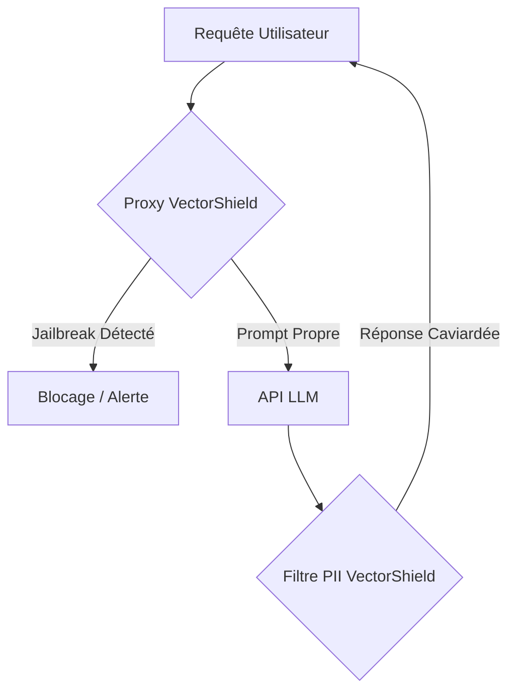
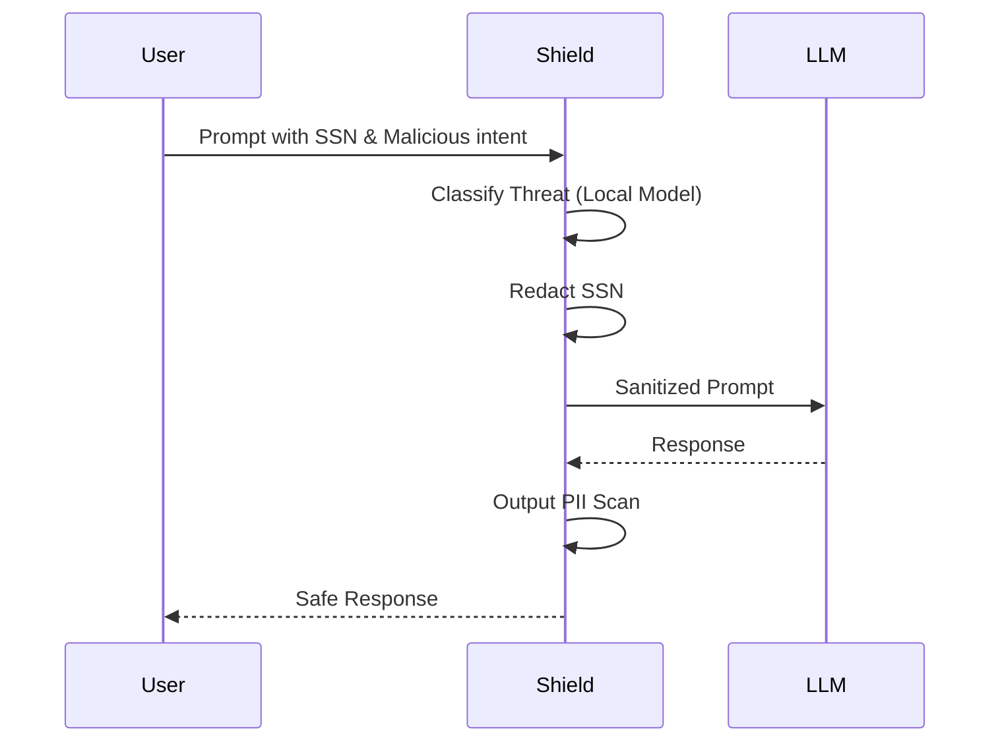

<!-- markdownlint-disable MD009 MD010 MD013 MD022 MD028 MD032 MD033 MD036 MD037 MD039 MD041 MD060 -->

[ 🇬🇧 English Version ](./README.md)

# VectorShield

> **Résumé exécutif :** Une passerelle API proxy inversé offrant une sécurité déterministe, filtrant les injections de prompt et caviardant les données sensibles avant l'appel LLM.

---

## 1. Aperçu visuel

```mermaid
graph TD
    %% Architecture
    A["Requête Utilisateur"] --> B{"Proxy VectorShield"}
    B -->|Jailbreak Détecté| C["Blocage / Alerte"]
    B -->|Prompt Propre| D["API LLM"]
    D --> E{"Filtre PII VectorShield"}
    E -->|Réponse Caviardée| A
```

## 2. La thèse contrariante (Peter Thiel Style)

**La croyance populaire :** Les instructions système et le fine-tuning suffisent à empêcher les fuites et jailbreaks.

**La vérité cachée :** Les prompts système peuvent toujours être contournés. La vraie sécurité exige une couche déterministe externe totalement isolée du LLM.

## 3. Le problème & La cible

**Modèle économique :** B2B
**Cible précise :** Banques, assurances, e-commerce et santé déployant des LLMs en production.
**La douleur urgente :** Les applications LLM sont vulnérables aux injections de prompt et à l'exfiltration de données PII, exposant à des risques légaux majeurs.

## 4. Architecture technique & Plomberie

**L'approche technique :** Proxy inversé entre l'application et l'API LLM. Analyse les requêtes entrantes pour les menaces et filtre/caviarde les réponses sortantes.

```mermaid
sequenceDiagram
    participant User
    participant Shield
    participant LLM
    User->>Shield: Prompt with SSN & Malicious intent
    Shield->>Shield: Classify Threat (Local Model)
    Shield->>Shield: Redact SSN
    Shield->>LLM: Sanitized Prompt
    LLM-->>Shield: Response
    Shield->>Shield: Output PII Scan
    Shield-->>User: Safe Response
```

## 5. Modèle économique & Viabilité financière

| Métrique                        | Valeur                                 |
| :------------------------------ | :------------------------------------- |
| **Structure de prix**           | Enterprise License / Monitored Traffic |
| **Objectif 12 mois**            | 25 Enterprise Deployments              |
| **Calcul du CA (Target 100k€)** | 25 deployments \* $4k/mo = $100k/mo    |
| **Marge brute estimée**         | 85%                                    |

## 6. Moteur de distribution & Fossé défensif (Moat)

**Stratégie d'acquisition :** Ventes B2B directes aux équipes conformité et InfoSec.

**Moat (Barrière à l'entrée) :** Un LLM ne peut garantir la sécurité de ses propres entrées/sorties. Une couche déterministe externe est indispensable pour bloquer les attaques.

## 7. Grille d'évaluation détaillée

| Critère                           | Score VC (/100) | Score Terrain (/100) |
| --------------------------------- | --------------- | -------------------- |
| Thèse & Monopole / Urgence        | 23 / 25         | 25 / 25              |
| Moat / Résistance aux LLM natifs  | 22 / 25         | 21 / 25              |
| Scalabilité / Friction d'adoption | 24 / 25         | 22 / 25              |
| Unit Economics / ROI direct       | 24 / 25         | 24 / 25              |
| **TOTAL**                         | **93 / 100**    | **92 / 100**         |

> **Verdict VC :** Vector Shield construit une couche de défense déterministe et obligatoire entre les LLM imprévisibles et les strictes exigences de conformité des entreprises. Son positionnement en reverse proxy garantit qu'il devient une partie indispensable de l'infrastructure, créant une immense fidélité. Le lien évident avec la prévention des amendes réglementaires rend le processus de vente sans friction et hautement scalable.

> **Verdict Terrain :** Couche essentielle pour la prévention des fuites de données et la défense contre les injections. Forte urgence pour les entreprises réglementées, facile à déployer en proxy et à monétiser.
