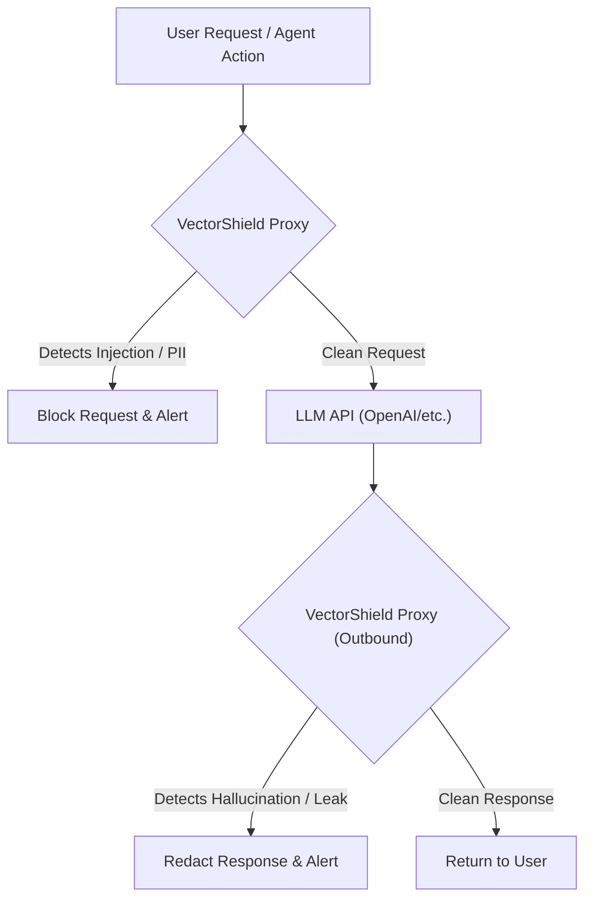
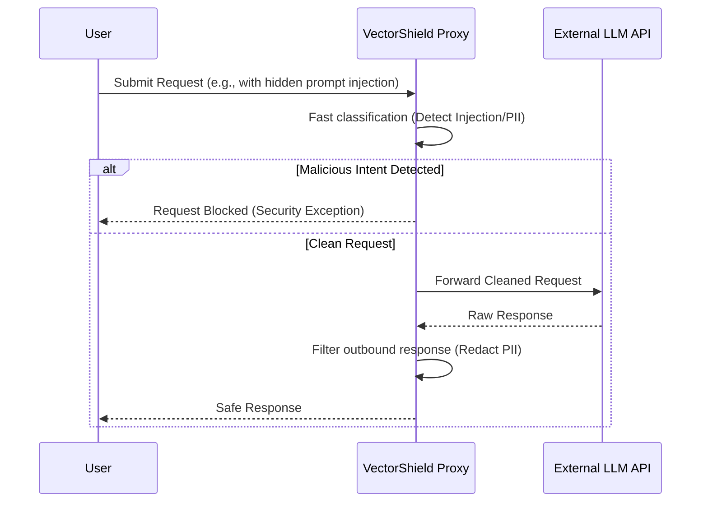

<!-- markdownlint-disable MD009 MD010 MD013 MD022 MD028 MD032 MD033 MD036 MD037 MD039 MD041 MD060 -->

[ 🇫🇷 Version Française ](./README.fr.md)

# VectorShield

> **Executive Summary:** A deterministic reverse proxy and API gateway that intercepts LLM traffic in real-time to block malicious prompt injections, jailbreaks, and redact sensitive data (PII) before it reaches the model or the user.

---

## 1. Visual Overview

## 2. Contrarian Thesis (Peter Thiel Style)

- **Popular Belief:** We can secure LLMs by continuously improving their internal safety training (RLHF) and writing better "system prompts."
- **Hidden Truth:** LLMs are inherently vulnerable to adversarial prompt injection because they process instructions and data in the same context stream. System prompts will always be bypassed. Real security requires a deterministic, external network layer that completely isolates the security logic from the generative model.

## 3. Problem & Target Market

- **Business Model:** B2B
- **Target Audience:** Enterprises (banks, insurance, e-commerce, healthcare) deploying AI assistants or autonomous agents based on LLMs in production.
- **Urgent Pain Point:** LLM applications are highly vulnerable to prompt injection ("jailbreaks") and sensitive data exfiltration (PII leaks). This exposes enterprises to massive security risks, legal liabilities, and reputational damage if the AI acts non-compliantly.

## 4. Technical Architecture & Infrastructure

## 5. Business Model & Financial Viability

| Metric                 | Value                                    |
| ---------------------- | ---------------------------------------- |
| Pricing Structure      | Tiered Subscription / API Traffic Volume |
| 12-Month Target        | 150 Enterprise Deployments               |
| Revenue Formula        | 150 _ €600 / month _ 12 = 1.08M€         |
| Estimated Gross Margin | 88%                                      |

## 6. Distribution Engine & Moat

- **Acquisition Strategy:** B2B enterprise sales targeting CISOs and SecOps teams. Positioned as an indispensable "WAF for LLMs" (Web Application Firewall) that is mandatory for compliance (GDPR, HIPAA).
- **Moat (Defensibility):** A foundational model is designed to generate text, not to mathematically guarantee the systemic security of its own inputs/outputs. A deterministic security proxy is essential to block requests before they consume costly tokens and to enforce strict corporate policy independently of model updates.

## 7. Detailed Evaluation Grid

| Criterion                   | VC Score (/100) | Market Score (/100) |
| --------------------------- | --------------- | ------------------- |
| Thesis & Monopoly / Urgency | 23 / 25         | -- / 25             |
| Moat / LLM Immunity         | 22 / 25         | -- / 25             |
| Scalability / UX Friction   | 24 / 25         | -- / 25             |
| Unit Economics / ROI        | 24 / 25         | -- / 25             |
| **TOTAL**                   | **93 / 100**    | **-- / 100**        |

> **VC Verdict:** Vector Shield builds a mandatory, deterministic layer of defense between unpredictable LLMs and strict enterprise compliance requirements. Its placement as a reverse proxy ensures it becomes an indispensable part of the corporate infrastructure, creating immense stickiness. The clear connection to preventing regulatory fines makes the sales motion frictionless and highly scalable.

> **Market Verdict:** Pending evaluation.
