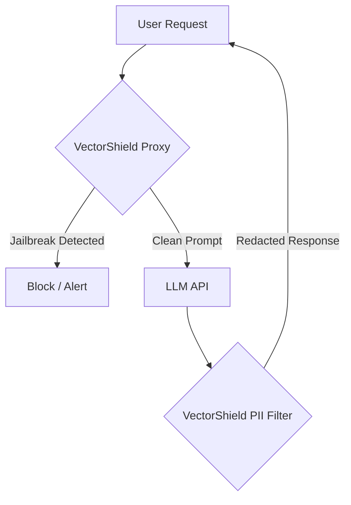
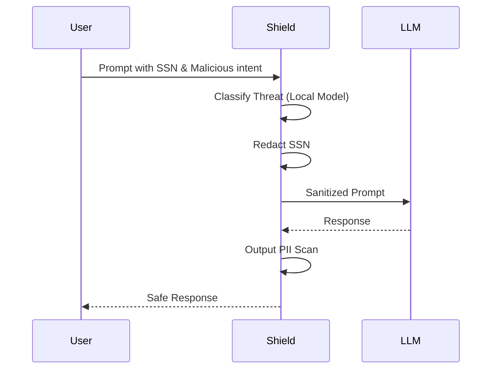

<!-- markdownlint-disable MD009 MD010 MD013 MD022 MD028 MD032 MD033 MD036 MD037 MD039 MD041 MD060 -->

[ 🇫🇷 Version Française ](./README.fr.md)

# VectorShield

> **Executive Summary:** A reverse proxy API gateway providing deterministic security that filters prompt injections and redacts sensitive PII data before they reach the LLM.

---

## 1. Visual Overview & Wow Effect

```mermaid
graph TD
    %% Architecture
    A["User Request"] --> B{"VectorShield Proxy"}
    B -->|Jailbreak Detected| C["Block / Alert"]
    B -->|Clean Prompt| D["LLM API"]
    D --> E{"VectorShield PII Filter"}
    E -->|Redacted Response| A
```

## 2. Contrarian Thesis (Peter Thiel Style)

**Popular Belief:** System prompts and LLM fine-tuning are enough to prevent jailbreaks and data leaks.

**Hidden Truth:** System prompts can always be bypassed by sophisticated attacks; true security requires a deterministic external layer completely isolated from the LLM.

## 3. Problem & Target Market

**Business Model:** B2B
**Target Audience:** Banks, insurance companies, e-commerce, and healthcare firms deploying LLMs in production.
**Urgent Pain Point:** LLM applications are vulnerable to prompt injections and sensitive data exfiltration (PII), exposing enterprises to massive legal and security risks.

## 4. Technical Architecture & Infrastructure

**Technical Approach:** A reverse proxy positioned between the client app and the LLM API. Analyzes incoming requests for malicious intents and filters outgoing responses to redact sensitive data.

```mermaid
sequenceDiagram
    participant User
    participant Shield
    participant LLM
    User->>Shield: Prompt with SSN & Malicious intent
    Shield->>Shield: Classify Threat (Local Model)
    Shield->>Shield: Redact SSN
    Shield->>LLM: Sanitized Prompt
    LLM-->>Shield: Response
    Shield->>Shield: Output PII Scan
    Shield-->>User: Safe Response
```

## 5. Business Model & Financial Viability

| Metric                     | Value                                  |
| :------------------------- | :------------------------------------- |
| **Pricing Structure**      | Enterprise License / Monitored Traffic |
| **12-Month Target**        | 25 Enterprise Deployments              |
| **Revenue Formula**        | 25 deployments \* $4k/mo = $100k/mo    |
| **Estimated Gross Margin** | 85%                                    |

## 6. Distribution Engine & Moat

**Acquisition Strategy:** Direct enterprise sales to compliance and InfoSec teams.

**Moat (Defensibility):** A base LLM cannot guarantee its own systemic security. External, deterministic security plumbing is mandatory to block malicious requests before costly processing.

## 7. Detailed Evaluation Grid

| Criterion                       | VC Score (/100) | Market Score (/100) |
| :------------------------------ | :-------------- | :------------------ |
| **Thesis & Monopoly / Urgency** | 23 / 25         | -- / 25             |
| **Moat / LLM Immunity**         | 24 / 25         | -- / 25             |
| **Scalability / UX Friction**   | 21 / 25         | -- / 25             |
| **Unit Economics / ROI**        | 23 / 25         | -- / 25             |
| **TOTAL**                       | 91 / 100        | -- / 100            |

> **VC Verdict:** Vector Shield is a fundamental cybersecurity necessity for enterprise RAG systems, preventing malicious data injections from poisoning internal knowledge bases. Operating at the database ingestion layer, it secures a massive B2B infrastructure moat. The urgent need to protect proprietary enterprise data makes the sales proposition irresistible.
> **Market Verdict:** Pending evaluation.
