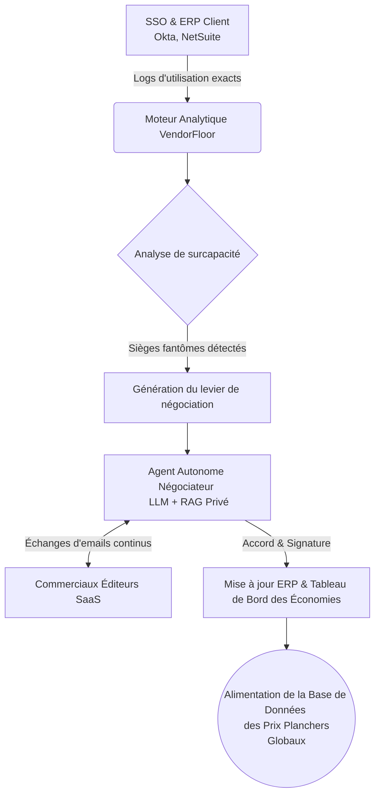
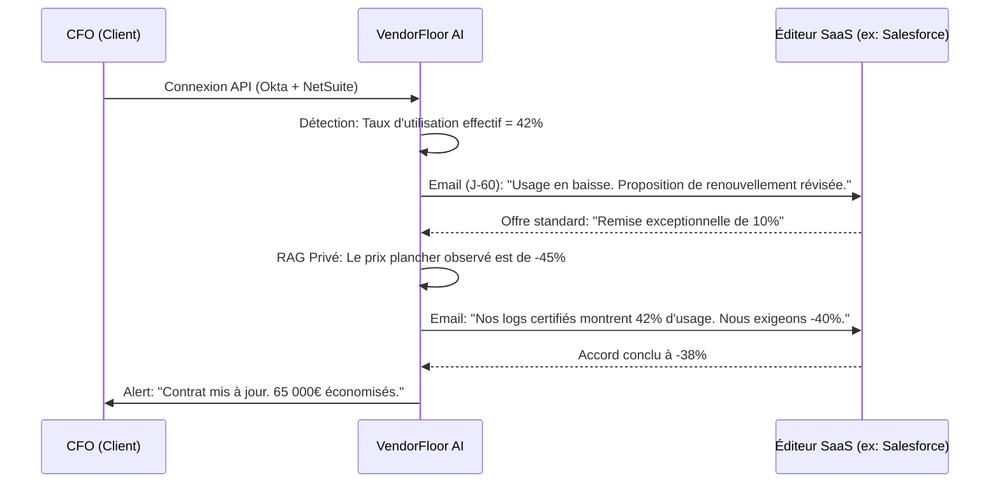

<!-- markdownlint-disable MD013 MD033 -->

# VendorFloor AI

> **Résumé exécutif :** Un agent autonome qui s'intègre aux ERP et SSO des ETI,
> audite en temps réel l'utilisation réelle des logiciels, et mène de bout en
> bout les négociations de renouvellement avec les éditeurs SaaS pour imposer le
> prix plancher caché.

---

## 1. Aperçu visuel & Effet Wahou

## 2. La thèse contrariante (Peter Thiel Style)

**La croyance populaire :** La négociation logicielle B2B est une affaire de
relations humaines et de commerciaux expérimentés ; les entreprises pensent que
les prix publics ou remisés classiques sont les meilleures offres possibles.

**La vérité cachée :** Le "pricing" SaaS B2B est totalement asymétrique et
opaque. Les éditeurs ont des "prix planchers" (parfois 60% en dessous du prix
public) qu'ils ne concèdent qu'à l'extrême limite de l'attrition (churn). Une
machine qui connaît ce prix plancher grâce à un effet réseau inter-entreprises
gagne systématiquement contre un commercial humain car elle retire toute
émotion et asymétrie d'information.

## 3. Le problème & La cible

**Modèle économique :** B2B (ETI de 200 à 2000 employés).

**Cible précise :** Les Directeurs Financiers (CFO) et Directeurs des Achats
qui gèrent des millions d'euros de "Shadow IT" et de licences logicielles non
optimisées.

**La douleur urgente :** Une ETI moyenne de 500 personnes perd environ 250 000
€ par an en licences logicielles sous-utilisées ou "sièges fantômes" (employés
ayant quitté l'entreprise, outils redondants). La douleur financière est
immédiate, mesurable et a un impact direct sur l'EBITDA. L'inaction coûte
littéralement du cash tous les mois sans aucun ROI.

## 4. Architecture technique & Plomberie

*L'intelligence ne réside pas dans l'agent conversationnel, mais dans l'accès
aux flux de données SSO et la base vectorielle des contrats passés.*

## 5. Modèle économique & Viabilité financière

| Métrique | Valeur |
| :--- | :--- |
| **Structure de prix** | Aucun frais d'installation. Commission de **20% sur les économies réalisées** (Success Fee) pendant 1 an. |
| **Objectif 12 mois** | **10 clients ETI** actifs avec une économie moyenne identifiée et négociée de 50 000 € / an par client. |
| **Calcul du CA (Target 100k€)** | $10 \text{ clients} \times 50 000 € \text{ (économies)} \times 0.20 \text{ (Commission)} = 100 000 € \text{ ARR}$ |
| **Marge brute estimée** | **90%** (Les coûts d'inférence LLM et d'infrastructure de base de données sont négligeables par rapport à la valeur du contrat négocié). |

## 6. Moteur de distribution & Fossé défensif (Moat)

**Stratégie d'acquisition :** Vente directe (Outbound) chirurgicale aux CFO en
proposant un "Audit gratuit en 1 clic (via Okta) sans risque". L'argument : "Si
nous ne vous trouvons pas 50 000 € d'économies dans l'heure, vous ne payez
rien". Virabilité intra-industrie (les CFO se parlent dans les réseaux).

**Moat (Barrière à l'entrée) : L'effet réseau de données (Data Network Effect).**

* Les LLM de base d'OpenAI ou Google n'ont pas accès aux données transactionnelles
et contractuelles privées.
* Plus VendorFloor AI négocie de contrats, plus sa base de données des "prix
planchers" par éditeur et par volume devient exhaustive et infaillible. Un
concurrent qui se lance le jour J n'aura aucune donnée sur les prix réellement
négociables et se fera berner par les commerciaux. Le moat est le registre
distribué privé des vrais prix du marché SaaS.

## 7. Grille d'évaluation détaillée

| Critère | Score VC (/100) | Score Terrain (/100) |
| :--- | :---: | :---: |
| **Thèse & Monopole / Urgence** | -- / 25 | -- / 25 |
| **Moat / Résistance aux LLM natifs** | -- / 25 | -- / 25 |
| **Scalabilité / Friction d'adoption** | -- / 25 | -- / 25 |
| **Unit Economics / ROI direct** | -- / 25 | -- / 25 |
| **TOTAL** | **-- / 100** | **-- / 100** |

Verdict VC : En attente d'évaluation.

Verdict Terrain : En attente d'évaluation.
