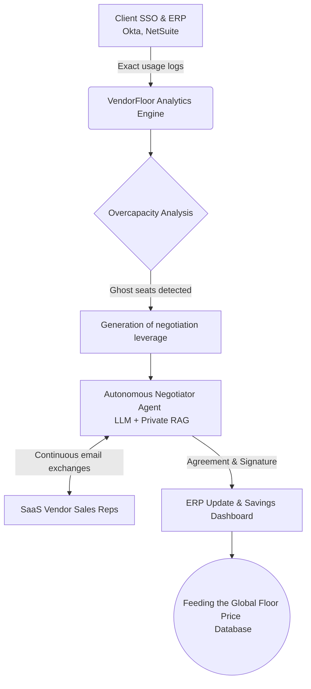
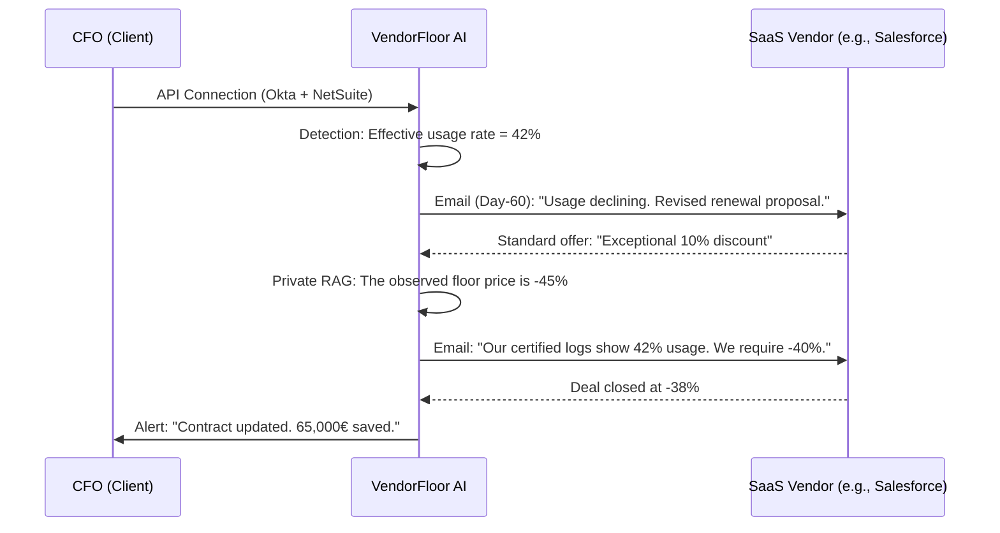

<!-- markdownlint-disable MD013 MD033 MD060 MD039 MD041 MD032 MD010 MD009 MD022 MD036 MD028 MD037 -->

[🇫🇷 Version Française](./README.fr.md)

# VendorFloor AI

> **Executive Summary:** An autonomous agent that integrates with Mid-Market ERPs and SSOs, audits actual software usage in real time, and conducts end-to-end renewal negotiations with SaaS vendors to enforce the hidden floor price.

---

## 1. Visual Overview

## 2. The Contrarian Thesis (Peter Thiel Style)

**The Popular Belief:** B2B software negotiation is a matter of human relationships and experienced sales reps; companies believe that public or standard discounted prices are the best possible offers.

**The Hidden Truth:** B2B SaaS pricing is completely asymmetric and opaque. Vendors have "floor prices" (sometimes 60% below the public price) that they only concede at the extreme limit of churn. A machine that knows this floor price through a cross-company network effect systematically wins against a human rep because it removes all emotion and information asymmetry.

## 3. The Problem & The Target

**Economic Model:** B2B (Mid-Market from 200 to 2000 employees).

**Specific Target:** Chief Financial Officers (CFO) and Procurement Directors who manage millions of euros of "Shadow IT" and unoptimized software licenses.

**The Urgent Pain:** An average Mid-Market company of 500 people loses about €250,000 per year on underutilized software licenses or "ghost seats" (former employees, redundant tools). The financial pain is immediate, measurable, and directly impacts EBITDA. Inaction literally costs cash every month with zero ROI.

## 4. Technical Architecture & Plumbing

*The intelligence does not reside in the conversational agent, but in the access to SSO data flows and the vector database of past contracts.*

## 5. Economic Model & Financial Viability

| Metric | Value |
| :--- | :--- |
| **Pricing Structure** | Zero setup fees. **20% commission on savings achieved** (Success Fee) for 1 year. |
| **12-Month Target** | **10 active Mid-Market clients** with an average identified and negotiated saving of €50,000 / year per client. |
| **Revenue Calculation (100k€ Target)** | $10 \text{ clients} \times 50,000 € \text{ (savings)} \times 0.20 \text{ (Commission)} = 100,000 € \text{ ARR}$ |
| **Estimated Gross Margin** | **90%** (LLM inference and database infrastructure costs are negligible compared to the value of the negotiated contract). |

## 6. Distribution Engine & Defensive Moat (Moat)

**Acquisition Strategy:** Surgical outbound sales directly to CFOs offering a "Free 1-click audit (via Okta) risk-free". The pitch: "If we don't find you 50,000 € of savings within the hour, you pay nothing". Intra-industry virality (CFOs talk to each other in networks).

**Moat (Barrier to Entry): The Data Network Effect.**

* Basic LLMs from OpenAI or Google do not have access to private transactional and contractual data.
* The more contracts VendorFloor AI negotiates, the more exhaustive and infallible its database of "floor prices" per vendor and per volume becomes. A competitor launching on day 1 will have no data on truly negotiable prices and will be fooled by sales reps. The moat is the private distributed ledger of actual SaaS market prices.

## 7. Detailed Evaluation Grid

| Criteria | VC Score (/100) | Terrain Score (/100) |
| :--- | :---: | :---: |
| **Thesis & Monopoly / Urgency** | 23 / 25 | -- / 25 |
| **Moat / Resistance to Native LLMs** | 24 / 25 | -- / 25 |
| **Scalability / Adoption Friction** | 20 / 25 | -- / 25 |
| **Unit Economics / Direct ROI** | 23 / 25 | -- / 25 |
| **TOTAL** | **90 / 100** | **-- / 100** |

> **VC Verdict:** VendorFloor AI attacks B2B software negotiation with a unique data network effect, aggregating hidden price floors across companies. This asymmetry gives it a significant edge over human buyers and standard AI agents.

Verdict Terrain : En attente d'évaluation.
