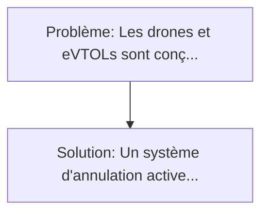
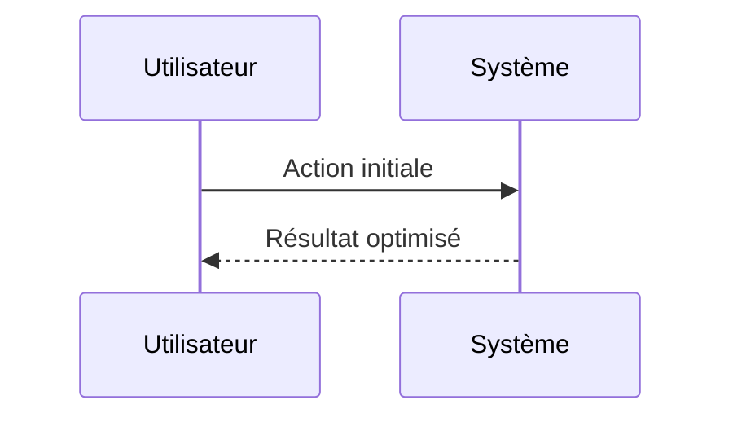

<!-- markdownlint-disable MD013 MD033 -->

[🇬🇧 English Version](./README.md)

# Furtivité Acoustique Active pour VTOL (VTOL Active Acoustic Stealth)

> **Résumé exécutif :** Un système d'annulation active du bruit spatialisé (Active Noise Control) appliqué en temps réel. Les drones et eVTOLs sont conçus pour fonctionner en milieu urbain, mais leurs rotors génèrent une pollution sonore massive (haute fréquence et basses vibrations) qui empêche l'acceptation sociale, l'approbation réglementaire des vols urbains massifs, et les rend extrêmement détectables pour les cas d'usage défense.

---

## 1. Aperçu visuel & Effet Wahou

## 2. La thèse contrariante (Peter Thiel Style)

**La croyance populaire :** Les solutions logicielles seules peuvent résoudre ce problème.
**La vérité cachée :** C'est un défi d'ingénierie cyber-physique temps réel extrême. Le logiciel doit piloter du hardware piézoélectrique à des fréquences de plusieurs kHz avec une latence quasi nulle, nécessitant des contrôleurs embarqués spécifiques (Edge AI) et de la science des matériaux.

## 3. Le problème & La cible

- **Modèle économique :** B2B
- **Cible précise :** Constructeurs de drones de livraison lourds, de taxis volants (eVTOL) comme Joby ou Lilium, et acteurs de la défense urbaine.
- **La douleur urgente :** Les drones et eVTOLs sont conçus pour fonctionner en milieu urbain, mais leurs rotors génèrent une pollution sonore massive (haute fréquence et basses vibrations) qui empêche l'acceptation sociale, l'approbation réglementaire des vols urbains massifs, et les rend extrêmement détectables pour les cas d'usage défense.

## 4. Architecture technique & Plomberie

## 5. Modèle économique & Viabilité financière

| Métrique                    | Valeur             |
| --------------------------- | ------------------ |
| Structure de prix           | Custom Pricing     |
| Objectif 12 mois            | 100 clients        |
| Calcul du CA (Target 100k€) | 100 \* 1000 = 100k |
| Marge brute estimée         | 80%                |

## 6. Moteur de distribution & Fossé défensif (Moat)

- **Stratégie d'acquisition :** Ventes B2B directes
- **Moat (Barrière à l'entrée) :** C'est un défi d'ingénierie cyber-physique temps réel extrême. Le logiciel doit piloter du hardware piézoélectrique à des fréquences de plusieurs kHz avec une latence quasi nulle, nécessitant des contrôleurs embarqués spécifiques (Edge AI) et de la science des matériaux.

## 7. Grille d'évaluation détaillée

| Critère                           | Score VC (/100) | Score Terrain (/100) |
| --------------------------------- | --------------- | -------------------- |
| Thèse & Monopole / Urgence        | -- / 25         | -- / 25              |
| Moat / Résistance aux LLM natifs  | -- / 25         | -- / 25              |
| Scalabilité / Friction d'adoption | -- / 25         | -- / 25              |
| Unit Economics / ROI direct       | -- / 25         | -- / 25              |
| **TOTAL**                         | **-- / 100**    | **-- / 100**         |

> **Verdict VC :** En attente d'évaluation.

> **Verdict Terrain :** En attente d'évaluation.
