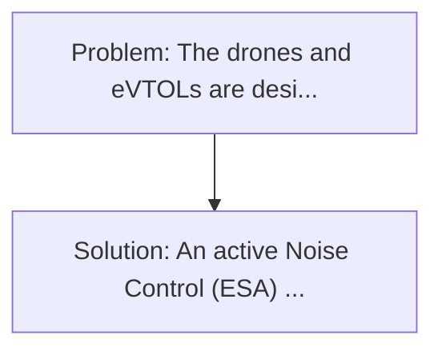
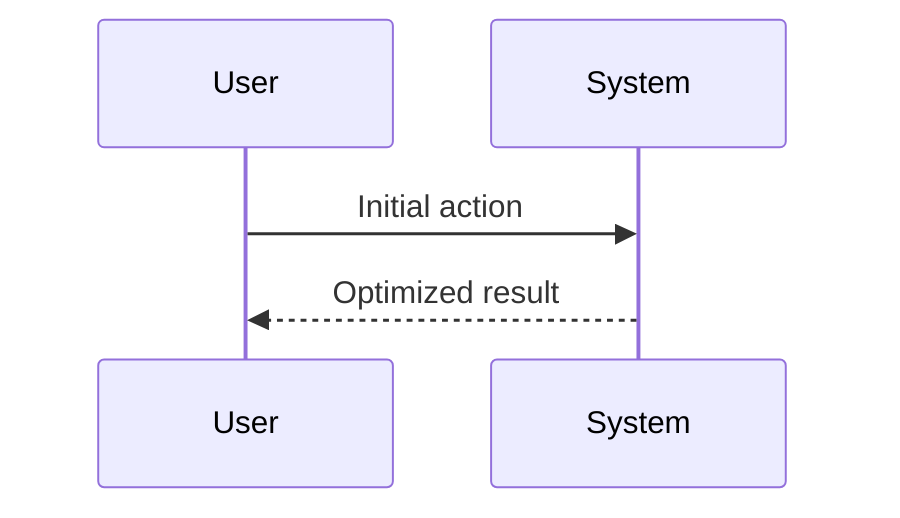

<!-- markdownlint-disable MD013 MD033 -->

[🇫🇷 Version Française](./README.fr.md)

# Active Acoustic Furcity for VTOL (VTOL Active Acoustic Stealth)

> **Executive Summary:** An active Noise Control (ESA) noise cancellation system applied in real time. The drones and eVTOLs are designed to operate in urban areas, but their rotors generate massive noise pollution (high frequency and low vibration) that prevents social acceptance, regulatory approval of massive urban flights, and makes them extremely detectable for defence use.

---

## 1. Visual Overview & Wow Effect

## 2. Contrarian Thesis (Peter Thiel Style)

**Popular Belief:** Generic software solutions can solve this.
**Hidden Truth:** This is an extreme real-time cyberphysical engineering challenge. The software must pilot piezoelectric hardware at frequencies of several kHz with almost zero latency, requiring specific embedded controllers (Edge AI) and material science.

## 3. Problem & Target Market

- **Business Model:** B2B
- **Target Audience:** Builders of heavy delivery drones, flying taxis (eVTOL) like Joby or Lilium, and actors in urban defence.
- **Urgent Pain Point:** The drones and eVTOLs are designed to operate in urban areas, but their rotors generate massive noise pollution (high frequency and low vibration) that prevents social acceptance, regulatory approval of massive urban flights, and makes them extremely detectable for defence use.

## 4. Technical Architecture & Infrastructure

## 5. Business Model & Financial Viability

| Metric                 | Value              |
| ---------------------- | ------------------ |
| Pricing Structure      | Custom Pricing     |
| 12-Month Target        | 100 customers      |
| Revenue Formula        | 100 \* 1000 = 100k |
| Estimated Gross Margin | 80%                |

## 6. Distribution Engine & Moat

- **Acquisition Strategy:** Direct B2B Sales
- **Moat (Defensibility):** This is an extreme real-time cyberphysical engineering challenge. The software must pilot piezoelectric hardware at frequencies of several kHz with almost zero latency, requiring specific embedded controllers (Edge AI) and material science.

## 7. Detailed Evaluation Grid

| Criterion                   | VC Score (/100) | Market Score (/100) |
| --------------------------- | --------------- | ------------------- |
| Thesis & Monopoly / Urgency | -- / 25         | -- / 25             |
| Moat / LLM Immunity         | -- / 25         | -- / 25             |
| Scalability / UX Friction   | -- / 25         | -- / 25             |
| Unit Economics / ROI        | -- / 25         | -- / 25             |
| **TOTAL**                   | **-- / 100**    | **-- / 100**        |

> **VC Verdict:** Pending evaluation.

> **Market Verdict:** Pending evaluation.
