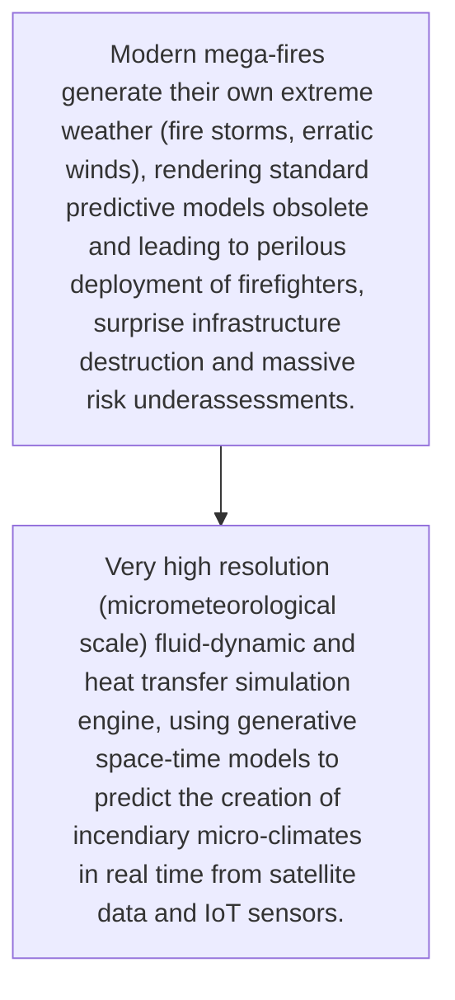
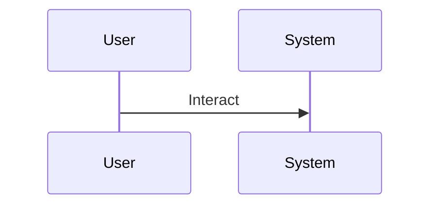

<!-- markdownlint-disable MD009 MD010 MD013 MD022 MD028 MD032 MD033 MD034 MD036 MD037 MD039 MD041 MD060 -->

[ 🇫🇷 Version Française ](./README.fr.md)

# Pyrocumulus Twin

> **Executive Summary:** Very high resolution (micrometeorological scale) fluid-dynamic and heat transfer simulation engine, using generative space-time models to predict the creation of incendiary micro-climates in real time from satellite data and IoT sensors.

---

## 1. Visual Overview & Wow Effect

## 2. Contrarian Thesis (Peter Thiel Style)

- **Popular Belief:** It is a chaos physics modeling problem requiring the calculation of complex fluid dynamics, 3D digital twins of the forest terrain, very different from a classic meteorological data-visualization dashboard.
- **Hidden Truth:** Very high resolution (micrometeorological scale) fluid-dynamic and heat transfer simulation engine, using generative space-time models to predict the creation of incendiary micro-climates in real time from satellite data and IoT sensors.

## 3. Problem & Target Market

- **Business Model:** B2B / B2G
- **Target Audience:** Forestry agencies, governments, reinsurance insurers, electricity network operators
- **Urgent Pain Point:** Modern mega-fires generate their own extreme weather (fire storms, erratic winds), rendering standard predictive models obsolete and leading to perilous deployment of firefighters, surprise infrastructure destruction and massive risk underassessments.

## 4. Technical Architecture & Infrastructure

## 5. Business Model & Financial Viability

| Metric                 | Value                                     |
| ---------------------- | ----------------------------------------- |
| Pricing Structure      | [Price / Subscription Model / Commission] |
| 12-Month Target        | [Exact volume required for 100k ARR]      |
| Revenue Formula        | [Mathematical calculation]                |
| Estimated Gross Margin | [Margin %]                                |

## 6. Distribution Engine & Moat

- **Acquisition Strategy:** [Virality, network effect, direct sales, developer adoption]
- **Moat (Defensibility):** Critical need for computing power (HPC), complex integration of scattered sensor networks, slow government purchasing cycles.

## 7. Detailed Evaluation Grid

| Criterion                   | VC Score (/100) | Market Score (/100) |
| --------------------------- | --------------- | ------------------- |
| Thesis & Monopoly / Urgency | -- / 25         | 24 / 25             |
| Moat / LLM Immunity         | -- / 25         | 25 / 25             |
| Scalability / UX Friction   | -- / 25         | 10 / 25             |
| Unit Economics / ROI        | -- / 25         | 18 / 25             |
| **TOTAL**                   | -- / 100        | **77 / 100**        |

> **VC Verdict:** Pending evaluation.
> **Market Verdict:** Moderate urgency but strong long-term strategic value. LLM immunity is good, relying on specialized models. Adoption presents notable friction that could slow initial monetization.
