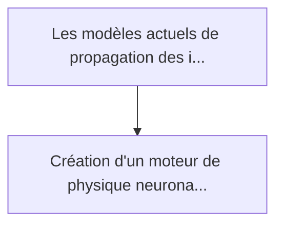
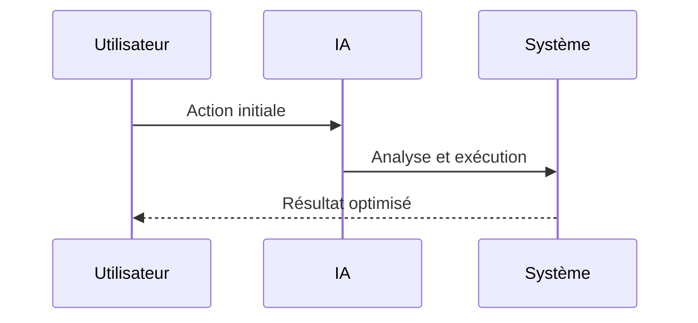

<!-- markdownlint-disable MD013 MD028 MD033 MD039 MD041 -->

[ 🇬🇧 English Version ](./README.md)

# Wildfire Neural Twin

> **Résumé exécutif :** Création d'un moteur de physique neuronale (Neural Physics Engine) ingérant en temps réel les données de télémétrie LIDAR, l'imagerie satellite inf...

---

## 1. Aperçu visuel & Effet Wahou

## 2. La thèse contrariante (Peter Thiel Style)

La croyance populaire : Les solutions génériques peuvent résoudre cela.
La vérité cachée : Un SaaS ou un simple modèle prédictif statistique ne peut pas capturer les non-linéarités de la mécanique des fluides et de la thermodynamique en temps réel. Il faut un modèle de monde (World Model) physique capable d'extrapoler les états futurs basés sur des lois physiques encodées dans les réseaux de neurones.

## 3. Le problème & La cible

Modèle économique : B2B / B2G
Cible précise : Agences gouvernementales de gestion des forêts, opérateurs de réseaux électriques (utilities), et compagnies d'assurance spécialisées dans les risques climatiques.
La douleur urgente : Les modèles actuels de propagation des incendies de forêt sont lents, s'appuient sur des données statiques et peinent à modéliser les dynamiques de feu extrêmes induites par le micro-climat. Cela entraîne des évacuations tardives, des pertes d'infrastructures massives et des primes d'assurance incalculables.

## 4. Architecture technique & Plomberie

## 5. Modèle économique & Viabilité financière

| Métrique                    | Valeur             |
| --------------------------- | ------------------ |
| Structure de prix           | Prix sur mesure    |
| Objectif 12 mois            | 100 clients        |
| Calcul du CA (Target 100k€) | 100 \* 1000 = 100k |
| Marge brute estimée         | 80%                |

## 6. Moteur de distribution & Fossé défensif (Moat)

Stratégie d'acquisition : Vente B2B directe
Moat (Barrière à l'entrée) : Un SaaS ou un simple modèle prédictif statistique ne peut pas capturer les non-linéarités de la mécanique des fluides et de la thermodynamique en temps réel. Il faut un modèle de monde (World Model) physique capable d'extrapoler les états futurs basés sur des lois physiques encodées dans les réseaux de neurones.

## 7. Grille d'évaluation détaillée

| Critère                           | Score VC (/100) | Score Terrain (/100) |
| --------------------------------- | --------------- | -------------------- |
| Thèse & Monopole / Urgence        | -- / 25         | 25 / 25              |
| Moat / Résistance aux LLM natifs  | -- / 25         | 23 / 25              |
| Scalabilité / Friction d'adoption | -- / 25         | 16 / 25              |
| Unit Economics / ROI direct       | -- / 25         | 21 / 25              |
| **TOTAL**                         | **-- / 100**    | **85 / 100**         |

> **Verdict VC :** En attente d'évaluation.

> **Verdict Terrain :** L'escalade des incendies de forêt rend la prédiction en temps réel vitale pour la protection civile. Les moteurs de physique neuronale traitant des données spatiales offrent un fossé défensif contre l'IA conversationnelle. La friction réside dans l'intégration avec les protocoles de secours obsolètes.
