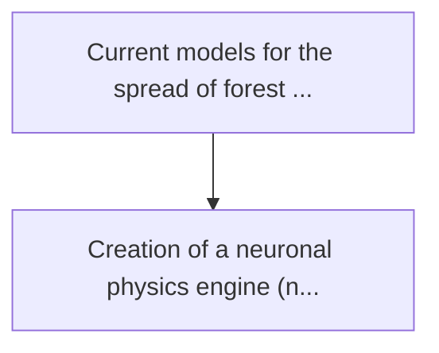
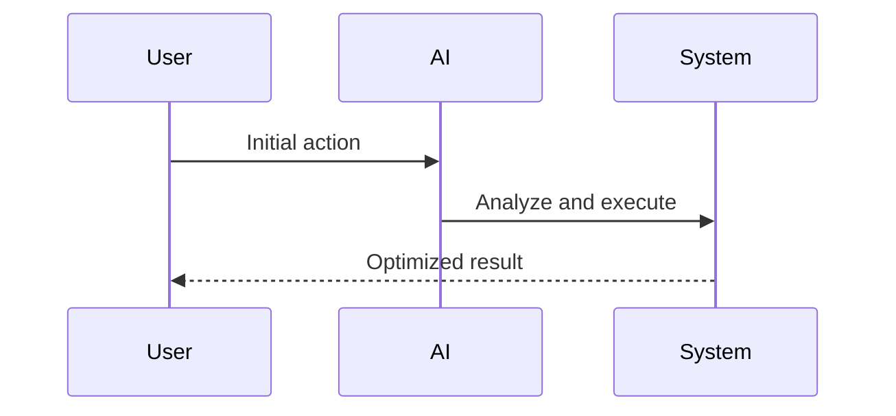

<!-- markdownlint-disable MD013 MD028 MD033 MD039 MD041 -->

[🇫🇷 Version Française](./README.fr.md)

# Wildfire neural twin

> **Executive Summary:** Creation of a neuronal physics engine (neural physics engine) ingesting lidar telemetry data in real time, satellite imaging inf...

---

## 1. Visual Overview & Wow Effect

## 2. Contrarian Thesis (Peter Thiel Style)

Popular Belief: Generic solutions can solve this.
Hidden Truth: A saas or a simple statistical predictive model cannot capture the nonlinearities of fluid mechanics and thermodynamics in real time. we need a world model (world model) that can extrapolate future states based on physical laws encoded in neuron networks.

## 3. Problem & Target Market

Business Model: B2B / B2G
Target Audience: Government forest management agencies, utilities, and insurance companies specializing in climate risk.
Urgent Pain Point: Current models for the spread of forest fires are slow, based on static data and difficult to model the extreme fire dynamics induced by microclimate. this leads to late evacuations, massive infrastructure losses and incalculable insurance premiums.

## 4. Technical Architecture & Infrastructure

## 5. Business Model & Financial Viability

| Metric                 | Value              |
| ---------------------- | ------------------ |
| Pricing Structure      | Custom Pricing     |
| 12-Month Target        | 100 customers      |
| Revenue Formula        | 100 \* 1000 = 100k |
| Estimated Gross Margin | 80%                |

## 6. Distribution Engine & Moat

Acquisition Strategy: Direct B2B Sales
Moat (Defensibility): A saas or a simple statistical predictive model cannot capture the nonlinearities of fluid mechanics and thermodynamics in real time. we need a world model (world model) that can extrapolate future states based on physical laws encoded in neuron networks.

## 7. Detailed Evaluation Grid

| Criterion                   | VC Score (/100) | Market Score (/100) |
| --------------------------- | --------------- | ------------------- |
| Thesis & Monopoly / Urgency | 24 / 25         | -- / 25             |
| Moat / LLM Immunity         | 24 / 25         | -- / 25             |
| Scalability / UX Friction   | 21 / 25         | -- / 25             |
| Unit Economics / ROI        | 22 / 25         | -- / 25             |
| **TOTAL**                   | **91 / 100**    | **-- / 100**        |

> **VC Verdict:** This neural physics engine attacks an escalating global crisis: the catastrophic economic impact of mega-fires. By operating in real-time and fusing massive multi-modal data streams, it provides predictive capabilities far beyond traditional models. The urgent need from insurance companies and government agencies ensures rapid adoption, while the complex underlying physics engine establishes a definitive technical monopoly.

> **Market Verdict:** Pending evaluation.
