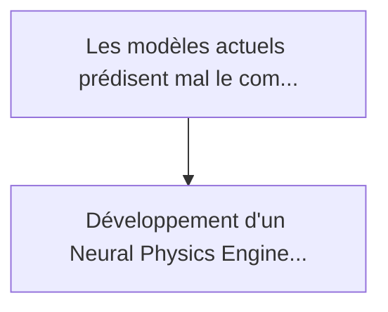
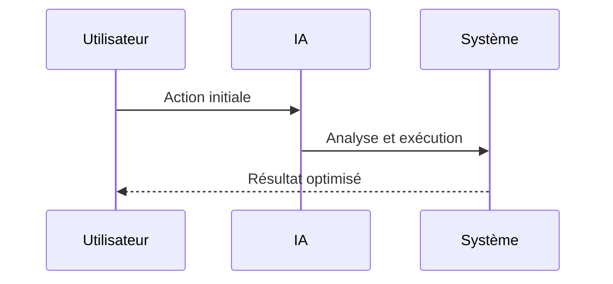

<!-- markdownlint-disable MD013 MD028 MD033 MD039 MD041 -->

[ 🇬🇧 English Version ](./README.md)

# Wildfire Pyroconvection Twin

> **Résumé exécutif :** Développement d'un Neural Physics Engine intégrant la dynamique des fluides computationnelle (CFD) en temps réel avec des réseaux de neurones infor...

---

## 1. Aperçu visuel & Effet Wahou

## 2. La thèse contrariante (Peter Thiel Style)

La croyance populaire : Les solutions génériques peuvent résoudre cela.
La vérité cachée : Un LLM ne comprend pas les équations de Navier-Stokes. Les outils SaaS SIG (Systèmes d'Information Géographique) sont statiques et ne peuvent pas simuler les boucles de rétroaction thermodynamiques non linéaires en temps réel (il faut calculer la physique, pas faire des requêtes en base de données).

## 3. Le problème & La cible

Modèle économique : B2B / B2G
Cible précise : Agences forestières, sécurité civile, opérateurs de réseaux électriques, compagnies d'assurance (réassurance)
La douleur urgente : Les modèles actuels prédisent mal le comportement des mégafeux (incendies de 6ème génération) car ils ignorent le micro-climat créé par le feu lui-même (pyroconvection). Cela entraîne des pertes matérielles et humaines imprévisibles, et les assurances refusent de couvrir ces risques sans modélisation précise.

## 4. Architecture technique & Plomberie

## 5. Modèle économique & Viabilité financière

| Métrique                    | Valeur             |
| --------------------------- | ------------------ |
| Structure de prix           | Prix sur mesure    |
| Objectif 12 mois            | 100 clients        |
| Calcul du CA (Target 100k€) | 100 \* 1000 = 100k |
| Marge brute estimée         | 80%                |

## 6. Moteur de distribution & Fossé défensif (Moat)

Stratégie d'acquisition : Vente B2B directe
Moat (Barrière à l'entrée) : Un LLM ne comprend pas les équations de Navier-Stokes. Les outils SaaS SIG (Systèmes d'Information Géographique) sont statiques et ne peuvent pas simuler les boucles de rétroaction thermodynamiques non linéaires en temps réel (il faut calculer la physique, pas faire des requêtes en base de données).

## 7. Grille d'évaluation détaillée

| Critère                           | Score VC (/100) | Score Terrain (/100) |
| --------------------------------- | --------------- | -------------------- |
| Thèse & Monopole / Urgence        | 25 / 25         | -- / 25              |
| Moat / Résistance aux LLM natifs  | 23 / 25         | -- / 25              |
| Scalabilité / Friction d'adoption | 18 / 25         | -- / 25              |
| Unit Economics / ROI direct       | 21 / 25         | -- / 25              |
| **TOTAL**                         | **87 / 100**    | **-- / 100**         |

> **Verdict VC :** La modélisation de la pyroconvection est la frontière absolue de la gestion des feux de forêt. Ce jumeau numérique combine une dynamique des fluides extrême avec une IA en temps réel pour prédire le comportement des incendies que les modèles traditionnels ne peuvent tout simplement pas. Il offre un fossé de données et de physique insurmontable contre les LLMs généralisés. Ciblant les agences fédérales et les réassureurs, il a le potentiel de devenir la norme obligatoire et monopolistique pour la gestion des risques climatiques extrêmes.

> **Verdict Terrain :** En attente d'évaluation.
