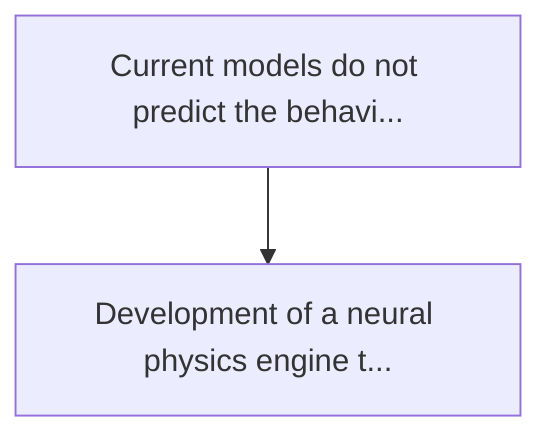
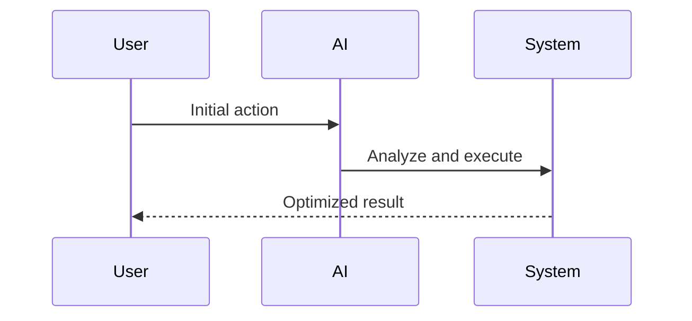

<!-- markdownlint-disable MD013 MD028 MD033 MD039 MD041 -->

[ 🇫🇷 Version Française ](./README.fr.md)

# Wildfire pyroconvection twin

> **Executive Summary:** Development of a neural physics engine that integrates the dynamics of computational fluids (cfd) in real time with networks of informational neurons...

---

## 1. Visual Overview & Wow Effect

## 2. Contrarian Thesis (Peter Thiel Style)

Popular Belief: Generic solutions can solve this.
Hidden Truth: A llm does not include the navier-stokes equations. saas gis (geographical information systems) tools are static and cannot simulate non-linear thermodynamic feedback loops in real time (you need to calculate physics, not make database queries).

## 3. Problem & Target Market

Business Model: B2B / B2G
Target Audience: Forestry agencies, civil security, electricity operators, insurance companies (reinsurance)
Urgent Pain Point: Current models do not predict the behaviour of megafires (sixth generation fires) because they ignore the microclimate created by the fire itself (pyroconvection). this results in unpredictable material and human losses, and insurance refuses to cover these risks without precise modelling.

## 4. Technical Architecture & Infrastructure

## 5. Business Model & Financial Viability

| Metric                 | Value              |
| ---------------------- | ------------------ |
| Pricing Structure      | Custom Pricing     |
| 12-Month Target        | 100 customers      |
| Revenue Formula        | 100 \* 1000 = 100k |
| Estimated Gross Margin | 80%                |

## 6. Distribution Engine & Moat

Acquisition Strategy: Direct B2B Sales
Moat (Defensibility): A llm does not include the navier-stokes equations. saas gis (geographical information systems) tools are static and cannot simulate non-linear thermodynamic feedback loops in real time (you need to calculate physics, not make database queries).

## 7. Detailed Evaluation Grid

| Criterion                   | VC Score (/100) | Market Score (/100) |
| --------------------------- | --------------- | ------------------- |
| Thesis & Monopoly / Urgency | 25 / 25         | -- / 25             |
| Moat / LLM Immunity         | 23 / 25         | -- / 25             |
| Scalability / UX Friction   | 18 / 25         | -- / 25             |
| Unit Economics / ROI        | 21 / 25         | -- / 25             |
| **TOTAL**                   | **87 / 100**    | **-- / 100**        |

> **VC Verdict:** Pyroconvection modeling is the absolute frontier of wildfire management. This digital twin combines extreme fluid dynamics with real-time AI to predict fire behavior that traditional models simply cannot. It offers an insurmountable data and physics moat against generalized LLMs. Targeting federal agencies and re-insurers, it has the potential to become the mandatory, monopolistic standard for managing extreme climate risks.

> **Market Verdict:** Pending evaluation.
