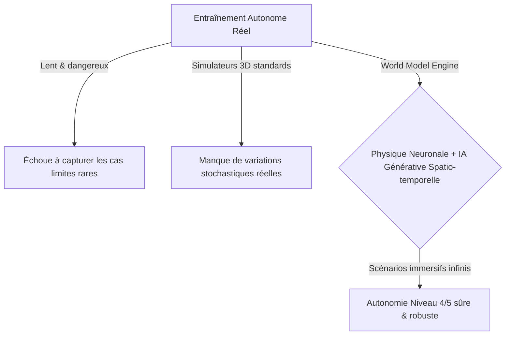
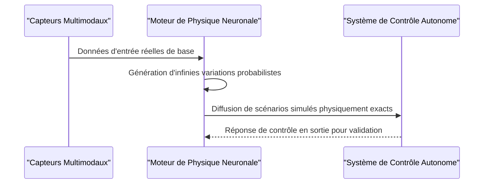

<!-- markdownlint-disable MD009 MD010 MD013 MD022 MD028 MD032 MD033 MD034 MD036 MD037 MD039 MD041 MD058 MD060 -->

[🇬🇧 English Version](./README.md)

# World Model for Autonomous Driving

> **Résumé exécutif :** Un moteur de physique neuronale agissant comme un modèle de monde spatio-temporel génératif pour simuler à l'infini des cas limites physiquement exacts pour la conduite autonome.

---

## 1. Aperçu visuel & Effet Wahou

## 2. La thèse contrariante (Peter Thiel Style)

La croyance populaire : Collecter des milliards de kilomètres de données de conduite réelle ou utiliser des moteurs de jeu 3D standards (Unity, Unreal) est la voie vers l'autonomie de niveau 5.
La vérité cachée : La collecte de données réelles échoue fondamentalement à capturer une quantité statistiquement significative de "corner cases". Les simulateurs 3D standards nécessitent de coder en dur des règles et ne peuvent générer l'infinité de variations stochastiques (météo, comportement humain) du monde réel. Un World Model probabiliste génératif est indispensable.

## 3. Le problème & La cible

Modèle économique : B2B
Cible précise : Constructeurs automobiles (OEMs), entreprises de robotique, développeurs de systèmes ADAS et gestionnaires de flottes autonomes.
La douleur urgente : L'entraînement des systèmes autonomes nécessite de parcourir des millions de kilomètres dans le monde réel. Ce processus est extrêmement lent, coûteux, dangereux, et échoue systématiquement à capturer les "corner cases" (situations extrêmes ou rares) de manière répétable, bloquant le déploiement sécurisé de l'autonomie de niveau 4/5.

## 4. Architecture technique & Plomberie

## 5. Modèle économique & Viabilité financière

| Métrique                    | Valeur                                                     |
| --------------------------- | ---------------------------------------------------------- |
| Structure de prix           | Licence entreprise / Utilisation de la puissance de calcul |
| Objectif 12 mois            | 1 à 2 constructeurs automobiles (OEMs) majeurs             |
| Calcul du CA (Target 100k€) | 2 \* 50k = 100k                                            |
| Marge brute estimée         | 75%                                                        |

## 6. Moteur de distribution & Fossé défensif (Moat)

Stratégie d'acquisition : Ventes directes aux OEMs et équipementiers automobiles de rang 1.
Moat (Barrière à l'entrée) : La puissance de calcul colossale requise (clusters GPU) pour l'entraînement du modèle de fondation, combinée à la dépendance à des jeux de données réels initiaux de très haute qualité, crée une barrière à l'entrée massive. Développer un moteur de physique neuronale physiquement exact est fondamentalement plus difficile que de construire un LLM standard.

## 7. Grille d'évaluation détaillée

| Critère                           | Score VC (/100) | Score Terrain (/100) |
| --------------------------------- | --------------- | -------------------- |
| Thèse & Monopole / Urgence        | 23 / 25         | -- / 25              |
| Moat / Résistance aux LLM natifs  | 21 / 25         | -- / 25              |
| Scalabilité / Friction d'adoption | 24 / 25         | -- / 25              |
| Unit Economics / ROI direct       | 22 / 25         | -- / 25              |
| **TOTAL**                         | **90 / 100**    | **-- / 100**         |

> **Verdict VC :** Ce projet présente une thèse fortement contrariante avec un véritable potentiel de monopole (23/25). Bien que l'approche technique soit solide, le fossé défensif face à des acteurs établis bien financés reste partiellement perméable (21/25). Associée à une évolutivité massive (24/25) et d'excellents unit economics (22/25), il s'agit d'une proposition hautement finançable.
>
> **Verdict Terrain :** En attente d'évaluation.
