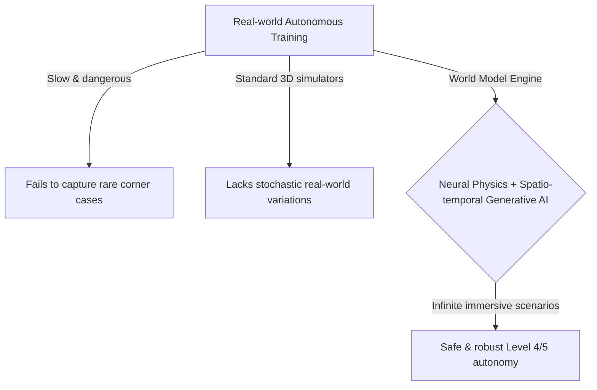
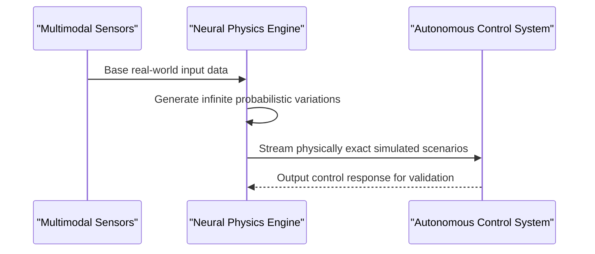

<!-- markdownlint-disable MD009 MD010 MD013 MD022 MD028 MD032 MD033 MD034 MD036 MD037 MD039 MD041 MD058 MD060 -->

[🇫🇷 Version Française](./README.fr.md)

# World Model for Autonomous Driving

> **Executive Summary:** A neural physics engine acting as a generative spatio-temporal world model to simulate infinite, physically exact corner cases for autonomous driving.

---

## 1. Visual Overview & Wow Effect

## 2. Contrarian Thesis (Peter Thiel Style)

Popular Belief: Collecting billions of miles of real-world driving data or using standard 3D game engines (Unity, Unreal) is the path to Level 5 autonomy.
Hidden Truth: Real-world data collection fundamentally fails to capture a statistically significant amount of "corner cases." Standard 3D simulators require hard-coding rules and cannot generate the infinite stochastic variations (weather, human behavior) of the real world. A generative probabilistic World Model is required.

## 3. Problem & Target Market

Business Model: B2B
Target Audience: Automotive OEMs, robotics companies, ADAS developers, and autonomous fleet managers.
Urgent Pain Point: Training autonomous systems requires driving millions of miles in the real world. This process is extremely slow, expensive, dangerous, and systematically fails to capture extreme or rare situations (corner cases) in a repeatable manner, blocking the safe deployment of Level 4/5 autonomy.

## 4. Technical Architecture & Infrastructure

## 5. Business Model & Financial Viability

| Metric                 | Value                                    |
| ---------------------- | ---------------------------------------- |
| Pricing Structure      | Enterprise license / Compute utilization |
| 12-Month Target        | 1 to 2 major automotive OEMs             |
| Revenue Formula        | 2 \* 50k = 100k                          |
| Estimated Gross Margin | 75%                                      |

## 6. Distribution Engine & Moat

Acquisition Strategy: Direct sales to OEMs and Tier 1 automotive suppliers.
Moat (Defensibility): The massive compute required (GPU clusters) to train the foundation model, combined with the dependency on ultra-high-quality initial real-world datasets for bootstrapping, creates a massive barrier to entry. Developing a physically exact neural physics engine is fundamentally harder than building a standard LLM.

## 7. Detailed Evaluation Grid

| Criterion                   | VC Score (/100) | Market Score (/100) |
| --------------------------- | --------------- | ------------------- |
| Thesis & Monopoly / Urgency | -- / 25         | -- / 25             |
| Moat / LLM Immunity         | -- / 25         | -- / 25             |
| Scalability / UX Friction   | -- / 25         | -- / 25             |
| Unit Economics / ROI        | -- / 25         | -- / 25             |
| **TOTAL**                   | **-- / 100**    | **-- / 100**        |

> **VC Verdict:** Pending evaluation.

> **Market Verdict:** Pending evaluation.
