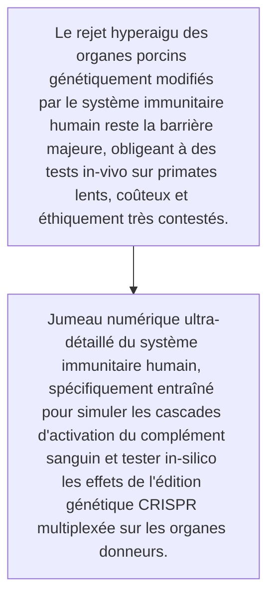
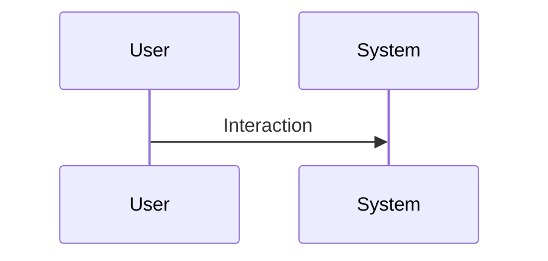

<!-- markdownlint-disable MD009 MD010 MD013 MD022 MD028 MD032 MD033 MD034 MD036 MD037 MD039 MD041 MD060 -->

[ 🇬🇧 English Version ](./README.md)

# Xeno-Immune Twin

> **Résumé exécutif :** Jumeau numérique ultra-détaillé du système immunitaire humain, spécifiquement entraîné pour simuler les cascades d'activation du complément sanguin et tester in-silico les effets de l'édition génétique CRISPR multiplexée sur les organes donneurs.

---

## 1. Aperçu visuel & Effet Wahou

## 2. La thèse contrariante (Peter Thiel Style)

- **La croyance populaire :** Nécessite des modèles fondateurs de biologie multi-omique spécifiques, des intégrations de données wet-lab propriétaires sur les réactions immunitaires croisées, impossible à simuler avec une simple API d'IA textuelle.
- **La vérité cachée :** Jumeau numérique ultra-détaillé du système immunitaire humain, spécifiquement entraîné pour simuler les cascades d'activation du complément sanguin et tester in-silico les effets de l'édition génétique CRISPR multiplexée sur les organes donneurs.

## 3. Le problème & La cible

- **Modèle économique :** B2B
- **Cible précise :** Entreprises de biotechnologie spécialisées dans la xénotransplantation et grands centres de recherche hospitaliers
- **La douleur urgente :** Le rejet hyperaigu des organes porcins génétiquement modifiés par le système immunitaire humain reste la barrière majeure, obligeant à des tests in-vivo sur primates lents, coûteux et éthiquement très contestés.

## 4. Architecture technique & Plomberie

## 5. Modèle économique & Viabilité financière

| Métrique                    | Valeur                                                          |
| --------------------------- | --------------------------------------------------------------- |
| Structure de prix           | [Prix / Modèle d'abonnement / Commission]                       |
| Objectif 12 mois            | [Nombre exact de clients/utilisateurs/transactions nécessaires] |
| Calcul du CA (Target 100k€) | [Formule mathématique exacte]                                   |
| Marge brute estimée         | [Marge en %]                                                    |

## 6. Moteur de distribution & Fossé défensif (Moat)

- **Stratégie d'acquisition :** [Viralité B2C, réseau C2C, acquisition B2B directe, adhésion dev M2M]
- **Moat (Barrière à l'entrée) :** Extrême complexité biologique (effet papillon immunitaire), validation clinique in-vivo inévitable en bout de course, barrières éthiques et réglementaires massives.

## 7. Grille d'évaluation détaillée

| Critère                           | Score VC (/100) | Score Terrain (/100) |
| --------------------------------- | --------------- | -------------------- |
| Thèse & Monopole / Urgence        | -- / 25         | 22 / 25              |
| Moat / Résistance aux LLM natifs  | -- / 25         | 23 / 25              |
| Scalabilité / Friction d'adoption | -- / 25         | 15 / 25              |
| Unit Economics / ROI direct       | -- / 25         | 20 / 25              |
| **TOTAL**                         | -- / 100        | **80 / 100**         |

> **Verdict VC :** En attente d'évaluation.
> **Verdict Terrain :** Urgence modérée mais valeur stratégique à long terme. L'immunité aux LLM est bonne, reposant sur des modèles spécifiques. L'adoption présente des frictions notables qui pourraient ralentir la monétisation initiale.
