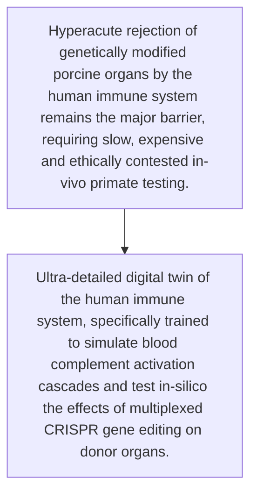
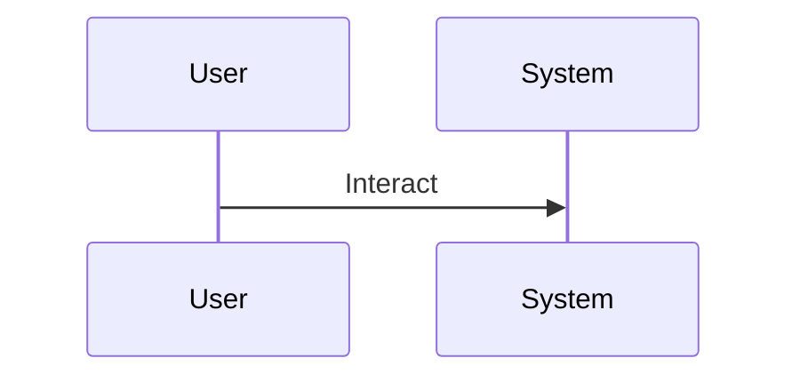

<!-- markdownlint-disable MD009 MD010 MD013 MD022 MD028 MD032 MD033 MD034 MD036 MD037 MD039 MD041 MD060 -->

[ 🇫🇷 Version Française ](./README.fr.md)

# Xeno-Immune Twin

> **Executive Summary:** Ultra-detailed digital twin of the human immune system, specifically trained to simulate blood complement activation cascades and test in-silico the effects of multiplexed CRISPR gene editing on donor organs.

---

## 1. Visual Overview & Wow Effect

## 2. Contrarian Thesis (Peter Thiel Style)

- **Popular Belief:** Requires specific multi-omics biology foundational models, proprietary wet-lab data integrations on immune cross-reactions, impossible to simulate with a simple text AI API.
- **Hidden Truth:** Ultra-detailed digital twin of the human immune system, specifically trained to simulate blood complement activation cascades and test in-silico the effects of multiplexed CRISPR gene editing on donor organs.

## 3. Problem & Target Market

- **Business Model:** B2B
- **Target Audience:** Biotechnology companies specializing in xenotransplantation and large hospital research centers
- **Urgent Pain Point:** Hyperacute rejection of genetically modified porcine organs by the human immune system remains the major barrier, requiring slow, expensive and ethically contested in-vivo primate testing.

## 4. Technical Architecture & Infrastructure

## 5. Business Model & Financial Viability

| Metric                 | Value                                     |
| ---------------------- | ----------------------------------------- |
| Pricing Structure      | [Price / Subscription Model / Commission] |
| 12-Month Target        | [Exact volume required for 100k ARR]      |
| Revenue Formula        | [Mathematical calculation]                |
| Estimated Gross Margin | [Margin %]                                |

## 6. Distribution Engine & Moat

- **Acquisition Strategy:** [Virality, network effect, direct sales, developer adoption]
- **Moat (Defensibility):** Extreme biological complexity (immune butterfly effect), in-vivo clinical validation ultimately inevitable, massive ethical and regulatory barriers.

## 7. Detailed Evaluation Grid

| Criterion                   | VC Score (/100) | Market Score (/100) |
| --------------------------- | --------------- | ------------------- |
| Thesis & Monopoly / Urgency | -- / 25         | 22 / 25             |
| Moat / LLM Immunity         | -- / 25         | 23 / 25             |
| Scalability / UX Friction   | -- / 25         | 15 / 25             |
| Unit Economics / ROI        | -- / 25         | 20 / 25             |
| **TOTAL**                   | -- / 100        | **80 / 100**        |

> **VC Verdict:** Pending evaluation.
> **Market Verdict:** Moderate urgency but strong long-term strategic value. LLM immunity is good, relying on specialized models. Adoption presents notable friction that could slow initial monetization.
