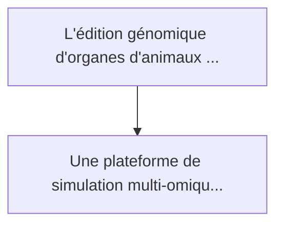
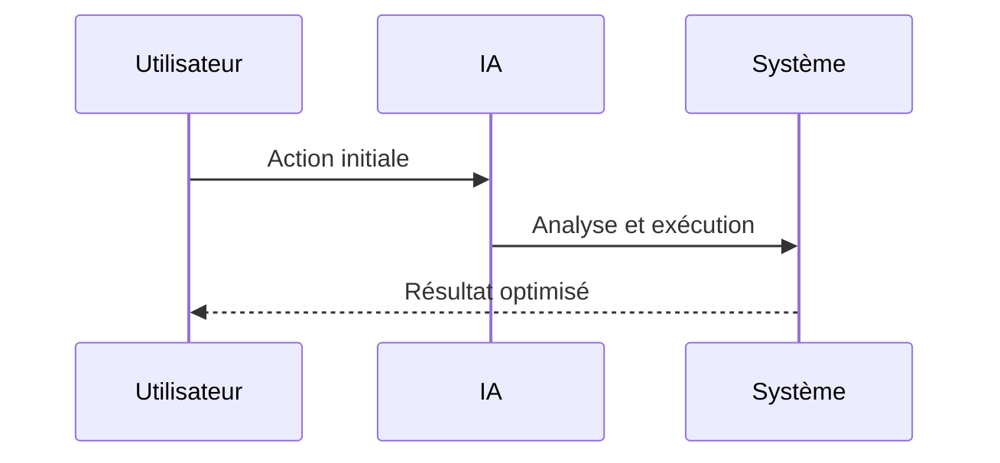

<!-- markdownlint-disable MD013 MD028 MD033 MD039 MD041 -->

[ 🇬🇧 English Version ](./README.md)

# Xenotransplantation Immune Sim

> **Résumé exécutif :** Une plateforme de simulation multi-omique et d'immunologie in-silico. Elle modélise la cascade du complément humain et l'interaction des antigènes ...

---

## 1. Aperçu visuel & Effet Wahou

## 2. La thèse contrariante (Peter Thiel Style)

La croyance populaire : Les solutions génériques peuvent résoudre cela.
La vérité cachée : Un LLM ne peut pas modéliser le repliement des protéines ni les réactions en cascade de l'immunologie complexe multi-espèces. Il faut un moteur de physique bio-moléculaire et des données d'entraînement omiques hautement propriétaires.

## 3. Le problème & La cible

Modèle économique : B2B
Cible précise : Entreprises de xénotransplantation, instituts de recherche en édition génomique (CRISPR), hôpitaux de recherche
La douleur urgente : L'édition génomique d'organes d'animaux (ex: cœur de porc) pour la transplantation humaine fait face à la barrière mortelle du rejet hyperaigu et des virus endogènes. Les tests in-vivo sont lents, chers, éthiquement complexes et ne permettent pas de tester des milliers de combinaisons d'éditions génétiques.

## 4. Architecture technique & Plomberie

## 5. Modèle économique & Viabilité financière

| Métrique                    | Valeur             |
| --------------------------- | ------------------ |
| Structure de prix           | Prix sur mesure    |
| Objectif 12 mois            | 100 clients        |
| Calcul du CA (Target 100k€) | 100 \* 1000 = 100k |
| Marge brute estimée         | 80%                |

## 6. Moteur de distribution & Fossé défensif (Moat)

Stratégie d'acquisition : Vente B2B directe
Moat (Barrière à l'entrée) : Un LLM ne peut pas modéliser le repliement des protéines ni les réactions en cascade de l'immunologie complexe multi-espèces. Il faut un moteur de physique bio-moléculaire et des données d'entraînement omiques hautement propriétaires.

## 7. Grille d'évaluation détaillée

| Critère                           | Score VC (/100) | Score Terrain (/100) |
| --------------------------------- | --------------- | -------------------- |
| Thèse & Monopole / Urgence        | -- / 25         | 24 / 25              |
| Moat / Résistance aux LLM natifs  | -- / 25         | 25 / 25              |
| Scalabilité / Friction d'adoption | -- / 25         | 15 / 25              |
| Unit Economics / ROI direct       | -- / 25         | 23 / 25              |
| **TOTAL**                         | **-- / 100**    | **87 / 100**         |

> **Verdict VC :** En attente d'évaluation.

> **Verdict Terrain :** La pénurie d'organes humains fait de la xénotransplantation le Saint Graal de la médecine moderne. Les simulations d'immunologie in-silico nécessitent une expertise bien au-delà des capacités de l'IA générique. La friction d'adoption est élevée à cause de la réglementation stricte.
