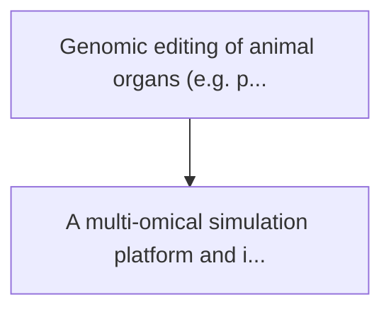
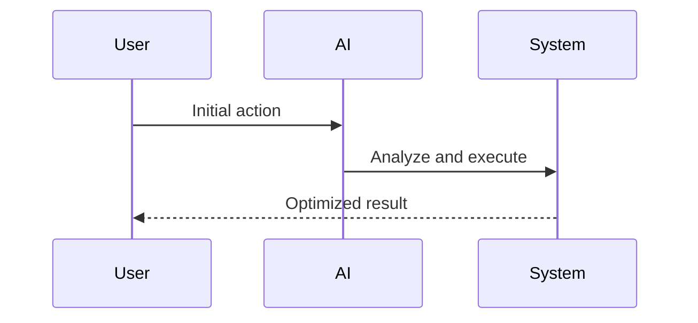

<!-- markdownlint-disable MD013 MD028 MD033 MD039 MD041 -->

[ 🇫🇷 Version Française ](./README.fr.md)

# Xenotransplantation immune sim

> **Executive Summary:** A multi-omical simulation platform and in-silico immunology. it models the cascade of human complement and the interaction of antigens ...

---

## 1. Visual Overview & Wow Effect

## 2. Contrarian Thesis (Peter Thiel Style)

Popular Belief: Generic solutions can solve this.
Hidden Truth: Llm cannot model protein folding or cascade reactions of complex multi-species immunology. it requires a biomolecular physics motor and highly proprietary omic drive data.

## 3. Problem & Target Market

Business Model: B2B
Target Audience: Xenotransplantation companies, genomic publishing research institutes (crispr), research hospitals
Urgent Pain Point: Genomic editing of animal organs (e.g. pig heart) for human transplantation faces the deadly barrier of hyperacute rejection and endogenous viruses. in-vivo tests are slow, expensive, ethically complex and do not allow thousands of combinations of genetic editing to be tested.

## 4. Technical Architecture & Infrastructure

## 5. Business Model & Financial Viability

| Metric                 | Value              |
| ---------------------- | ------------------ |
| Pricing Structure      | Custom Pricing     |
| 12-Month Target        | 100 customers      |
| Revenue Formula        | 100 \* 1000 = 100k |
| Estimated Gross Margin | 80%                |

## 6. Distribution Engine & Moat

Acquisition Strategy: Direct B2B Sales
Moat (Defensibility): Llm cannot model protein folding or cascade reactions of complex multi-species immunology. it requires a biomolecular physics motor and highly proprietary omic drive data.

## 7. Detailed Evaluation Grid

| Criterion                   | VC Score (/100) | Market Score (/100) |
| --------------------------- | --------------- | ------------------- |
| Thesis & Monopoly / Urgency | 24 / 25         | -- / 25             |
| Moat / LLM Immunity         | 25 / 25         | -- / 25             |
| Scalability / UX Friction   | 17 / 25         | -- / 25             |
| Unit Economics / ROI        | 23 / 25         | -- / 25             |
| **TOTAL**                   | **89 / 100**    | **-- / 100**        |

> **VC Verdict:** Simulating human immune responses for xenotransplantation is a high-risk, generational leap in biotechnology. This multi-omic platform tackles the primary barrier to organ transplantation, providing a computational moat far deeper than any generic biological model. While regulatory and clinical hurdles make scaling slow, success guarantees absolute monopolistic control over a massive, life-saving market.

> **Market Verdict:** Pending evaluation.
