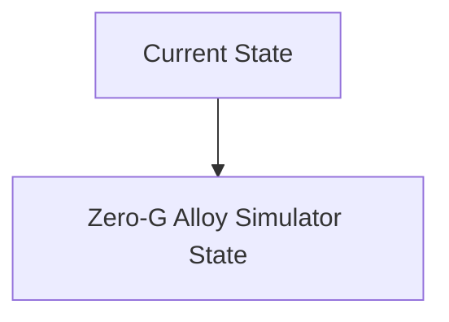
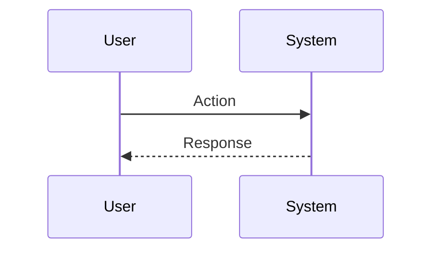

<!-- markdownlint-disable MD009 MD010 MD013 MD022 MD028 MD032 MD033 MD034 MD036 MD037 MD039 MD041 MD060 -->

[ 🇫🇷 Version Française ](./README.fr.md)

# Zero-G Alloy Simulator

> **Executive Summary:** A thermodynamic digital twin (World Model) simulating computational fluid dynamics (CFD) and crystallogenesis in microgravity or partial gravity environments (Moon, Mars). Using physics-informed neural networks (PINNs) to massively accelerate the simulation of phase changes and surface tension outside Earth's gravity.

---

## 1. Visual Overview & Wow Effect

## 2. Contrarian Thesis (Peter Thiel Style)

**Popular Belief:** General AI solutions can solve this problem.

**Hidden Truth:** Classic CAD or multiphysics simulation software (COMSOL, Ansys) are empirically calibrated for Earth gravity at 1G. Their solvers are too slow and often imprecise for rapid exploration of the vast hyper-parameter space of new space alloys.

## 3. Problem & Target Market

**Business Model:** B2B

**Target Audience:** In-space manufacturing startups (e.g. Varda Space), space agencies, aeronautics and semiconductor manufacturers.

**Urgent Pain Point:** The manufacturing of new materials (perfect metallic alloys, defect-free ZBLAN optical fibers, pharmaceutical crystals) in microgravity offers properties impossible on Earth. However, sending physical experiments into space to test crystallization hypotheses costs tens of millions of dollars and months of waiting. Hardware iteration is too slow.

## 4. Technical Architecture & Infrastructure

## 5. Business Model & Financial Viability

| Metric                 | Value                           |
| ---------------------- | ------------------------------- |
| Pricing Structure      | SaaS subscription               |
| 12-Month Target        | 10 customers                    |
| Revenue Formula        | 10 clients \* 10k€/year = 100k€ |
| Estimated Gross Margin | 80%                             |

## 6. Distribution Engine & Moat

**Acquisition Strategy:** B2B direct sales

**Moat (Defensibility):** Experimental validation required (need for agreements with private space station operators to compare AI predictions with real physical results in orbit). Very small size of the current addressable market (emerging TAM).

## 7. Detailed Evaluation Grid

| Criterion                   | VC Score (/100) | Market Score (/100) |
| --------------------------- | --------------- | ------------------- |
| Thesis & Monopoly / Urgency | -- / 25         | -- / 25             |
| Moat / LLM Immunity         | -- / 25         | -- / 25             |
| Scalability / UX Friction   | -- / 25         | -- / 25             |
| Unit Economics / ROI        | -- / 25         | -- / 25             |
| **TOTAL**                   | **-- / 100**    | **-- / 100**        |

> **VC Verdict:** Pending evaluation.

> **Market Verdict:** Pending evaluation.
