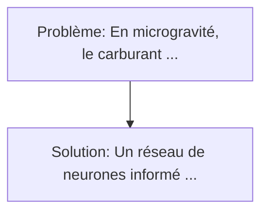
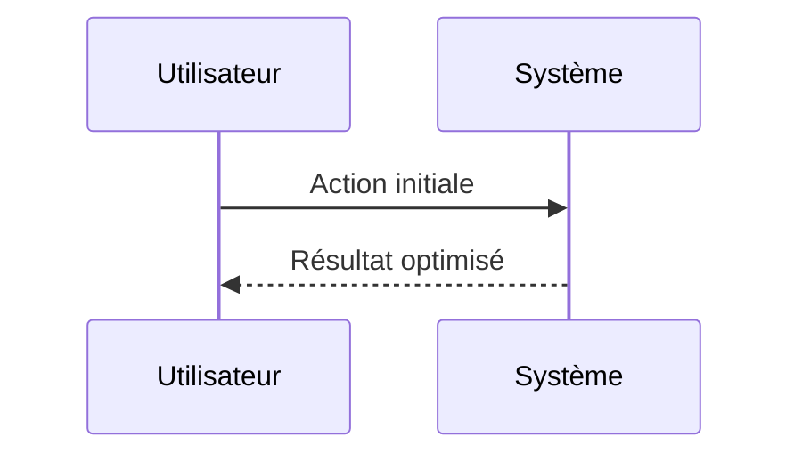

<!-- markdownlint-disable MD013 MD033 -->

[🇬🇧 English Version](./README.md)

# Zero-G Propellant Slosh Neural Engine

> **Résumé exécutif :** Un réseau de neurones informé par la physique (PINN) entraîné spécifiquement sur des données de mécanique des fluides en apesanteur. En microgravité, le carburant liquide (ergols) dans les réservoirs d'un engin spatial flotte et se déplace de manière chaotique (phénomène de "slosh").

---

## 1. Aperçu visuel & Effet Wahou

## 2. La thèse contrariante (Peter Thiel Style)

**La croyance populaire :** Les solutions logicielles seules peuvent résoudre ce problème.
**La vérité cachée :** Les solveurs Navier-Stokes classiques nécessitent des supercalculateurs et des jours de calcul, ce qui est impossible sur les processeurs rad-hard limités en orbite. Un modèle IA généraliste ne respectera pas les lois strictes de conservation de la masse et de l'énergie (besoin d'architecture PINN).

## 3. Le problème & La cible

- **Modèle économique :** B2B
- **Cible précise :** Fabricants de lanceurs spatiaux (SpaceX, Rocket Lab, ArianeGroup), opérateurs de remorqueurs spatiaux (Space Tugs) et de satellites à propulsion liquide.
- **La douleur urgente :** En microgravité, le carburant liquide (ergols) dans les réservoirs d'un engin spatial flotte et se déplace de manière chaotique (phénomène de "slosh"). Ce ballottement modifie le centre de gravité en temps réel, rendant les manœuvres d'amarrage, de changement d'orbite, ou le rallumage des moteurs extrêmement dangereux et difficiles à contrôler. Les simulations CFD traditionnelles sont beaucoup trop lentes pour être exécutées en temps réel à bord.

## 4. Architecture technique & Plomberie

## 5. Modèle économique & Viabilité financière

| Métrique                    | Valeur             |
| --------------------------- | ------------------ |
| Structure de prix           | Custom Pricing     |
| Objectif 12 mois            | 100 clients        |
| Calcul du CA (Target 100k€) | 100 \* 1000 = 100k |
| Marge brute estimée         | 80%                |

## 6. Moteur de distribution & Fossé défensif (Moat)

- **Stratégie d'acquisition :** Ventes B2B directes
- **Moat (Barrière à l'entrée) :** Les solveurs Navier-Stokes classiques nécessitent des supercalculateurs et des jours de calcul, ce qui est impossible sur les processeurs rad-hard limités en orbite. Un modèle IA généraliste ne respectera pas les lois strictes de conservation de la masse et de l'énergie (besoin d'architecture PINN).

## 7. Grille d'évaluation détaillée

| Critère                           | Score VC (/100) | Score Terrain (/100) |
| --------------------------------- | --------------- | -------------------- |
| Thèse & Monopole / Urgence        | -- / 25         | -- / 25              |
| Moat / Résistance aux LLM natifs  | -- / 25         | -- / 25              |
| Scalabilité / Friction d'adoption | -- / 25         | -- / 25              |
| Unit Economics / ROI direct       | -- / 25         | -- / 25              |
| **TOTAL**                         | **-- / 100**    | **-- / 100**         |

> **Verdict VC :** En attente d'évaluation.

> **Verdict Terrain :** En attente d'évaluation.
