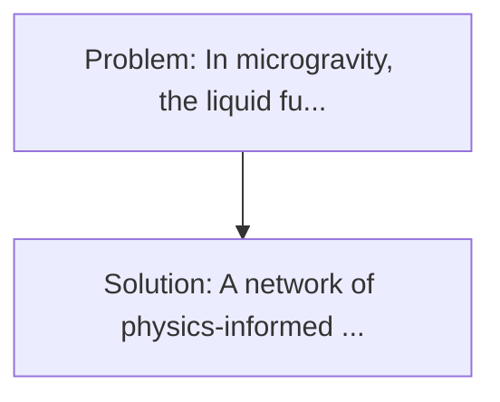
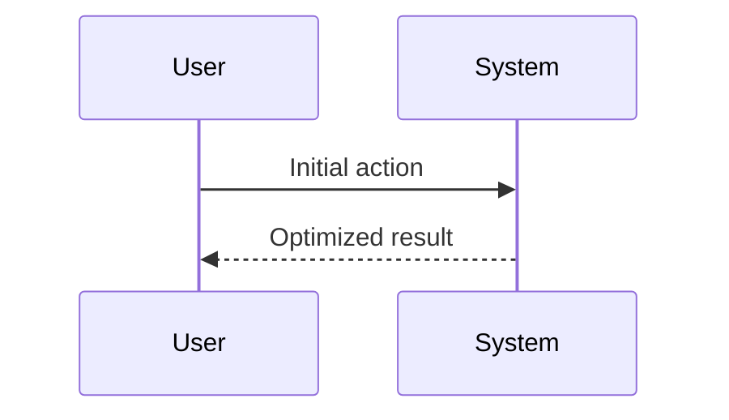

<!-- markdownlint-disable MD013 MD033 -->

[🇫🇷 Version Française](./README.fr.md)

# Zero-G Propellant Slosh Neural Engine

> **Executive Summary:** A network of physics-informed neurons (PINN) trained specifically on weighting fluid mechanics. In microgravity, the liquid fuel (ergols) in the tanks of a spacecraft floats and moves chaotically (slosh phenomenon).

---

## 1. Visual Overview & Wow Effect

## 2. Contrarian Thesis (Peter Thiel Style)

**Popular Belief:** Generic software solutions can solve this.
**Hidden Truth:** Conventional Navier-Stokes solvers require supercomputers and calculation days, which is impossible on rad-hard processors limited in orbit. A generalist AI model will not comply with the strict laws of conservation of mass and energy (need for PINN architecture).

## 3. Problem & Target Market

- **Business Model:** B2B
- **Target Audience:** Manufacturers of space launchers (SpaceX, Rocket Lab, ArianeGroup), space tug operators (Space Tugs) and liquid-powered satellites.
- **Urgent Pain Point:** In microgravity, the liquid fuel (ergols) in the tanks of a spacecraft floats and moves chaotically (slosh phenomenon). This swing changes the centre of gravity in real time, making mooring, orbit change, or re-ignitioning extremely dangerous and difficult to control engines. Traditional CFD simulations are far too slow to be executed in real time on board.

## 4. Technical Architecture & Infrastructure

## 5. Business Model & Financial Viability

| Metric                 | Value              |
| ---------------------- | ------------------ |
| Pricing Structure      | Custom Pricing     |
| 12-Month Target        | 100 customers      |
| Revenue Formula        | 100 \* 1000 = 100k |
| Estimated Gross Margin | 80%                |

## 6. Distribution Engine & Moat

- **Acquisition Strategy:** Direct B2B Sales
- **Moat (Defensibility):** Conventional Navier-Stokes solvers require supercomputers and calculation days, which is impossible on rad-hard processors limited in orbit. A generalist AI model will not comply with the strict laws of conservation of mass and energy (need for PINN architecture).

## 7. Detailed Evaluation Grid

| Criterion                   | VC Score (/100) | Market Score (/100) |
| --------------------------- | --------------- | ------------------- |
| Thesis & Monopoly / Urgency | -- / 25         | -- / 25             |
| Moat / LLM Immunity         | -- / 25         | -- / 25             |
| Scalability / UX Friction   | -- / 25         | -- / 25             |
| Unit Economics / ROI        | -- / 25         | -- / 25             |
| **TOTAL**                   | **-- / 100**    | **-- / 100**        |

> **VC Verdict:** Pending evaluation.

> **Market Verdict:** Pending evaluation.
