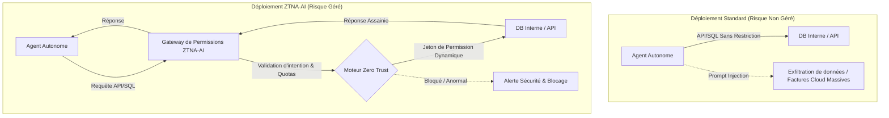
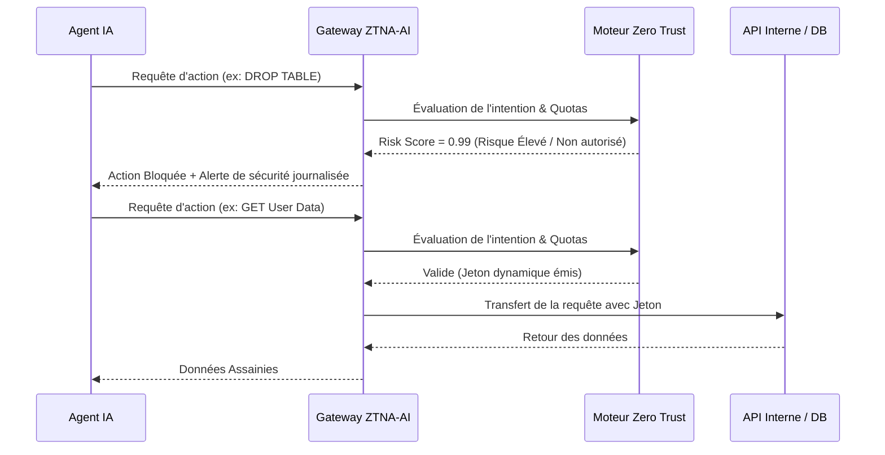

<!-- markdownlint-disable MD013 MD033 MD060 MD036 MD039 MD041 MD028 -->

[ 🇬🇧 English Version ](./README.md)

# Zero Trust Network Access pour Agents IA (ZTNA-AI)

> **Résumé exécutif :** ZTNA-AI est une infrastructure spécialisée de reverse-proxy agissant comme une passerelle de permissions pour sécuriser et contrôler les actions des agents IA autonomes en appliquant des politiques strictes de "Zero Trust" à toutes leurs interactions API et bases de données.


---

## 1. Aperçu visuel



## 2. La thèse contrariante (Peter Thiel Style)

**La croyance populaire :** Les LLMs généraux peuvent être promptés ou fine-tunés pour restreindre leurs propres permissions réseau de manière déterministe, garantissant qu'ils n'hallucinent pas d'appels API dangereux ou ne subissent pas de "prompt injections".

**La vérité cachée :** Les LLMs sont des moteurs probabilistes et n'ont aucune capacité déterministe à s'auto-réguler sur le plan réseau. En cas de manipulation (jailbreak), ils contournent leurs propres règles. La sécurité exige une couche d'infrastructure externe, séparée du modèle génératif, pour imposer un contrôle d'accès réseau strict et auditable.

## 3. Le problème & La cible

- **Modèle économique :** B2B
- **Cible précise :** Entreprises tech, RSSI (CISO), équipes DevOps et SecOps déployant des agents autonomes.
- **La douleur urgente :** Les agents autonomes nécessitent des accès API et bases de données pour agir. En cas d'hallucination ou de "prompt injection", un agent doté de droits trop larges peut exfiltrer des données sensibles, corrompre l'infrastructure ou causer d'immenses factures cloud. C'est un risque de sécurité majeur qui freine l'adoption de l'IA agentique en entreprise.

## 4. Architecture technique & Plomberie

```python
import ztna_ai_gateway

# Initialisation du proxy de protection ZTNA avec politiques strictes zero-trust
gateway_client = ztna_ai_gateway.Client(
    api_key="sk_...",
    agent_id="agent-finance-01",
    policy="strict-zero-trust",
    budget_limit_usd=50.00
)

def execute_agent_action(intent, payload):
    # La gateway intercepte l'action, la valide et émet un jeton dynamique
    response = gateway_client.execute(
        action_intent=intent,
        data=payload
    )

    # Si la réponse déclenche le bouclier (violation de politique ou quota atteint)
    if response.ztna_risk.blocked:
        return "Action bloquée par ZTNA-AI pour des raisons de sécurité."

    return response.result
```



## 5. Modèle économique & Viabilité financière

| Métrique                        | Valeur                                                                                                                          |
| :------------------------------ | :------------------------------------------------------------------------------------------------------------------------------ |
| **Structure de prix**           | Abonnement B2B SaaS basé sur le volume (Nombre d'agents actifs + Volume de requêtes API via le proxy) : Base à ~1 500 € / mois. |
| **Objectif 12 mois**            | 6 clients Entreprise / Mid-Market.                                                                                              |
| **Calcul du CA (Target 100k€)** | 6 clients × 1 500 €/mois × 12 mois = 108 000 € ARR.                                                                             |
| **Marge brute estimée**         | 85% (Les coûts d'infrastructure du reverse-proxy sont extrêmement faibles par rapport au prix de l'abonnement).                 |

## 6. Moteur de distribution & Fossé défensif (Moat)

- **Stratégie d'acquisition :** Ventes directes B2B ciblant les CISO et équipes DevOps. L'hameçon ("Lead magnet") est un audit gratuit des permissions réseau de leurs agents IA actuels, démontrant avec quelle facilité une "prompt injection" peut mener à la compromission totale de l'infrastructure.
- **Moat (Barrière à l'entrée) :**
  - **Intégration réseau de bas niveau :** Une fois ZTNA-AI installé comme proxy obligatoire sur le réseau, il est extrêmement difficile à déloger (High Switching Costs).
  - **Couche de sécurité agnostique :** Les entreprises préféreront toujours une gateway de sécurité tierce indépendante plutôt que de s'en remettre aux garde-fous probabilistes intégrés des fournisseurs de modèles (OpenAI, Anthropic).

## 7. Grille d'évaluation détaillée

| Critère                               |  Score VC (/100)  |    Score Terrain (/100)     |
| :------------------------------------ | :---------------: | :-------------------------: |
| **Thèse & Monopole / Urgence**        |      20 / 25      |           -- / 25           |
| **Moat / Résistance aux LLM natifs**  |      23 / 25      |           -- / 25           |
| **Scalabilité / Friction d'adoption** |      21 / 25      |           -- / 25           |
| **Unit Economics / ROI direct**       |      22 / 25      |           -- / 25           |
| **TOTAL**                             | **86 / 100** | **En attente d'évaluation** |

> **Verdict VC :** L'application des principes Zero Trust aux agents IA puise dans les budgets et modèles mentaux existants des RSSI. L'intégration profonde en entreprise offre un solide fossé contre les wrappers IA génériques. Un chemin clair vers la monétisation via des licences par agent.
> **Verdict Terrain :** En attente d'évaluation.

> **Verdict VC :** L'application des principes Zero Trust aux agents IA puise dans les budgets et modèles mentaux existants des RSSI. L'intégration profonde en entreprise offre un solide fossé contre les wrappers IA génériques. Un chemin clair vers la monétisation via des licences par agent.
