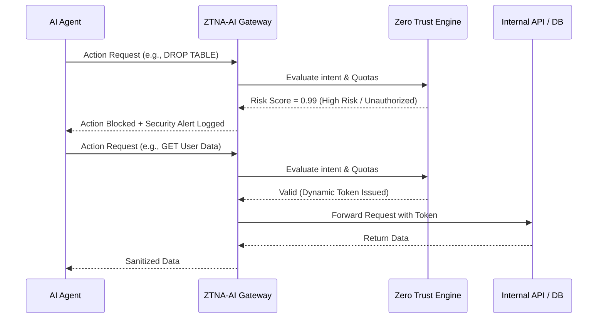

<!-- markdownlint-disable MD013 MD033 MD060 MD039 MD041 MD032 MD010 MD009 MD022 MD036 MD028 MD037 -->

[ 🇫🇷 Version Française ](./README.fr.md)

# Zero Trust Network Access for AI Agents (ZTNA-AI)

> **Executive Summary:** ZTNA-AI is a specialized reverse-proxy acting as a permission gateway to secure and control the actions of autonomous AI agents by applying strict "Zero Trust" policies to all their API and database interactions.


---

## 1. Visual Overview & Wow Effect

```mermaid
graph TD
    subgraph Standard Deployment "Standard Deployment (Unmanaged Risk)"
        A1[Autonomous Agent] -->|Unrestricted API/SQL| DB1[Internal DB / API]
        A1 -.->|Prompt Injection| H1[Data Exfiltration / Massive Cloud Bills]
    end

    subgraph ZTNA Deployment "ZTNA-AI Deployment (Managed Risk)"
        A2[Autonomous Agent] -->|API/SQL Request| B[ZTNA-AI Permission Gateway]
        B -->|Intent Validation & Quotas| C{Zero Trust Engine}
        C -->|Dynamic Permission Token| DB2[Internal DB / API]
        C -.->|Blocked / Abnormal| E[Security Alert & Circuit Breaker]
        DB2 -->|Sanitized Response| B
        B -->|Response| A2
    end
```

## 2. The Contrarian Thesis (Peter Thiel Style)

**The Popular Belief:** General LLMs can be prompted or fine-tuned to deterministically restrict their own network permissions, ensuring they don't hallucinate dangerous API calls or suffer from prompt injections.

**The Hidden Truth:** LLMs are probabilistic engines and have zero deterministic capacity to self-regulate network access. When manipulated or jailbroken, they bypass their own internal guardrails. True security for agentic AI requires an external infrastructure layer, completely separate from the generative model, to enforce strict and auditable network access control.

## 3. The Problem & The Target

- **Economic Model:** B2B
- **Specific Target:** Tech Companies, Chief Information Security Officers (CISOs), DevOps, and SecOps teams deploying autonomous agents.
- **The Urgent Pain:** Autonomous agents require API and database access to function. In the event of hallucination or "prompt injection", an agent with overly broad rights can exfiltrate sensitive data, corrupt infrastructure, or rack up massive cloud bills. This constitutes a major security risk that is currently paralyzing the enterprise adoption of agentic AI.

## 4. Technical Architecture & Plumbing

```python
import ztna_ai_gateway

# Initialize the ZTNA protection proxy with strict zero-trust policies
gateway_client = ztna_ai_gateway.Client(
    api_key="sk_...",
    agent_id="agent-finance-01",
    policy="strict-zero-trust",
    budget_limit_usd=50.00
)

def execute_agent_action(intent, payload):
    # The gateway intercepts the action, validates it, and issues a dynamic token
    response = gateway_client.execute(
        action_intent=intent,
        data=payload
    )

    # If the response triggers the circuit breaker (policy violation or quota reached)
    if response.ztna_risk.blocked:
        return "Action blocked by ZTNA-AI for security reasons."

    return response.result
```



## 5. Economic Model & Financial Viability

| Metric                                 | Value                                                                                                           |
| :------------------------------------- | :-------------------------------------------------------------------------------------------------------------- |
| **Pricing Structure**                  | B2B SaaS based on volume (Number of active agents + API request volume via the proxy): Base at ~1,500€ / month. |
| **12-Month Target**                    | 6 Enterprise / Mid-Market clients.                                                                              |
| **Revenue Calculation (100k€ Target)** | 6 clients × 1,500€/month × 12 months = 108,000€ ARR.                                                            |
| **Estimated Gross Margin**             | 85% (Lightweight reverse-proxy infrastructure costs are extremely low compared to the subscription price).      |

## 6. Distribution Engine & Defensive Moat (Moat)

- **Acquisition Strategy:** Direct B2B sales targeting CISOs and DevOps teams. The hook ("Lead magnet") is a free network permission audit of their current AI agents, demonstrating how easily a prompt injection can lead to complete infrastructure compromise.
- **Moat (Barrier to Entry):**
  - **Deep Infrastructure Integration:** Once ZTNA-AI is integrated as the mandatory reverse-proxy for all agent communications, it becomes exceptionally sticky (High Switching Costs).
  - **Agnostic Security Layer:** Companies will always prefer an independent third-party security gateway over relying on the built-in, probabilistic guardrails of the model providers (OpenAI, Anthropic).

## 7. Detailed Evaluation Grid

| Criteria                             | VC Score (/100) |  Terrain Score (/100)  |
| :----------------------------------- | :-------------: | :--------------------: |
| **Thesis & Monopoly / Urgency**      |     24 / 25     |        -- / 25         |
| **Moat / Resistance to Native LLMs** |     25 / 25     |        -- / 25         |
| **Scalability / Adoption Friction**  |     20 / 25     |        -- / 25         |
| **Unit Economics / Direct ROI**      |     21 / 25     |        -- / 25         |
| **TOTAL**                            |   **90 / 100**   | **Pending evaluation** |

> **Terrain Verdict:** Pending evaluation.

> **VC Verdict:** Zero Trust Agents solves a hair-on-fire problem for CISOs deploying autonomous systems. By separating the security layer from the probabilistic LLM, it creates a robust, agnostic gateway that becomes immediately sticky.
