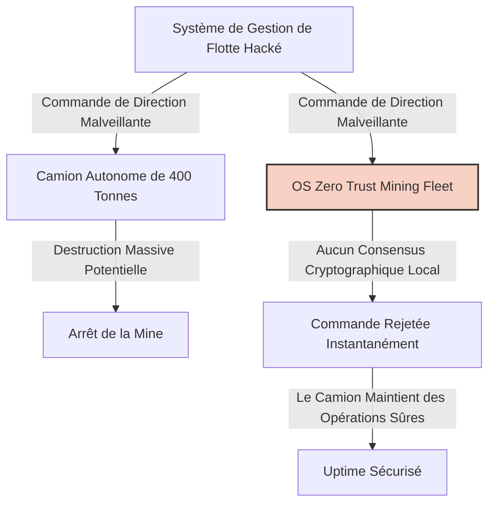
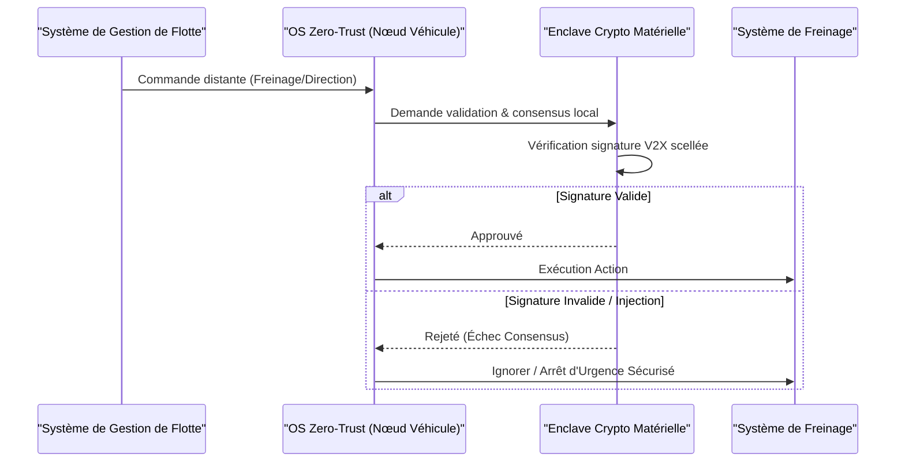

<!-- markdownlint-disable MD009 MD010 MD013 MD022 MD028 MD032 MD033 MD034 MD036 MD037 MD039 MD041 MD058 MD060 -->

[ 🇬🇧 English Version ](./README.md)

# Zero Trust Mining Fleet

> **Résumé exécutif :** Un système d'exploitation V2X Zero-Trust au niveau matériel pour les flottes minières autonomes massives, prévenant les attaques cyber-physiques catastrophiques via un consensus cryptographique local.

---

## 1. Aperçu visuel & Effet Wahou

## 2. La thèse contrariante (Peter Thiel Style)

**La croyance populaire :** Pour sécuriser les machines lourdes autonomes, il suffit d'avoir de meilleurs pare-feux cloud et des VPN IT standards sur le système de gestion de flotte (FMS).
**La vérité cachée :** Les pare-feux IT sont inutiles lorsque le réseau OT (Operational Technology) interne est compromis. L'authentification cloud introduit une latence mortelle pour des véhicules de 400 tonnes lancés à pleine vitesse. La véritable sécurité exige un consensus cryptographique localisé et scellé au niveau matériel directement sur le véhicule.

## 3. Le problème & La cible

**Modèle économique :** B2B
**Cible précise :** Les conglomérats miniers mondiaux (Rio Tinto, BHP) et les opérateurs d'infrastructures lourdes autonomes.
**La douleur urgente :** Les flottes massives de camions autonomes sont des réseaux IoT géants sur roues. Un seul piratage de ces véhicules ou de leurs systèmes de gestion peut causer des destructions matérielles colossales, des arrêts de production coûtant des millions par heure et mettre des vies humaines en danger.

## 4. Architecture technique & Plomberie

## 5. Modèle économique & Viabilité financière

| Métrique                        | Valeur                                                   |
| :------------------------------ | :------------------------------------------------------- |
| **Structure de prix**           | Licence annuelle par véhicule autonome + Module matériel |
| **Objectif 12 mois**            | 1 flotte pilote (10 véhicules)                           |
| **Calcul du CA (Target 100k€)** | 10 véhicules \* 15k€ = 150k€ ARR                         |
| **Marge brute estimée**         | 80% (Principalement licence logicielle OS)               |

## 6. Moteur de distribution & Fossé défensif (Moat)

**Stratégie d'acquisition :** Ventes B2B directes aux opérateurs miniers, positionnées comme une assurance obligatoire contre des pertes opérationnelles se chiffrant en milliards.
**Moat (Barrière à l'entrée) :** Exige une fiabilité temps réel extrême (uptime 99.999%) et une intégration étroite avec les systèmes fermés des équipementiers (Caterpillar, Komatsu). Les logiciels de sécurité cloud standards ne peuvent pas fonctionner avec les latences de l'ordre de la milliseconde requises pour la conduite autonome.

## 7. Grille d'évaluation détaillée

| Critère                               | Score VC (/100) | Score Terrain (/100) |
| :------------------------------------ | :-------------- | :------------------- |
| **Thèse & Monopole / Urgence**        | -- / 25         | 24 / 25              |
| **Moat / Résistance aux LLM natifs**  | -- / 25         | 25 / 25              |
| **Scalabilité / Friction d'adoption** | -- / 25         | 15 / 25              |
| **Unit Economics / ROI direct**       | -- / 25         | 23 / 25              |
| **TOTAL**                             | **-- / 100**    | **87 / 100**         |

> **Verdict VC :** En attente d'évaluation.

> **Verdict Terrain :** Zero-trust-mining-fleet fournit une sécurité opérationnelle essentielle pour des opérations autonomes de plusieurs milliards de dollars. Le consensus cryptographique localisé garantit qu'il ne peut pas être répliqué ou contourné par des IA basées sur le cloud. Le ROI clair sur la prévention des accidents catastrophiques favorise une forte adoption par les entreprises malgré les défis d'intégration.
