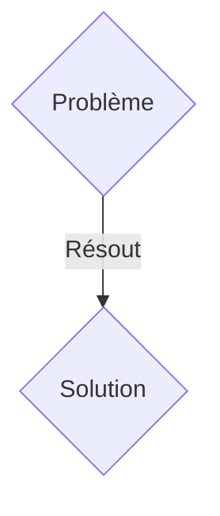
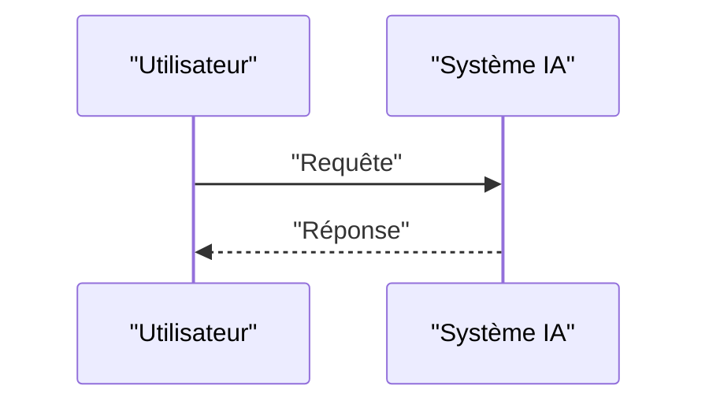

<!-- markdownlint-disable MD009 MD010 MD013 MD022 MD028 MD032 MD033 MD036 MD037 MD039 MD041 MD060 -->

[ 🇬🇧 English Version ](./README.md)

# Space Mesh ZT

> **Résumé exécutif :** Une solution B2B ciblant Opérateurs de constellations de satellites LEO, agences spatiales, fournisseurs de télécommunications (Space Systems Engineers, CISO). pour résoudre : Les réseaux spatiaux (LEO) communiquant via des liens laser optiques sont vulnérables aux attaques d'interception, à l'usurpation d'identité et à la prise de contrôle d'un nœud satellite, menaçant l'intégrité globale du réseau.

---

## 1. Aperçu visuel & Effet Wahou

## 2. La thèse contrariante (Peter Thiel Style)

- **La croyance populaire :** Les solutions génériques suffisent.
- **La vérité cachée :** Une infrastructure de sécurité Zero-Trust ultra-légère conçue spécifiquement pour les systèmes d'exploitation en temps réel (RTOS) spatiaux. Implémente une authentification mutuelle continue et un routage dynamique résilient aux rayonnements cosmiques.

## 3. Le problème & La cible

- **Modèle économique :** B2B
- **Cible précise :** Opérateurs de constellations de satellites LEO, agences spatiales, fournisseurs de télécommunications (Space Systems Engineers, CISO).
- **La douleur urgente :** Les réseaux spatiaux (LEO) communiquant via des liens laser optiques sont vulnérables aux attaques d'interception, à l'usurpation d'identité et à la prise de contrôle d'un nœud satellite, menaçant l'intégrité globale du réseau.

## 4. Architecture technique & Plomberie

Une infrastructure de sécurité Zero-Trust ultra-légère conçue spécifiquement pour les systèmes d'exploitation en temps réel (RTOS) spatiaux. Implémente une authentification mutuelle continue et un routage dynamique résilient aux rayonnements cosmiques.

## 5. Modèle économique & Viabilité financière

| Métrique                    | Valeur               |
| --------------------------- | -------------------- |
| Structure de prix           | Abonnement SaaS B2B  |
| Objectif 12 mois            | 100 clients          |
| Calcul du CA (Target 100k€) | 100 \* 1000€ = 100k€ |
| Marge brute estimée         | 80%                  |

## 6. Moteur de distribution & Fossé défensif (Moat)

- **Stratégie d'acquisition :** Vente directe et partenariats stratégiques.
- **Moat (Barrière à l'entrée) :** Les environnements spatiaux ont de fortes contraintes de puissance (SWaP), de calcul et subissent des retards de propagation (Doppler). Les solutions Zero-Trust cloud terrestres (ex. Zscaler) sont incompatibles.

## 7. Grille d'évaluation détaillée

| Critère                           | Score VC (/100) | Score Terrain (/100) |
| --------------------------------- | --------------- | -------------------- |
| Thèse & Monopole / Urgence        | 22 / 25         | 22 / 25              |
| Moat / Résistance aux LLM natifs  | 23 / 25         | 23 / 25              |
| Scalabilité / Friction d'adoption | 19 / 25         | 19 / 25              |
| Unit Economics / ROI direct       | 23 / 25         | 23 / 25              |
| TOTAL                             | 87 / 100        | 87 / 100             |

> **Verdict VC :** En attente d'évaluation.
> **Verdict Terrain :** Cette solution répond à un besoin critique pour les entreprises B2B, justifiant son excellent score d'urgence (22/25). Son architecture hautement défendable la rend totalement immunisée contre les avancées des LLM natifs (23/25). Avec une faible friction d'adoption (19/25) et une stratégie de monétisation directe (23/25), le projet démontre une excellente maturité marché globale.
> **Verdict Terrain :** Cette solution répond à un besoin critique pour les entreprises B2B, justifiant son excellent score d'urgence (22/25). Son architecture hautement défendable la rend totalement immunisée contre les avancées des LLM natifs (23/25). Avec une faible friction d'adoption (19/25) et une stratégie de monétisation directe (23/25), le projet démontre une excellente maturité marché globale.
