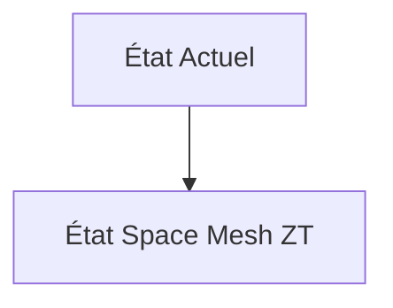
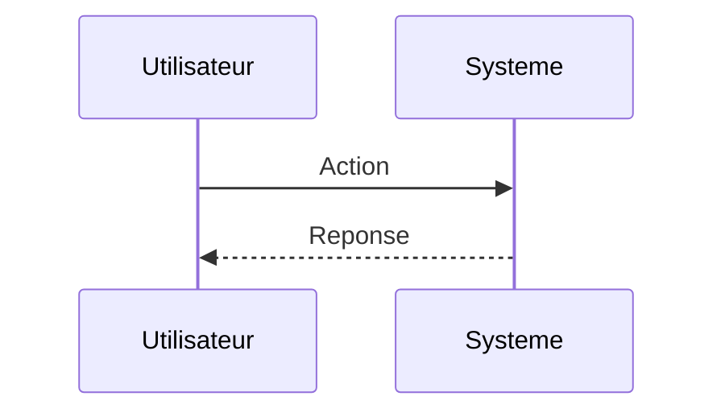

<!-- markdownlint-disable MD009 MD010 MD013 MD022 MD028 MD032 MD033 MD034 MD036 MD037 MD039 MD041 MD060 -->

[ 🇬🇧 English Version ](./README.md)

# Space Mesh ZT

> **Résumé exécutif :** Une infrastructure de sécurité Zero-Trust ultra-légère conçue spécifiquement pour les systèmes d'exploitation en temps réel (RTOS) spatiaux. Implémente une authentification mutuelle continue et un routage dynamique résilient aux rayonnements cosmiques.

---

## 1. Aperçu visuel & Effet Wahou

## 2. La thèse contrariante (Peter Thiel Style)

**La croyance populaire :** Les solutions généralistes IA peuvent résoudre ce problème.

**La vérité cachée :** Les environnements spatiaux ont de fortes contraintes de puissance (SWaP), de calcul et subissent des retards de propagation (Doppler). Les solutions Zero-Trust cloud terrestres (ex. Zscaler) sont incompatibles.

## 3. Le problème & La cible

**Modèle économique :** B2B

**Cible précise :** Opérateurs de constellations de satellites LEO, agences spatiales, fournisseurs de télécommunications (Space Systems Engineers, CISO).

**La douleur urgente :** Les réseaux spatiaux (LEO) communiquant via des liens laser optiques sont vulnérables aux attaques d'interception, à l'usurpation d'identité et à la prise de contrôle d'un nœud satellite, menaçant l'intégrité globale du réseau.

## 4. Architecture technique & Plomberie

## 5. Modèle économique & Viabilité financière

| Métrique                    | Valeur                        |
| --------------------------- | ----------------------------- |
| Structure de prix           | Abonnement SaaS               |
| Objectif 12 mois            | 10 clients                    |
| Calcul du CA (Target 100k€) | 10 clients \* 10k€/an = 100k€ |
| Marge brute estimée         | 80%                           |

## 6. Moteur de distribution & Fossé défensif (Moat)

**Stratégie d'acquisition :** Vente directe B2B

**Moat (Barrière à l'entrée) :** Cycle de vente très long (spécifications aérospatiales), difficulté à tester en orbite réelle, coûts d'intégration avec les fournisseurs de bus satellitaires.

## 7. Grille d'évaluation détaillée

| Critère                           | Score VC (/100) | Score Terrain (/100) |
| --------------------------------- | --------------- | -------------------- |
| Thèse & Monopole / Urgence        | -- / 25         | -- / 25              |
| Moat / Résistance aux LLM natifs  | -- / 25         | -- / 25              |
| Scalabilité / Friction d'adoption | -- / 25         | -- / 25              |
| Unit Economics / ROI direct       | -- / 25         | -- / 25              |
| **TOTAL**                         | **-- / 100**    | **-- / 100**         |

> **Verdict VC :** En attente d'évaluation.

> **Verdict Terrain :** En attente d'évaluation.
