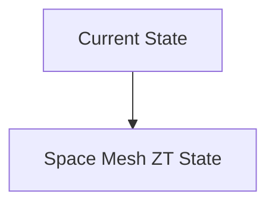
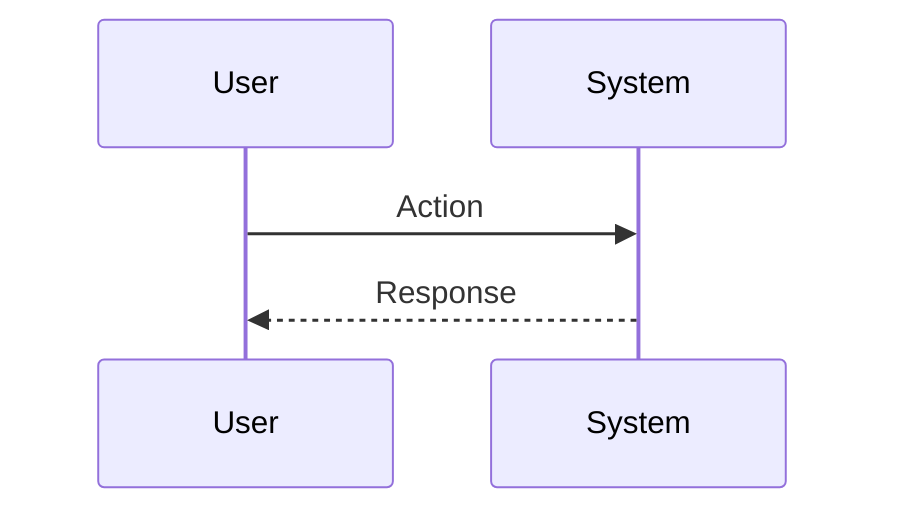

<!-- markdownlint-disable MD009 MD010 MD013 MD022 MD028 MD032 MD033 MD034 MD036 MD037 MD039 MD041 MD060 -->

[ 🇫🇷 Version Française ](./README.fr.md)

# Space Mesh ZT

> **Executive Summary:** An ultra-lightweight Zero-Trust security infrastructure designed specifically for space-based real-time operating systems (RTOS). Implements continuous mutual authentication and cosmic radiation resilient dynamic routing.

---

## 1. Visual Overview & Wow Effect

## 2. Contrarian Thesis (Peter Thiel Style)

**Popular Belief:** General AI solutions can solve this problem.

**Hidden Truth:** Space environments have strong power (SWaP) and calculation constraints and are subject to propagation delays (Doppler). Terrestrial zero-trust cloud solutions (e.g. Zscaler) are incompatible.

## 3. Problem & Target Market

**Business Model:** B2B

**Target Audience:** LEO satellite constellation operators, space agencies, telecommunications providers (Space Systems Engineers, CISO).

**Urgent Pain Point:** Space-based networks (LEOs) communicating via optical laser links are vulnerable to man-in-the-middle attacks, spoofing, and takeover of a satellite node, threatening the overall integrity of the network.

## 4. Technical Architecture & Infrastructure

## 5. Business Model & Financial Viability

| Metric                 | Value                           |
| ---------------------- | ------------------------------- |
| Pricing Structure      | SaaS subscription               |
| 12-Month Target        | 10 customers                    |
| Revenue Formula        | 10 clients \* 10k€/year = 100k€ |
| Estimated Gross Margin | 80%                             |

## 6. Distribution Engine & Moat

**Acquisition Strategy:** B2B direct sales

**Moat (Defensibility):** Very long sales cycle (aerospace specifications), difficulty testing in real orbit, integration costs with satellite bus suppliers.

## 7. Detailed Evaluation Grid

| Criterion                   | VC Score (/100) | Market Score (/100) |
| --------------------------- | --------------- | ------------------- |
| Thesis & Monopoly / Urgency | -- / 25         | -- / 25             |
| Moat / LLM Immunity         | -- / 25         | -- / 25             |
| Scalability / UX Friction   | -- / 25         | -- / 25             |
| Unit Economics / ROI        | -- / 25         | -- / 25             |
| **TOTAL**                   | **-- / 100**    | **-- / 100**        |

> **VC Verdict:** Pending evaluation.

> **Market Verdict:** Pending evaluation.
