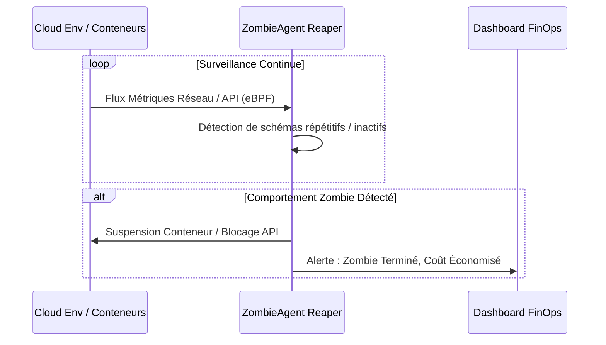

<!-- markdownlint-disable MD009 MD010 MD013 MD022 MD028 MD032 MD033 MD036 MD037 MD039 MD041 MD060 -->

[ 🇬🇧 English Version ](./README.md)

# ZombieAgent Reaper

> **Résumé exécutif :** Un Control Plane qui s'intègre aux environnements cloud pour détecter et suspendre les agents IA inactifs, redondants ou en boucle infinie (zombies) qui consument inutilement les budgets de tokens LLM.


---

## 1. Aperçu visuel

```mermaid
graph TD
    A["Infrastructure Cloud (Processus Agents)"] --> B{"Control Plane ZombieAgent"}
    B -->|Analyse Trafic Réseau & API (eBPF)| C["Identification Agents Inactifs / En Boucle"]
    C -->|Évaluation TTL & Règles de Budget| D["Suspension Processus / Blocage Réseau"]
    D --> E["Déclenchement Alerte FinOps"]
```

## 2. La thèse contrariante (Peter Thiel Style)

- **La croyance populaire :** Les coûts cloud liés à l'IA proviennent principalement de l'entraînement des modèles ou d'une inférence utile.
- **La vérité cachée :** Une proportion massive des coûts cloud de l'IA à l'avenir proviendra d'agents "zombies" orphelins et oubliés, coincés dans des boucles en arrière-plan, interrogeant aveuglément des API LLM coûteuses sans aucune supervision humaine.

## 3. Le problème & La cible

- **Modèle économique :** B2B
- **Cible précise :** Équipes FinOps, CloudOps et DevOps dans les entreprises déployant des agents autonomes.
- **La douleur urgente :** Les développeurs déploient des agents mais oublient de les désactiver. Ces "zombies" continuent de tourner, générant des factures astronomiques et des risques de sécurité, totalement sous le radar.

## 4. Architecture technique & Plomberie



## 5. Modèle économique & Viabilité financière

| Métrique                    | Valeur                                                |
| --------------------------- | ----------------------------------------------------- |
| Structure de prix           | SaaS par Paliers basé sur l'infrastructure surveillée |
| Objectif 12 mois            | 100 Comptes Entreprise                                |
| Calcul du CA (Target 100k€) | 100 _ 1000€ / mois _ 12 = 1.2M€                       |
| Marge brute estimée         | 85%                                                   |

## 6. Moteur de distribution & Fossé défensif (Moat)

- **Stratégie d'acquisition :** Intégrations Marketplaces (AWS, GCP, Azure) ciblant les CloudOps. Positionné comme un outil à ROI immédiat ("installez ceci et réduisez votre facture cloud IA de 20% aujourd'hui").
- **Moat (Barrière à l'entrée) :** Nécessite une visibilité d'infrastructure profonde (eBPF ou proxies réseau) et des contrôles d'orchestration pour suspendre des processus. Un LLM n'a aucune visibilité sur l'infrastructure hôte et ne peut pas faire un "kill -9" sur son propre conteneur.

## 7. Grille d'évaluation détaillée

| Critère                           | Score VC (/100) | Score Terrain (/100) |
| --------------------------------- | --------------- | -------------------- |
| Thèse & Monopole / Urgence        | -- / 25         | -- / 25              |
| Moat / Résistance aux LLM natifs  | -- / 25         | -- / 25              |
| Scalabilité / Friction d'adoption | -- / 25         | -- / 25              |
| Unit Economics / ROI direct       | -- / 25         | -- / 25              |
| **TOTAL**                         | **-- / 100**    | **-- / 100**         |

> **Verdict VC :** En attente d'évaluation.

> **Verdict Terrain :** En attente d'évaluation.
