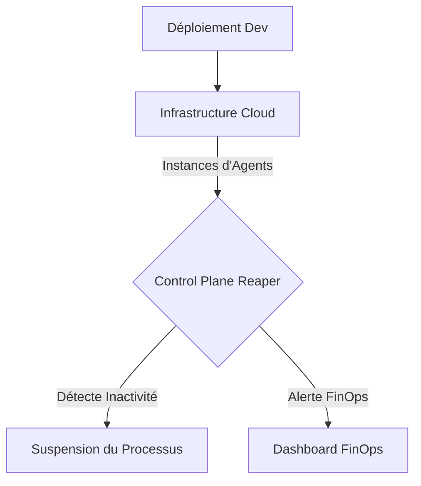
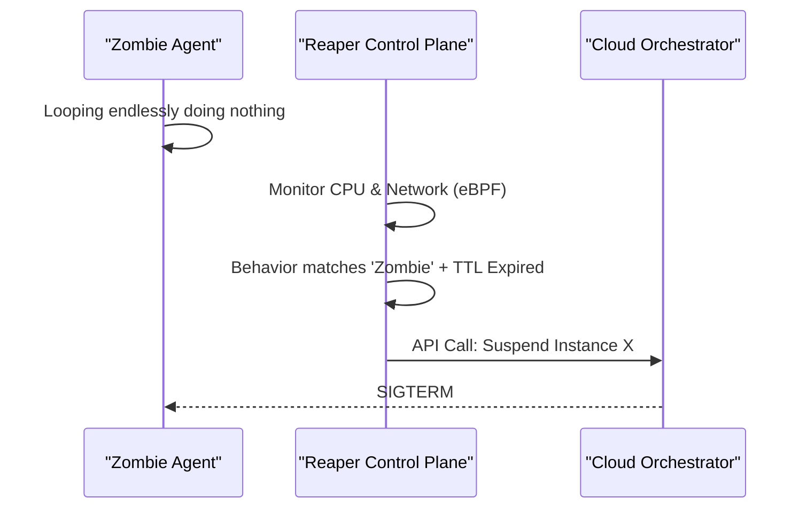

<!-- markdownlint-disable MD009 MD010 MD013 MD022 MD028 MD032 MD033 MD034 MD036 MD037 MD039 MD041 MD060 -->

[ 🇬🇧 English Version ](./README.md)

# ZombieAgent Reaper

> **Résumé exécutif :** Un Control Plane cloud pour identifier et suspendre automatiquement les agents IA zombies inactifs ou redondants, évitant les surcoûts astronomiques.

---

## 1. Aperçu visuel

```mermaid
graph TD
    %% Architecture
    A["Déploiement Dev"] --> B["Infrastructure Cloud"]
    B -->|Instances d'Agents| C{"Control Plane Reaper"}
    C -->|Détecte Inactivité| D["Suspension du Processus"]
    C -->|Alerte FinOps| E["Dashboard FinOps"]
```

## 2. La thèse contrariante (Peter Thiel Style)

**La croyance populaire :** Les développeurs n'oublieront pas d'éteindre leurs agents une fois la tâche terminée.

**La vérité cachée :** Dans des architectures complexes, les tâches fantômes sont oubliées et les coûts explosent silencieusement. Un ramassage automatisé des instances est nécessaire.

## 3. Le problème & La cible

**Modèle économique :** B2B
**Cible précise :** Équipes FinOps, CloudOps et DevOps d'entreprises déployant des agents autonomes.
**La douleur urgente :** Les développeurs oublient de désactiver les agents. Ces zombies tournent en boucle, consommant des tokens et générant des factures astronomiques.

## 4. Architecture technique & Plomberie

**L'approche technique :** Control Plane intégré aux environnements cloud. Analyse le trafic réseau via proxy ou eBPF pour repérer les agents redondants et les suspendre selon des règles TTL.

```mermaid
sequenceDiagram
    participant Agent as "Zombie Agent"
    participant Plane as "Reaper Control Plane"
    participant Cloud as "Cloud Orchestrator"
    Agent->>Agent: Looping endlessly doing nothing
    Plane->>Plane: Monitor CPU & Network (eBPF)
    Plane->>Plane: Behavior matches 'Zombie' + TTL Expired
    Plane->>Cloud: API Call: Suspend Instance X
    Cloud-->>Agent: SIGTERM
```

## 5. Modèle économique & Viabilité financière

| Métrique                        | Valeur                             |
| :------------------------------ | :--------------------------------- |
| **Structure de prix**           | SaaS Tiered by Monitored Instances |
| **Objectif 12 mois**            | 100 CloudOps Teams                 |
| **Calcul du CA (Target 100k€)** | 100 teams \* $1k/mo = $100k/mo     |
| **Marge brute estimée**         | 85%                                |

## 6. Moteur de distribution & Fossé défensif (Moat)

**Stratégie d'acquisition :** Marketplaces cloud (AWS, GCP) et intégrations Datadog/NewRelic.

**Moat (Barrière à l'entrée) :** Un LLM n'a aucune visibilité sur l'infrastructure cloud ou l'activité réseau en arrière-plan. La suspension nécessite une intégration au niveau système.

## 7. Grille d'évaluation détaillée

| Critère                               | Score VC (/100) | Score Terrain (/100) |
| :------------------------------------ | :-------------- | :------------------- |
| **Thèse & Monopole / Urgence**        | -- / 25         | -- / 25              |
| **Moat / Résistance aux LLM natifs**  | -- / 25         | -- / 25              |
| **Scalabilité / Friction d'adoption** | -- / 25         | -- / 25              |
| **Unit Economics / ROI direct**       | -- / 25         | -- / 25              |
| **TOTAL**                             | -- / 100        | -- / 100             |

> **Verdict VC :** En attente d'évaluation.
> **Verdict Terrain :** En attente d'évaluation.
