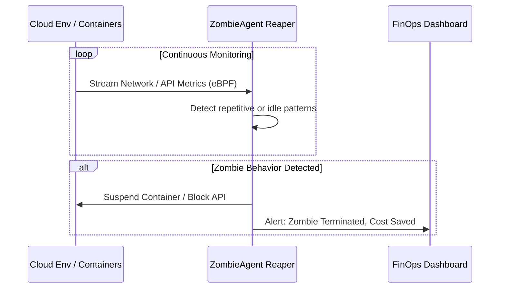

<!-- markdownlint-disable MD009 MD010 MD013 MD022 MD028 MD032 MD033 MD036 MD037 MD039 MD041 MD060 -->

[ 🇫🇷 Version Française ](./README.fr.md)

# ZombieAgent Reaper

> **Executive Summary:** A Control Plane that integrates with cloud environments to detect and suspend idle, redundant, or infinitely looping "zombie" AI agents that burn LLM token budgets.


---

## 1. Visual Overview

```mermaid
graph TD
    A["Cloud Infrastructure (Agent Processes)"] --> B{"ZombieAgent Control Plane"}
    B -->|Network & API Traffic Analysis (eBPF)| C["Identify Inactive / Looping Agents"]
    C -->|Evaluate TTL & Budget Rules| D["Suspend Process / Block Network"]
    D --> E["Trigger FinOps Alert"]
```

## 2. Contrarian Thesis (Peter Thiel Style)

- **Popular Belief:** Cloud costs for AI are mainly driven by training or useful inference.
- **Hidden Truth:** A massive percentage of AI cloud costs in the future will come from forgotten, orphaned "zombie" agents stuck in background loops, mindlessly pinging expensive LLM APIs without user supervision.

## 3. Problem & Target Market

- **Business Model:** B2B
- **Target Audience:** FinOps, CloudOps, and DevOps teams in enterprises deploying autonomous agents.
- **Urgent Pain Point:** Developers deploy autonomous agents but often forget to deactivate them, or the agents enter recursive loops. These "zombies" continue to run, consuming highly expensive LLM tokens, resulting in astronomical bills and security risks.

## 4. Technical Architecture & Infrastructure



## 5. Business Model & Financial Viability

| Metric                 | Value                                  |
| ---------------------- | -------------------------------------- |
| Pricing Structure      | Tiered SaaS based on compute monitored |
| 12-Month Target        | 100 Enterprise Accounts                |
| Revenue Formula        | 100 _ €1,000 / month _ 12 = 1.2M€      |
| Estimated Gross Margin | 85%                                    |

## 6. Distribution Engine & Moat

- **Acquisition Strategy:** Marketplace integrations (AWS, GCP, Azure) targeting CloudOps. Positioned as an immediate ROI tool ("install this and cut your AI cloud bill by 20% today").
- **Moat (Defensibility):** Requires deep infrastructure visibility (like eBPF or network proxies) and orchestration controls to suspend processes. An LLM lacks any visibility or control over the host infrastructure and cannot "kill -9" its own container.

## 7. Detailed Evaluation Grid

| Criterion                   | VC Score (/100) | Market Score (/100) |
| --------------------------- | --------------- | ------------------- |
| Thesis & Monopoly / Urgency | 23 / 25         | -- / 25             |
| Moat / LLM Immunity         | 22 / 25         | -- / 25             |
| Scalability / UX Friction   | 24 / 25         | -- / 25             |
| Unit Economics / ROI        | 24 / 25         | -- / 25             |
| **TOTAL**                   | **93 / 100**    | **-- / 100**        |

> **VC Verdict:** Zombie Agent Reaper ruthlessly eliminates the catastrophic financial drain caused by rogue AI processes, turning unpredictable AI experimentation into a financially governed operation. Its integration directly into the cloud control plane creates a deep structural moat that is immune to prompt-engineering bypasses. This is a highly profitable, scalable insurance policy for modern DevOps.

> **Market Verdict:** Pending evaluation.
