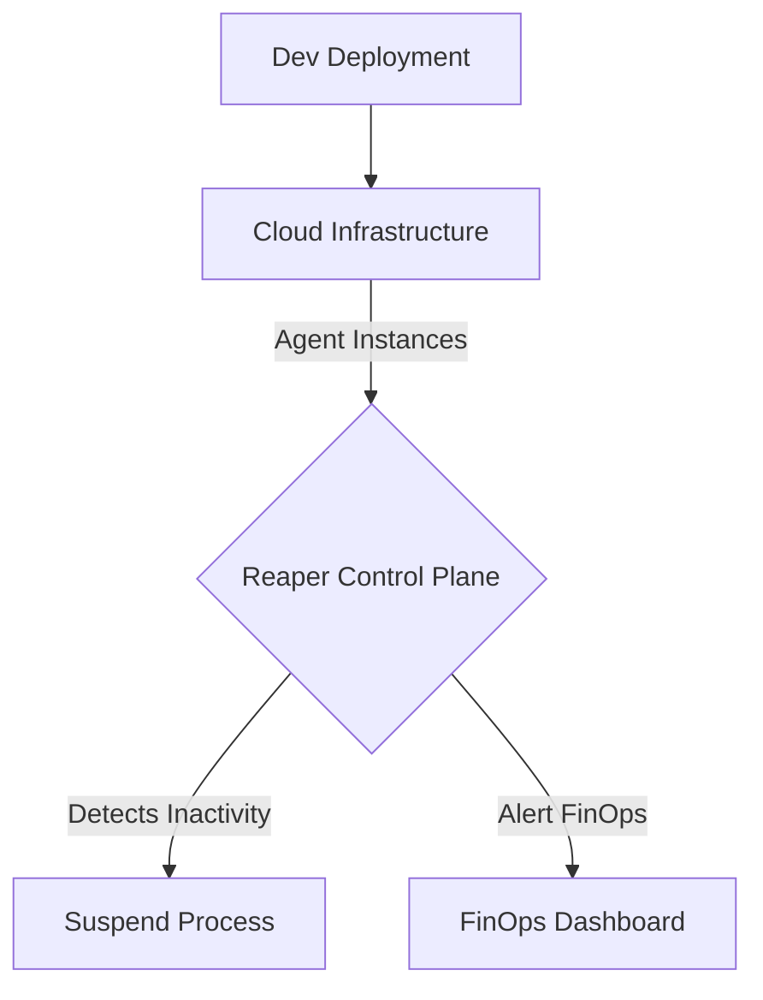
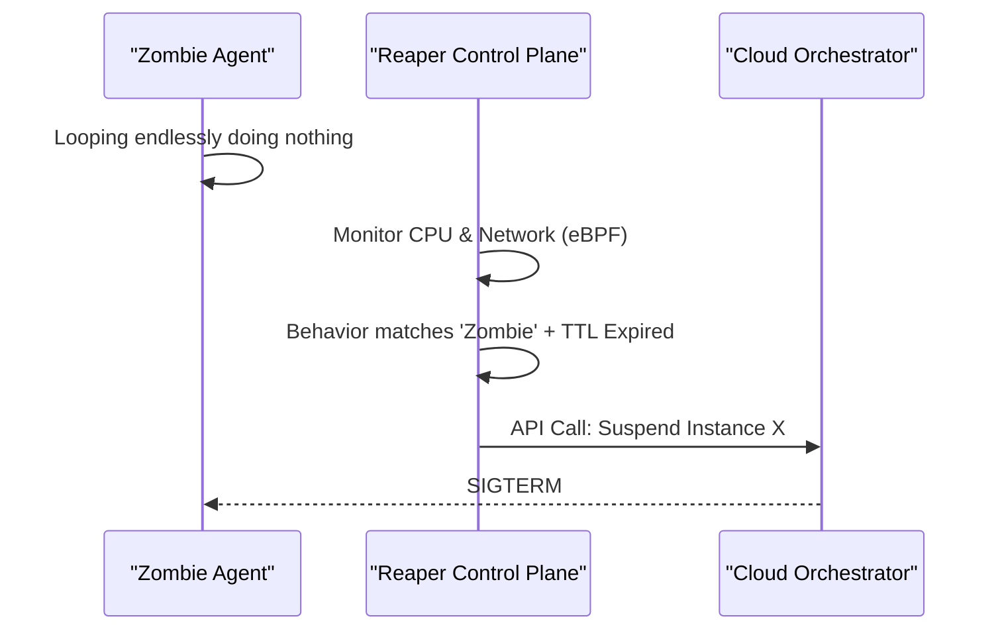

<!-- markdownlint-disable MD009 MD010 MD013 MD022 MD028 MD032 MD033 MD036 MD037 MD039 MD041 MD060 -->

[ 🇫🇷 Version Française ](./README.fr.md)

# ZombieAgent Reaper

> **Executive Summary:** A cloud control plane that integrates with deployment environments to identify and automatically suspend inactive or redundant zombie AI agents, preventing massive billing overruns.

---

## 1. Visual Overview & Wow Effect

```mermaid
graph TD
    %% Architecture
    A["Dev Deployment"] --> B["Cloud Infrastructure"]
    B -->|Agent Instances| C{"Reaper Control Plane"}
    C -->|Detects Inactivity| D["Suspend Process"]
    C -->|Alert FinOps| E["FinOps Dashboard"]
```

## 2. Contrarian Thesis (Peter Thiel Style)

**Popular Belief:** Developers will naturally remember to turn off agents when they are done.

**Hidden Truth:** In complex agentic architectures, ghost tasks are easily forgotten, and cloud costs spiral silently; automated garbage collection of entire agent instances is required.

## 3. Problem & Target Market

**Business Model:** B2B
**Target Audience:** FinOps, CloudOps, and DevOps teams in enterprises deploying autonomous agents.
**Urgent Pain Point:** Developers deploy agents but forget to turn them off. 'Zombie agents' loop endlessly, consuming expensive LLM tokens and causing astronomical billing overruns.

## 4. Technical Architecture & Infrastructure

**Technical Approach:** A Control Plane integrated via cloud APIs or eBPF. Analyzes network traffic and API calls to identify inactive/redundant agent behaviors and suspends processes based on TTL and budget rules.

```mermaid
sequenceDiagram
    participant Agent as "Zombie Agent"
    participant Plane as "Reaper Control Plane"
    participant Cloud as "Cloud Orchestrator"
    Agent->>Agent: Looping endlessly doing nothing
    Plane->>Plane: Monitor CPU & Network (eBPF)
    Plane->>Plane: Behavior matches 'Zombie' + TTL Expired
    Plane->>Cloud: API Call: Suspend Instance X
    Cloud-->>Agent: SIGTERM
```

## 5. Business Model & Financial Viability

| Metric                     | Value                              |
| :------------------------- | :--------------------------------- |
| **Pricing Structure**      | SaaS Tiered by Monitored Instances |
| **12-Month Target**        | 100 CloudOps Teams                 |
| **Revenue Formula**        | 100 teams \* $1k/mo = $100k/mo     |
| **Estimated Gross Margin** | 85%                                |

## 6. Distribution Engine & Moat

**Acquisition Strategy:** Cloud marketplaces (AWS, GCP) and integrations with Datadog/NewRelic.

**Moat (Defensibility):** LLMs have zero visibility into cloud infrastructure orchestration or background network activity. Suspending zombie processes requires deep system-level integration.

## 7. Detailed Evaluation Grid

| Criterion                       | VC Score (/100) | Market Score (/100) |
| :------------------------------ | :-------------- | :------------------ |
| **Thesis & Monopoly / Urgency** | -- / 25         | 24 / 25             |
| **Moat / LLM Immunity**         | -- / 25         | 22 / 25             |
| **Scalability / UX Friction**   | -- / 25         | 21 / 25             |
| **Unit Economics / ROI**        | -- / 25         | 24 / 25             |
| **TOTAL**                       | -- / 100        | 91 / 100            |

> **VC Verdict:** Pending evaluation.
> **Market Verdict:** Automatically detecting and killing inactive cloud instances of AI agents solves an immediate financial bleeding issue. The infrastructure-level monitoring provides a solid defensibility layer entirely decoupled from the language models. Cloud integration is standard for DevOps, leading to a highly persuasive ROI-driven sales motion.
